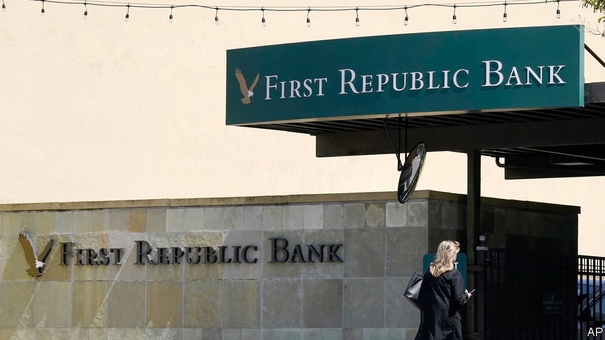
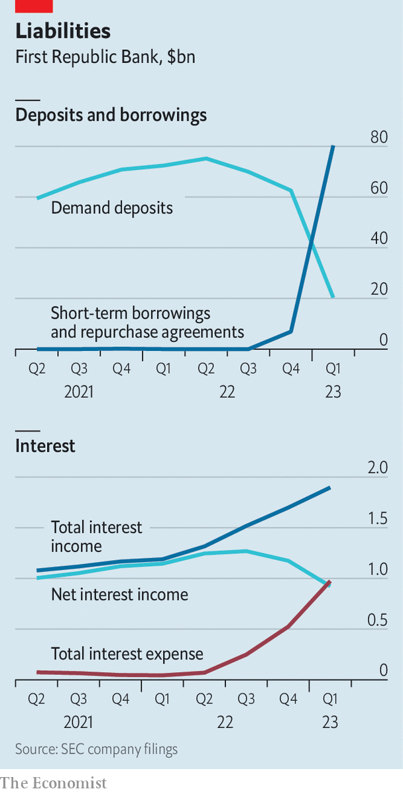

###### Banking chaos

# First Republic Bank is on the edge of a precipice 

##### Investors are fleeing after a dismal set of results 

 

> Apr 26th 2023 

The central conceit of most zombie flicks, like “28 Days Later”, a film set in an apocalyptic London, is that a terrible disease has spread. It has turned legions of healthy humans into dangerous monsters. These walking dead now stalk the land: from afar it can be hard to discern if they are living or not. A little more than 28 days elapsed between the failure of  (svb) and the publication of First Republic Bank’s first-quarter earnings on April 24th—45 to be exact—but the earnings made it clear that American banking has at least one .

At the end of 2022 First Republic held $213bn in assets, of which about $167bn were in loans and $32bn in bonds. It was funded by $176bn in deposits, $7bn in short-term funding and $9bn in long-term funding. The bank also had $18bn in high-quality capital. By the end of the first quarter the firm had lost $102bn of its original deposits. This has been replaced by a vast amount of short-term borrowing, which climbed to $80bn by the end of the first quarter, and by $30bn of pity deposits from six big banks, which placed money with the institution to throw it a lifeline. 

 


There are several problems with this picture. The first is that First Republic lent a lot of money when interest rates were low, including via cheap mortgages. Mark Zuckerberg is supposed to have taken out a 30-year mortgage for his $6m Palo Alto home at 1.05%. The value of such loans will have plunged as interest rates have risen. 

The second is that the deal with many well-heeled customers was that they would agree to move their deposits to the bank as well. But these customers, who held large balances uninsured by regulators, have now fled. Without cheap deposit funding, First Republic has turned to short-term funding—much of it lent by the Federal Reserve and the Federal Home Loan Banks, another government-backed lender, at market rates. This has probably demolished its ability to earn a profit. 

In the last quarter of 2022 First Republic earned a net interest margin—the difference between what it collects on loans and pays for funding—of 2.5%. That fell to 1.8% in the first quarter. Yet the reality could be worse. After all, the first quarter included two months before svb collapsed, implying First Republic earned next to nothing in net interest in March. In other words, the bank seems to be paying as much for funding as it is receiving on its loans.

There is no obvious escape for First Republic, unless depositors agree to return. It cannot earn its way out because net interest margins have collapsed. Selling off assets would not help either. Imagine the value of its loan book fell by, say, 10-15% in 2022, a price drop which would be less than the fall in the value of most mid-to-long-term government bonds. This would mean that if First Republic sold such assets, all its equity would be wiped out. Recapitalisation would be a solution, but investors do not seem keen. The bank’s share price fell by 50% on April 25th. Its market capitalisation is now below $1bn, down from $23bn in January. Regulators think First Republic is in such trouble they may limit its access to short-term funding. That may leave only an svb-style wind-down. 

How many zombies are out there? A paper in March by Erica Jiang of the University of Southern California and co-authors simulated what might happen if half of uninsured depositors—the type that felled svb and have departed First Republic—pulled their money from banks. The bad news is that 190 (unidentified) institutions were left with negative equity capital. The better news is they are likely to have been smaller institutions, as they had combined assets of $300bn. If this figure included First Republic it suggests a bigger and more terrifying zombie is probably not lurking around the corner. Still, another jump scare hardly seems out of the question. ■


