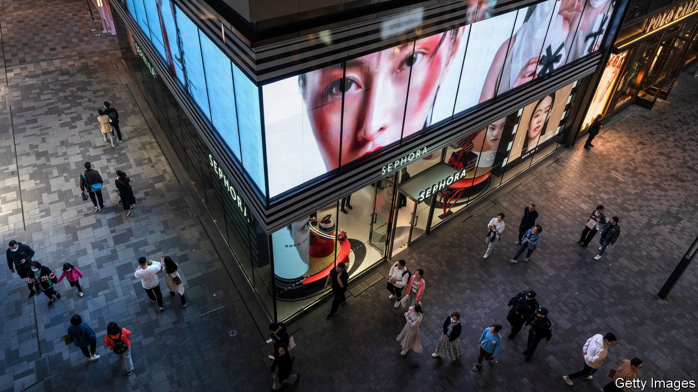
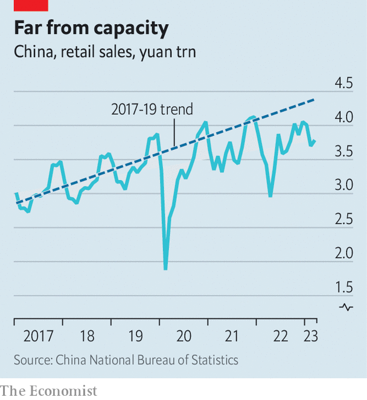

###### Priceless recovery

# If China’s growth is so strong, why is inflation so weak? 

##### A paradox that has analysts snickering 

 

> Apr 27th 2023 

When America unshackled its economy from pandemic-era restrictions two years ago, it also unlocked inflation. By mid-2021, consumer prices were rising by more than 5% compared with the previous year. China’s later, faster reopening is now more than three months old. But inflation remains locked down. Consumer prices rose by only 0.7% year-on-year in March, slower than anywhere else in the world. 

This newspaper described China’s reopening as the biggest economic event of the year. So why has it had such a small effect on prices? Some suspect the recovery is weaker than the official statistics portray. Analysts at China Beige Book, which relies on independent surveys to track the country’s economy, told clients they were “snickering” at official figures showing that retail sales surged by 10.6% in March compared with the previous year.

 


But growth looked laughably strong only when set against 2022, which was lamentably weak. Judged against earlier years, growth in retail sales was more modest and thus more credible. Compared with March 2021, for example, sales grew at the more modest annual pace of 3.3%. 

What is true of retail sales is true of the broader economy. The recovery from last year’s nadir is real and robust. But the recovery to pre-pandemic trends is partial and uneven. China spent much longer under lockdowns than America. It may therefore have further to go before it returns to anything like full capacity. Take property. Although sales this year are stronger than they were late last year, especially in the big cities, they remain far weaker than in 2021 (a boom year) or even 2020. Rents are still falling, contributing to low inflation. 

The drop in the price of fuel for vehicles has also made a difference. China’s great reopening was supposed to lift global energy prices, prolonging the rest of the world’s battle against inflation. Yet as America and Europe have courted recession, oil prices have dropped. The rest of the world’s battle against inflation has curtailed energy prices, prolonging weak inflation in China. 

China’s reopening has departed from the script in other ways, too. In America, workers armed with “stimmy” cheques from the government felt able to cut their hours, quit their jobs or badger their bosses for better pay. There was much talk of a “Great Resignation”. China’s households have had no such luck. They received little direct help from the government under its zero-covid regime. Their labour supply was not therefore “distorted by excessive transfers”, as economists at Morgan Stanley, a bank, point out. 

Indeed, even as China’s reopening has strengthened demand for goods and services, it has improved China’s capacity to supply them. The lifting of restrictions removed bottlenecks and unsnarled supply chains. Despite a weak global economy, China’s exports rose by almost 15% year-on-year in dollar terms in March, as firms finally cleared a long backlog of orders.

Psychology may also help explain China’s inflationless recovery. Companies do not raise prices lightly. If they are not sure stronger demand will persist, they will remain reluctant to charge customers more. China’s economy is growing despite lingering doubts. But inflation may be weak because of them. ■


