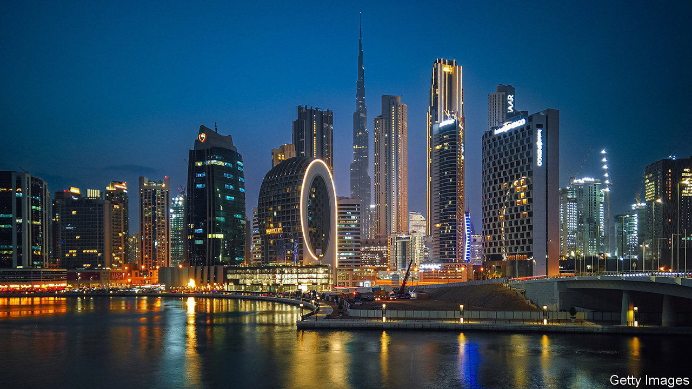
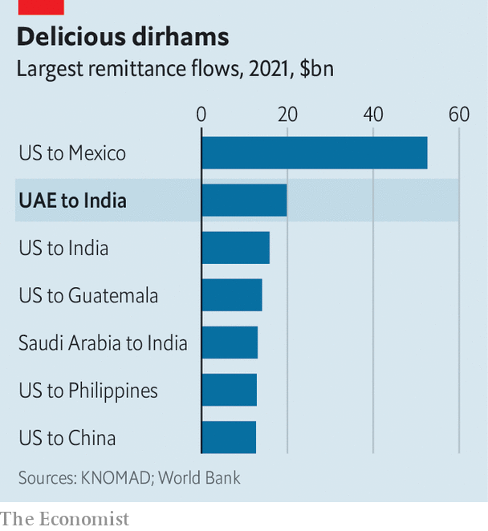

###### Asian commerce

# Indian firms are flocking to the United Arab Emirates 

##### Forget Mumbai. Dubai is the place to be 

 

> Apr 27th 2023 

Stand in the middle of the teeming Meena Bazaar in Dubai and it is not hard to imagine you are 1,200 miles across the Arabian Sea in Mumbai. Lanes are filled with names like Biryaniwalla &amp; Co, Mini Punjab Restaurant and Tanishq jewellery. Arabic works as a means of communication; so, too, do Hindi and Malayalam. The financial institution with perhaps the greatest prominence, looming over the Dubai Creek, is Bank of Baroda, which is controlled by the Indian state. 

Rather than serving merely as an ethnic enclave, the Meena Bazaar is the visible tip of a vast, growing network of Indian businesses—one that includes many of the most important companies in the United Arab Emirates (uae). To live in Dubai is to play a part in Indian commerce. The local business chamber reports that some 11,000 Indian-owned companies were added to its records in 2022, bringing the total number to 83,000. Trade links between the two countries are getting ever tighter.

 


Behind these companies stands a vast diaspora: 3.5m Indians live in the uae, compared with 1.2m Emiratis. These expats collectively sent home $20bn in 2021, a transfer exceeded only by remittances from America to Mexico (see chart). Many in Mumbai joke that Abu Dhabi and Dubai are now the cleanest Indian cities. For the uae, India is a source of food, gems, jewellery, leather, people, pharmaceuticals and investment opportunities. For India, the uae is a crucial source of capital and, increasingly, a place where Indian business can efficiently connect with global markets away from its homeland’s debilitating red tape, crippling traffic, stalled airport immigration lines and punitive taxes.

This relationship would have been unimaginable in 1973, when a store selling Indian saris gave the Meena Bazaar its name. Abu Dhabi was desperately poor. Insufficient desalinisation meant water was often brackish. Until 1966 a version of the Indian rupee, called the “external rupee”, served as the area’s currency. The uae had only emerged from what was known as the Trucial States, tribal lands linked by old treaties, in 1971. Almost all international trade, which (pre-oil) mostly consisted of diamonds, pearls and gems, passed through Bombay. Half a century later, conditions have turned on their head. Crowded Emirati malls glitter with the world’s most sophisticated products. Indian gem traders fill Dubai’s 68-storey Almas Tower, fed by ground-level restaurants such as Delhi Darbar Express and Mumbai Masala.

Travel between the two regions is frenetic and growing. Emirates, Dubai’s flagship airline, is capped by Indian authorities at 66,000 seats a week; it wants another 50,000 and argues higher limits would benefit other carriers, too. Mumbai businessmen frequently make day trips to the uae. Many choose to stay longer, often with “golden” ten-year visas. A survey by the Indian Embassy in the uae finds that 60% of chief financial officers of major firms are Indian. Pankaj Gupta, a fund manager who moved to Dubai from Delhi 25 years ago, says Indians can be found in top jobs across industries in the Emirates. Nominal trade between the two countries has grown by 16% in the past year, boosted by a trade deal that went into effect in May. 

This has had an impact on the geography of Indian success. “Affluent India has a new residential address,” as the has put it. Mukesh Ambani, India’s richest citizen, broke Dubai’s house-price record in August with the purchase of a property for $80m (replete with ten bedrooms, indoor and outdoor swimming pools, a beach and a private spa, it sits at the tip of a palm-fringed archipelago). He then broke that record with a $163m purchase in October (about which details are more scarce). All told, Indians last year spent $4.3bn on housing in Dubai, twice as much as in 2021. Figures on commercial purchases of property are harder to unearth, but one banker reports that interest has been just as intense. These are spurred by odd provisions in India’s tax code that push people who want to get cash out of the country into property investments.

The uae’s tax system exerts its own pull: there are no personal taxes. By contrast, Indian income taxes approach 40% and come on top of swingeing consumption levies. Corporate-income taxes are not only higher in India, they are also bewildering in their complexity. 

There are other important legal differences. The uae technically operates under strict Islamic law. In practice, it now has commercial courts that operate under international standards and a tolerant view of vice. It also encourages religious pluralism. Abu Dhabi recently built an enormous Hindu temple and combined Muslim-Christian-Jewish centre. India is technically secular with established common law. But in practice it offers clogged courts, strictly enforced anti-alcohol and vice laws, and increasing religious strife.

Closer links with the uae are to the advantage of those doing in business in India, too. Beginning in 2020, when Mr Ambani raised billions of dollars from the uae’s many sovereign-wealth funds, the country has increasingly been seen as an important source of capital. Bain, a consultancy, reckons that between 2018 and 2022, Emirati sovereign-wealth funds and other private-equity firms invested $34bn in India, in steadily rising amounts.

The range of investments is impressive. There are direct stakes in some of India’s leading banks, manufacturers and startups. It is widely assumed that if Gautam Adani, India’s second-richest tycoon, recapitalises his businesses, a crucial source of finance will be Abu Dhabi, which has already invested billions of dollars in several of his companies. All of this suggests that the Emirates is evolving into a financial capital for India. 

Yet this evolution is not free of obstacles. In March last year the uae was put on the “grey list” by the Financial Action Task Force, an international body that battles money-laundering and terrorist finance. Locals say that, since the designation, routine cash transfers have drawn intense scrutiny. Some rich Indians who would like to open family offices in the Emirates instead decide to route foreign investments through Singapore and London, respectively three and four times as far away.

Another obstacle is that most Indians’ visas will ultimately need to be renewed. The current Emirati openness and progress has come because the monarchy supports the direction of travel. This has allowed for decisiveness and lavish investment but is also, for many, a reason for caution. What if local leaders change their minds? That said, Indian businessmen also worry about their own rulers, who often seem to operate in monarchical fashion in terms of their whims and favourites. 

Nevertheless, present optimism is now so heady that many see these obstacles as mere wrinkles. They believe that the relationship of Abu Dhabi and Dubai to India will increasingly come to resemble that of Singapore to South-East Asia: small, orderly city-states serving as financial and business conduits to enormous, unruly neighbours where economic dynamism and potential is undercut by chaotic administration and corrosive rules. The strongest statements of this type invariably come from Indians who arrived in Abu Dhabi or Dubai before the turn of the millennium, and have witnessed the cities’ extraordinary rise. They point to large buildings and remember when the properties were just lines sketched in the sand. ■


