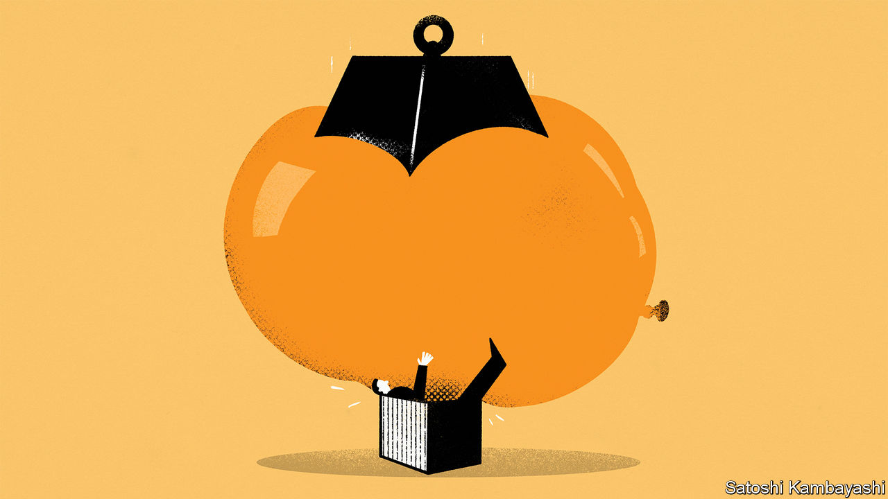

###### Buttonwood

# Investors have reason to fear a strong economy 

##### Meet the next pain trade 

 

> Apr 27th 2023 

It takes two to make a market, which inevitably sets the scene for contradictory opinions. Yet rarely do the signals sent by different markets seem quite as much in conflict as they do today. Here is an incomplete list:


It is difficult to see how all these signals could be correct. Equally, it is difficult to see how they could all be wrong. Normally, the riskiest moments in finance arrive not when different sets of investors hold wildly contradictory views, but when large numbers of them are thinking along similar lines. Recall the near-universal fawning over tech stocks as the dotcom bubble inflated. Or the widespread delusion, in the run-up to the global financial crisis of 2007-09, that securitisation had transformed risky mortgages into safe but high-yielding bonds. In each case, the degree of consensus set the stage for a “pain trade”: a market convulsion that hurt virtually everybody at once. 

Yet even among today’s mutually exclusive opinions there is a scenario that would undo investors’ positions in every market at once. The pain trade of 2023 would be caused by a robust economy and sustained high interest rates.

To see why, start with how professional investors are positioned. Every month Bank of America carries out a survey of global fund managers. April’s found them to be almost record-breakingly bearish, which on its own suggests a brightening outlook would wrongfoot many. This tallies with the contradictory signals from markets. In aggregate, fund managers have loaded up on bonds more than at any time since March 2009, pushing yields down. Nearly two-thirds think the Fed will cut rates in the final quarter of this year or the first quarter of next year. They are shunning the stocks of financial firms more than at any time since the first covid-19 lockdowns. Their top candidates for the most crowded trade are “long big tech stocks” and “short us banks”.

Every one of these positions would be harmed by a strengthening economy and sustained high interest rates. Rising long-term yields would force bond prices down and wreck bets on the Fed cutting. Though banks’ bond portfolios would suffer, steady growth and an upward-sloping rather than inverted yield curve would boost their lending margins and help their shares recover. Without rate cuts, big tech firms would lose access to cheap borrowing, and the higher yields available on bonds would make the uncertain promise of future revenues less attractive by comparison. Their immediate earnings prospects might improve. But with valuations already sky-high, their scope to benefit from this would be limited.

Admittedly, this scenario is far from the most likely outcome. The Fed itself thinks that rates will eventually settle at around 2.5%. Investors and pundits predicting ongoing hawkishness are vanishingly rare. Monetary tightening has already caused global markets to plunge, Britain to flirt with a sovereign-debt crisis and America to experience banking turmoil. The idea that the economy hums along even as rates stay high or rise further seems far-fetched.

Yet monetary policy could also stay tight amid a slowing economy, and that alone would give investors a bloody nose. Inflation, though falling, remains unslain. Jerome Powell, the Fed’s chairman, is determined not to repeat the mistakes of the 1970s by giving up the fight against rising prices too early. And it is not only central banks that influence interest rates. As politicians squabble over America’s debt ceiling, the risk is growing that they miscalculate, trigger a sovereign default and send borrowing costs spiralling by accident. This might seem like a remote risk. But almost by definition, pain trades always do.■


