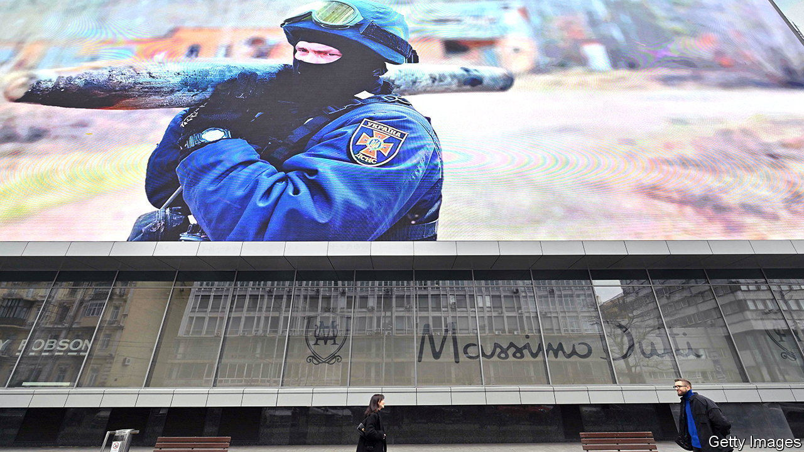

###### Money to burn

# Patriotic Ukrainians are rushing to pay their taxes 

##### Even those behind enemy lines are coughing up 

 

> Apr 27th 2023 


After Russia invaded in February last year, Ukraine’s finance minister, Serhiy Marchenko, braced, logically enough, for government revenues to “plummet”. He says he expected them to fall by roughly as much as economic activity. That did not happen. Although Ukraine’s gdp plunged by 29% in 2022, the state pulled in just 14% less than the year before.

The war has led to big drops in tax revenues from imports and tourism. Blackouts caused by Russian attacks on power plants and the grid, which began in earnest in October, disrupt automated reporting of taxable transactions. What, then, is behind the state’s “unique results”, as an official puts it, in wartime revenue collection?

One explanation is that firms and taxpayers, eager to support their country’s defence, are paying more tax than required. According to Ukraine’s finance ministry, in March last year such donations came to 26bn hryvnias ($880m), rising to 28bn in May. These are considerable sums. Estimates vary, but last year Ukraine’s total revenues, excluding donations, perhaps amounted to some $37bn, reckons Maksym Dudnyk, a tax partner at pwc, who shuttles between the consultancy’s offices in Warsaw and Kyiv. Widespread thinking, he says, goes like this: if Ukraine wins, you’ve got your country; if Russia wins, thuggish authorities will take your money anyway, so why not help out now?

Many Ukrainians are also paying their taxes early. Constantin Solyar of Asters, a law firm in Kyiv, recounts a meeting with a client shortly after Russia’s onslaught began. When the client asked how his company could go about prepaying taxes, Mr Solyar was so moved he could “barely hold my tears”. This sort of early payment has since become normal. A year or so on, Mr Dudnyk says that nearly all the 100-odd clients he serves have begun to prepay.

As Illya Sverdlov of Kinstellar, another law firm, points out, doing so is not entirely altruistic: it also generates good pr, with some companies trumpeting the gesture in the media. But plenty are chipping in quietly, too. The conflict has even led some Ukrainians who have lived abroad for years and who are not public figures to begin paying taxes back home, says Mr Solyar. Efforts to seek loopholes to lower tax bills appear to have decreased.

Perhaps most astonishingly, the State Tax Service of Ukraine continues to receive payments, through its online portal, from occupied territories (albeit not from Crimea, where Russia’s grip is strongest). For people in such areas, the pressure to pay Russian taxes is enormous, says Mr Marchenko, Ukraine’s finance minister. Lots of local businesses must also grease the palms of Russian commanders and militias to get permission to keep operating. Even so, last year 2.3m individuals and organisations in occupied areas paid $9.5bn in taxes to Ukraine. They are braving the risk of retribution from Russian “punishers”, who have a fondness for brutality.

Yet patriotism is not the only reason for higher-than-expected tax revenues. Levies on gas production rose early last year. Danil Getmantsev, chair of the Ukrainian parliament’s Committee on Finance, Taxation and Customs Policy, also points to a crackdown on corruption that has included the dismissal of many tax officials. That effort may have something to do with the increased scrutiny of Ukraine’s governance from Western donors. Even in a time of war, the taxman must still do his job. ■


