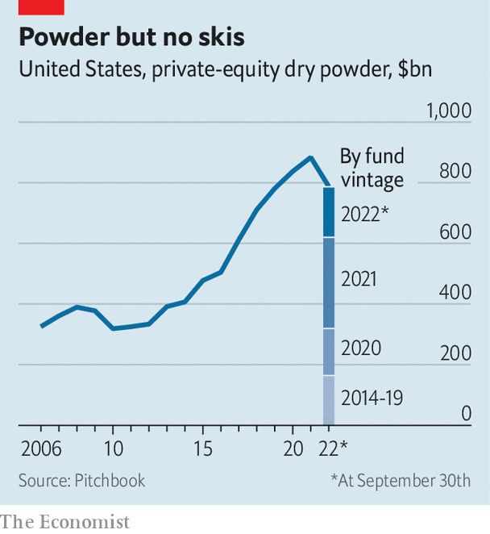

###### The buy-out business

# Welcome to a new, humbler private-equity industry 

##### Dealmakers are getting back to work. Yet they will struggle to recapture past glories 

 

> Apr 25th 2023 

During the past decade it sometimes seemed as if anyone could make a healthy return from private equity. Rising valuations for portfolio companies, and cheap financing with which to buy them, boosted returns and reeled in cash at an astonishing clip. Improving the efficiency of a firm, by contrast, contributed less to returns. As acquisitions accelerated, more Americans came to be employed, indirectly, by the industry; today over 10m toil for its portfolio firms. But last year private equity’s tailwinds went into reverse, as valuations fell and leverage became scarce. By the summer, dealmaking had collapsed. Transactions agreed at high prices in headier times began to look foolhardy. 

Private equity is entering a new era. After months of inaction dealmakers are getting back to work. Economic uncertainty is still driving a wedge between the expectations of buyers and sellers, but more big deals were announced in March than any month since May last year. In one such deal Silver Lake, a tech investor, announced it would buy Qualtrics, a software firm, for more than $12bn, with $1bn in debt commitments—not much leverage, but a buy-out nonetheless. The industry that emerges from this period will be a different beast from the all-consuming giant of the 2010s. Private equity will be dogged by its folly at the top of the cycle. Growth in assets is likely to be less rapid. And the new phase will favour owners willing to roll up their sleeves and improve operations at the companies they have bought.

Since funds invested during downturns tend to be among private equity’s most profitable, some investment managers, sensing expectations of a recession have created bargains, are now itching to deploy capital. They are scooping up companies with valuations that have been struck by rising interest rates. On April 17th thg announced it had received a non-binding bid from Apollo, a big private-equity firm. The beleaguered British e-commerce company had seen its share price fall by 90% since 2021. In February Francisco Partners beat away a crowded field of other potential private-equity buyers to strike a $1.7bn deal to purchase Sumo Logic, for around four times the value of its annual sales. The American software firm had traded at a multiple of more than 15 in 2021. Bain Capital, another big private-equity firm, has built a $2.4bn tech-focused fund to take advantage of turbulence in the sector.

Corporate carve-outs also have gilet-wearing types excited. Such deals, where large companies shed unloved assets, have fallen as a share of private-equity transactions since the global financial crisis of 2007-09. But given tough economic conditions, companies are increasingly looking to sell “non-core” assets in order to focus operations and bolster balance-sheets. Spin-offs announced by American firms surged by around a third in 2022, according to Goldman Sachs, a bank. 

The problem is that today’s bargains are yesterday’s rip-offs—and dealmaking was happening at a much faster pace a few years ago. Buying at the top of the market is a disaster whether that market is public or private. One steely private-equity boss says he likes to remind his investors that a buyer of Microsoft shares in the months before the dotcom bubble burst in 2000 would have had to wait until 2015 to break even. Until an investment is sold, the score is kept by quarterly valuations. Investors in private-equity funds are not expecting to see large write-downs in their investments. But of the $1.1trn spent on buy-outs in 2021, it is the third ploughed into tech companies, often at peak valuations, that is attracting the most attention.

 


Older deals pose a particular threat to funds that were more trigger-happy. The cost of floating-rate borrowing has rocketed. The yield on the Morningstar lsta index of leveraged loans, which was 4.6% a year ago, has jumped to 9.4%. Although recent buy-out deals involved less borrowing as a share of their value, lofty valuations nonetheless meant that borrowing increased relative to profits. This has left some firms walking a financial tightrope.

When mixed with a portfolio firm’s underlying business problems, high interest costs can add to the danger. Consider Morrisons, a British supermarket bought by Clayton, Dubilier and Rice, an American investor. The grocer has lost market share to cheaper retailers, as inflation has stretched customer wallets. According to CreditSights, a research firm, the company’s interest bill will more than quadruple this year. Things could be still more perilous in the tech industry, where many of the largest deals of the past few years were financed with floating-rate loans.

As in any subdued market, lots of funds will struggle to raise capital. A more existential question is if the opportunities now available can sustain an industry that has grown so enormous. Andrea Auerbach of Cambridge Associates, an investment firm, says she is “most concerned about returns being competed away in the upper regions of the market, where there are fewer managers with a lot more dry powder”. 

Since the industry has swollen in size, mega-funds that have raised more than $5bn are now much more common than they used to be. In America such funds sit on some $340bn in dry powder, a pile which could swell to twice that amount with the use of leverage. Optimists point to the size of the public markets in comparison. There are around 1,100 profitable listed American companies worth $1bn-20bn; their market values add up to around $6trn. Although this looks like a big pool of potential targets, investment committees searching for “goldilocks” operating qualities—including stable cash flows to service debt and a good deal on price in the most competitive patches of the market—may find that it is not quite big enough.

In this more restrained era, private-equity managers might have to ditch their habit of chasing the same targets. Over the past decade, around 40% of sales of portfolio firms were to another private-equity fund. But there are probably fewer operating improvements to be made to such firms, making them less alluring to buyers. 

Private-equity funds unable to buy cheaply will need to raise the profitability of their assets if they wish to make money. They can be efficient custodians; concentrated ownership, a penchant for bringing in outside managers with financial incentives to boost profits, rigorous cost control and add-on deals (where a fund merges another smaller operation into its portfolio company) all contribute to stronger profits. Yet for many firms, such operating improvements have been a sideshow during the past decade. Rising valuations relative to profits accounted for more than half of private-equity returns, according to an analysis by Bain, a consultancy. Between 2017 and 2022, improving profit margins provided a measly 5% of returns.

Do not expect a pivot from financial to operational engineering to benefit all private-equity funds equally, even if dusting off old textbooks increases the industry’s management prowess. Higher debt costs make add-ons more costly, and such deals are increasingly the focus of vigilant competition authorities. A downturn could also exacerbate political opposition to the industry’s cost-cutting, especially in sensitive industries such as health care.

All this means pension funds and endowments, typical investors in private-equity funds, will spend the next few years debating which managers truly earn their high fees. Most corporate raiders—veterans of the explosion in leveraged finance during the 1980s—are long retired. In their place stand a professionalised cadre of moneymakers too young to recall the high interest rates of their industry’s prehistory. Those able to strike bargains, and funds with deep industry expertise and lots of skilled operating professionals, could prosper. Pretenders previously lifted by rising valuations and cheap leverage during the past decade will certainly not. ■


