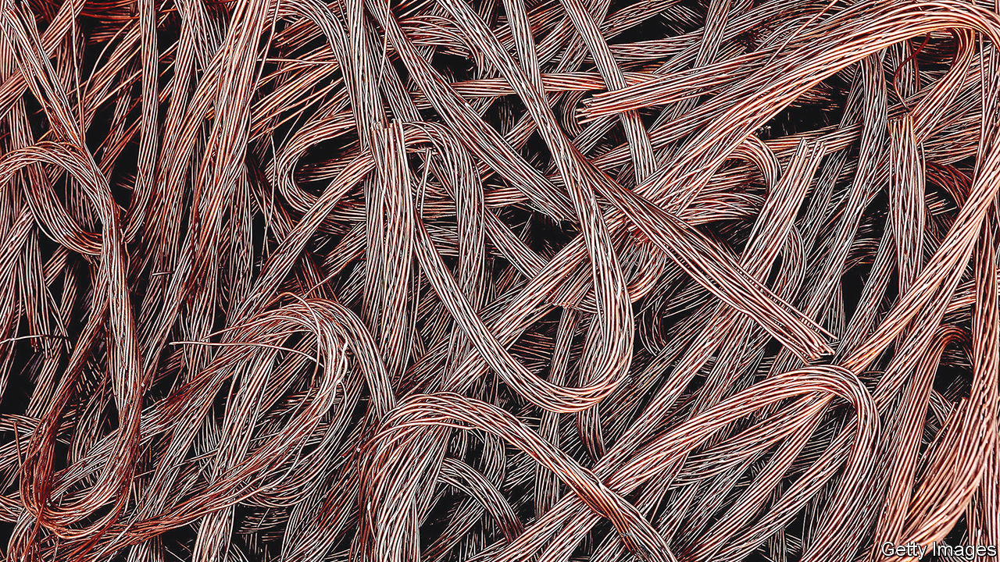

###### Crossed wires

# Why commodity-trading scandals are multiplying 

##### And banks are undeterred 

 

> Apr 27th 2023 

The choppy waters of commodity trading have claimed another victim. On April 23rd it emerged that ING, a Dutch lender, was suing ICBC, China’s biggest bank. ING accuses ICBC of releasing export documents to Maike, a trader that once handled a quarter of China’s copper imports, without first collecting payment owed to ING. Shortly after this Maike ran out of cash, sinking hope of recouping the money. Now ING is seeking $170m from ICBC for its alleged error. 

Such disputes are becoming painfully common in the industry responsible for ferrying food, fuel and metals around the world. Last year traders stopped supplying a Chinese metals merchant after $500m-worth of copper went AWOL. In February Trafigura, a trading giant, booked $600m in losses after discovering that cargoes of nickel it had bought were in fact worthless stones. Last month the London Metals Exchange (lme) found bags of stone instead of nickel at one of its warehouses. 

The 40-odd banks that finance the bulk of the $5.5trn-worth of raw materials which travel the globe every year are often on the losing end of such scandals. France’s Natixis and Italy’s UniCredit were among those fooled in 2020 when Gulf Petrochem, a now-defunct trader, misdelivered oil, before fleeing creditors. JPMorgan Chase is the unlucky owner of the 54 tonnes of fake nickel found by the lme. 

Commodity trading has long been vulnerable to foul play. Unlike manufactured goods, such as cars or smartphones, common raw materials are priced according to public benchmarks. These can move far and fast, wrong-footing traders; the widespread use of financial instruments to hedge against, or speculate on, price movements can magnify losses. Commodity trading is full of obscure middlemen, sheltered in countries with lax policing, that have little reputation to lose. 

Lately there have been wild swings aplenty. In April 2020, as lockdowns sapped demand for energy, the collapse of Hin Leong, a Singapore-based oil trader accused of fraud, left 23 banks on the hook for $3.9bn. Last year Maike used its pricey copper to raise funds to bet on Chinese property—shortly before zero-covid policies and debt rationing strangled the sector. Rising prices for fuels and metals seem to have made trickery all the more appealing. 

More frequent scandals, and stricter rules on risky lending in rich countries, have prompted a few banks to backtrack. ABN Amro, a Dutch lender, quit commodity-trade finance in 2020. BNP Paribas and Rabobank have trimmed their portfolios. 

Yet instead of retreating, most big banks have refocused on the larger traders. Trafigura, which borrows from some 140 banks, increased its credit lines by $7bn to $73bn last year. Meanwhile, smaller firms in countries for which commodities trading is bread-and-butter, such as Switzerland, where the industry employs 10,000 people, can still find enough working capital to go on, notes Jean-François Lambert, an industry consultant. Singapore’s three main banks remain active lenders, too. 

Commodity-trade finance will only get more alluring. The industry is growing fast and ever hungrier for capital. Its aggregate gross margin has doubled since 2009, when markets boomed, to a record $115bn. McKinsey, a consultancy, estimates that volatile commodity prices, rising interest rates and longer shipping times will push traders to look for an extra $300bn-500bn in working capital between 2021 and 2024. 

For many governments, worried about the supply of raw materials, commodity trading has become strategic. Earlier this year Germany and Italy said they would guarantee loans to Trafigura, lowering risk for its creditors. Local midsized banks are pondering an entry, says an industry veteran. Existing players are upping their game as well. In January Standard Chartered named its first commodity-trade chief. Last year Mitsubishi bought BNP’s American commodity-finance arm. Years of volatility bode well for the big traders—and few banks are willing to miss the boat. ■


