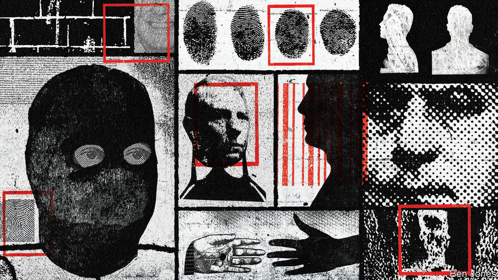
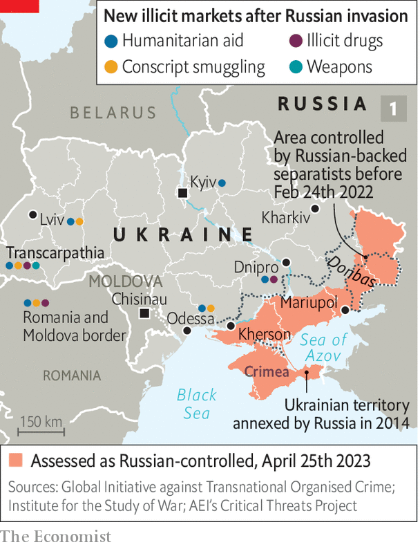
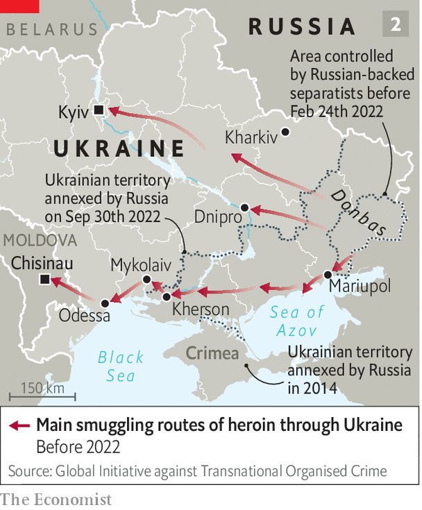

###### Criminal underworlds

# How the war split the mafia 

##### It has transformed crime not only in Russia and Ukraine, but around the world 

 

> Apr 24th 2023 


Aleksandr otdelnov owns an unusual tourist attraction: a smuggling museum. Contraband has been flowing through his native  since the 18th century. Until it closed because of covid-19, the museum displayed everything from pearls and pistols sneaked into imperial Russia to more contemporary loot. Then came the war in February 2022. “The port stopped working, and everything stopped,” says Mr Otdelnov. It wasn’t just the tourist flows that ended. Odessa had been a key node in a vast network of crime centred on Ukraine and Russia that reached from Afghanistan to the Andes. It was part of the “strongest criminal ecosystem in Europe”, reckons the Global Initiative against Transnational Organised Crime (gitoc), a think-tank.

 


 has hit this underworld with the force of an earthquake (see map 1). The vast majority of rock-hard Ukrainian mobsters have stopped collaborating with their Russian peers. “We are thieves, we are against any state, but we decided we are for Ukraine,” says one. Lucrative heroin-smuggling routes are being remapped, affecting prices and profits for criminal syndicates thousands of miles away. If the disruption proves lasting it could alter the face of global crime. It will also change Ukraine.

The country has struggled with corruption ever since it left the Soviet Union in 1991. The Maidan revolution of 2013-14 overthrew a corrupt president and some of the oligarchy behind him. In 2019 Volodymyr Zelensky was elected as president on an anti-corruption platform and passed mafia-busting reforms. But at best it was a half-finished clean-up. Before the invasion gitoc ranked Ukraine 34th-worst out of 193 countries on its criminality index, and third in Europe. Ukraine also scored notably badly on perceptions of corruption.

The underworld in the government-held parts of Ukraine before 2022 was intermittently, and violently, contested between different groups. Nonetheless it had three facets that linked Ukraine to global criminal markets. First, a contraband “superhighway” linking Russia and Ukraine, passing through the parts of eastern Ukraine that were occupied by Russia in 2014. Second, global smuggling hubs in Odessa and the other Black Sea ports. And finally factories in Ukraine for the production of illicit goods for export.

 


This infrastructure supported different business models for different products. Ukraine was a growing “spin-off” transit route for , augmenting routes through the Balkans and the Caucasus (see map 2). Before the war it had the fourth-largest heroin seizures in Europe. Cocaine from Latin America flowed via the Black Sea. In the other direction, mobsters exported weapons to Asia and Africa, notably from Mykolaiv, a port. In 2020 Ukraine overtook China to become Europe’s largest source of illegal tobacco. The local manufacture of amphetamines was rising: 67 illegal laboratories were dismantled that year, the highest reported figure of any country.

The war has changed everything by creating “an environment of unacceptable risk for international illicit trafficking”, says a new report from America’s government. Black Sea ports have been closed or much restricted for shipping. The boundary between government-run Ukraine and the territories occupied by Russia is now a fortified series of killing fields, breaking the superhighway. Enlistment in Ukraine has deprived the underworld of manpower while martial law has stopped a wide range of criminal activity. Curfews make it harder to move around at night.

Ukrainian gangsters are also shunning their Russian counterparts. “It is one thing to be called a criminal; quite another to be thought of as a traitor,” says Mark Galeotti, author of “The Vory: Russia’s Super Mafia”. Loyalty to Ukraine is about risk control as well as patriotism. “If we were annexed to Russia, many of the guys in prison might be transferred a long way away,” explains one gangster. “Russian guards are merciless. None of us need that. So we’ll do the dirty work for Ukraine.“

The knock-on effects are being felt globally as contraband networks are reconfigured to bypass Ukraine. Turkish customs officials say more heroin and methamphetamines are flowing across the border with Iran. Lithuanian border officials saw a fourfold year-on-year rise in illicit tobacco volumes in the first quarter of 2022. Estonian officials working with Europol, the eu’s police agency, nabbed 3.5 tonnes of Latin American cocaine in the port of Muuga, worth roughly half a billion euros, last year. The blocking of Ukraine’s Black Sea ports and increased controls in western Europe may also explain large seizures recently in Russia. On April 10th the authorities seized almost 700 kilos of cocaine in Moscow. Russian wiseguys close to the border with Belarus, once marginal, are now profiting from the smuggling of luxury goods into Russia, especially fancy designer handbags.

The war has also meant new short-term opportunities for gangsters in Ukraine. One is people-smuggling. The un estimates that about 5m Ukrainian refugees are in “temporary protection” in Europe, and its statistical modelling of historical trends suggests perhaps 100,000 might become victims of people-trafficking. There is also a market for smuggling conscripts out of Ukraine. Sometimes this can be as simple as sneaking them past Ukrainian passport control. At least 8,000 have been caught trying to leave the country, mostly for Moldova or Poland. Smugglers reportedly charge from €5,000 ($5,500) to €10,000. Still, so far the scale of human-trafficking is not as bad as it could be. “It happens,” says a senior Europol official, “but far less than we expected.”

The long-term impact of the war on criminality in Russia is likely to be malign. The state has intensified links with organised criminals that were already established, though only occasionally exploited, according to Mr Galeotti. Russian mobsters operating outside the country have been required to deposit a share of their profits in so-called “black accounts” that can be accessed by Russia’s spies to cover their operating costs. Criminals have been recruited to act as Kremlin intelligence agents, notably to help obtain much-needed embargoed semiconductors for the war effort. The seizure of Western-owned firms in Russia by the Kremlin or its proxies will fuel a new era of cronyism, while the requirement to mask cross-border transactions or bypass the Western financial system will reduce transparency and accountability further.

For Ukraine the long-run picture is less clear cut. A frozen conflict could certainly create big risks. Before the invasion Ukraine had somewhere between 7m and 9m legal firearms. There were perhaps as many illicit ones. The country is now even more awash with weaponry. History suggests that wars fuel arms-dealing: guns from Yugoslavia are used in violent crime across Europe. Interpol’s secretary-general, Jürgen Stock, has warned there could be a surge in the trafficking of small arms. So far, however, so good. “We are not seeing arms-trafficking on a systematic or organised basis,” explains the Europol official.

Domestic drug production could crank up again. America’s government recently reported the growth of more distributed networks of smaller drug laboratories in Ukraine which use the internet for sales and the postal system for delivery. The biggest risk comes from the process of reconstruction. Last month the World Bank put the cost of rebuilding Ukraine at $411bn, including $92bn on transport and $69bn on housing. Such large-scale projects could easily be preyed upon by mafias, who rig public-procurement systems and bidding systems to gain access to land, subsidies and licences.

Still, there is an opportunity to make permanent the diminution in organised crime in Ukraine. The main effort must come from within the country. A draft law from December aims to reform urban planning: related government documents say the construction industry is prone to “abuse of power”, “general corruption” and “avoidance of punishment”. In January Mr Zelensky fired four deputy ministers and five regional governors for graft, according to Reuters. “Any internal problems that interfere with the state are being cleaned up,” he declared.

Outside pressure may help: those reconstruction funds are likely to come largely from foreigners and to have strings attached. Ukraine’s eventual membership of the eu is still many years away but the process of converging with eu norms is a lever with which to combat organised crime. The country was given candidate status back in June.

It is a truism among those who study organised crime around the world that war and social dislocation generate opportunities for gangsters and their white-collar collaborators. Yet there are unusual elements of Ukraine’s experience that might permit a different result. The war has severed the decades-old physical and social arteries between the country and Russia’s criminal networks, possibly for years to come. It has given the Ukrainian state further public legitimacy to combat oligarchy and may increase Western participation in, and scrutiny of, the economy. No one sensible thinks smuggling in Odessa will be relegated to a museum. But there is a chance that Ukraine could finally stop being a gangsters’ paradise.■

