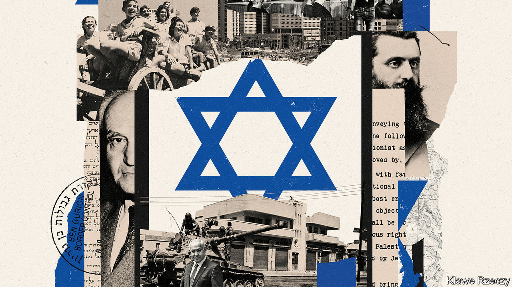

###### Survivor nation

# As Israel turns 75, its biggest threats now come from within 

##### The country needs a new political settlement that diminishes the power of extremists 

 

> Apr 27th 2023 

As Israel marks , take a moment to admire how it has triumphed against the odds. Before it declared independence in 1948 its own generals warned that it had only a fifty-fifty chance of survival. Today Israel is hugely rich, safer than it has been for most of its history, and democratic—if, that is, you are prepared to exclude the territories . It has overcome wars, droughts and poverty with few natural endowments other than human grit. It is an outlier in the Middle East, a hub of innovation and a winner from globalisation. 

Yet, as we explain,  faces a different set of opportunities and threats in the coming decades. You can get a taste of this from the turmoil of recent weeks: a constitutional crisis over judicial independence triggered by the right-wing government of Binyamin Netanyahu; an eerie power vacuum in the stagnant West Bank; and the rules of the old American-led order being shredded as Saudi Arabia, Iran and China cut new deals. In the 20th century the risk of invasion threatened Israel’s survival. In the 21st the danger is that internal splits sap it of the strength and agility it needs to thrive. 

Israel’s achievements are easy to take for granted. After 1948 it built a liberal—and gladiatorial—democracy with fiercely independent courts, despite lacking a written constitution. After flirting with socialism it embraced markets. In 1980 its gdp per person was about half of Germany’s; now it is 12% higher. It is 11 times richer than Egypt. Israel has more “unicorn” tech startups than the rest of the Middle East and more Nobel prizes than China. It has navigated geopolitical shifts adeptly. After the cold war it absorbed 1m Jewish migrants from the Soviet Union, while maintaining its special relationship with America.

Like most successful places it has married an embrace of competition and disruptive change with a capacity for unity when the stakes are high enough. Its military advantage over its vastly more numerous Arab neighbours reflects superior technology, and also an army of over 400,000 motivated reservists. As climate change has intensified droughts, it has created a state-run, world-leading desalination network supplying half its water. In its darkest and most divisive days—the Yom Kippur war of 1973; its disastrous invasion of Lebanon in 1982; the murder of prime minister Yitzhak Rabin in 1995, and all the endless failed peace talks with the Palestinians—it has managed to adapt and find a new political and social accommodation.


Israel’s ingenuity and resilience will be tested again by three new trends. First, demography. The country is young: its population could rise from 10m now to 20m by 2065. But it is growing more divided. Mr Netanyahu’s coalition relies on far-right religious parties enmeshed in the growing settler movement. Reflecting this, it wants to limit the independence of the courts, which it sees as unrepresentative. Meanwhile the share of citizens who are ultra-Orthodox, a group less likely to work, do military service or attend conventional schools, will rise from 13% now to 32% by 2065. This will further fragment the electorate, shift politics rightwards and strain Israel’s liberal-democratic character. Over time the values of ultra-Orthodox citizens may evolve as more attend conventional schools or get jobs. But if Israel’s lurch from liberal values continues it will endanger prosperity. Its coders, capitalists and creatives may move elsewhere. 

The second big shift is the fading global salience of the Palestinians, 3m of whom live in the West Bank under a “temporary” Israeli occupation and 2m of whom are pinned down in Gaza. In the 20th century American presidents strained mightily to try to broker a peace deal, assuming that it was the key to making Israel secure and unlocking the potential of the moribund Middle East. Now the world has given up and moved on. For Israel this may seem like a boon. It is unlikely to be forced by outside powers to make big concessions on territory or settlement-building, even as it has built political, defence and economic ties with more Arab states through the Abraham accords, signed in 2020. 

Yet in the longer run it is hard to see how ignoring the Palestinians can work out well for Israel. The economic gap grows ever larger: gdp per person in the West Bank is 94% lower than in Israel, and on a par with Papua New Guinea. The Palestinian Authority is collapsing; its ageing leaders have suspended elections and lost legitimacy. Israeli hardliners once grudgingly accepted the benefits of mutual economic development, even as they denied Palestinians political rights. Now Israel’s ascendant right-wing parties want to isolate and impoverish the West Bank. It and the even more wretched Gaza may end up as failed statelets, compromising Israel’s safety and moral standing.

The final shift is the advent of a multipolar world. America was the first country to recognise Israel in 1948 and has been its staunch ally. A more distributed global balance of power will create new opportunities for Israel, including links with Arab neighbours and with China and India, which care little about the Palestinians. Already Israel trades more goods with Asia than with America. The catch is that America still provides 66% of its arms imports and a de facto security guarantee that deters attacks, including from Iran. On Israel’s present, illiberal political path,  for it in America will weaken and grow more partisan: one in four American Jews say it is an apartheid state.

The plan for 2048 

Israel’s first prime minister, David Ben-Gurion, wrote in his diary that Israel’s “fate lies in the hands of its defence forces”. Today it also lies with its political system. It is easy to imagine a virtuous cycle that allows Israel to thrive in the next few decades. The key is a new political settlement that diminishes the power of extremists and is flexible enough to absorb the stresses from demographic shifts. That is why Israel must establish a constitutional convention that codifies the powers of parliament and the courts, and encourage a party realignment that affords its centrist majority more weight—which would require the exit of the divisive Mr Netanyahu. More moderate politics at home would hold open the possibility of a more just and pragmatic stance towards the Palestinians, and reduce the risk of estrangement from America. Israel controls its own fate. It is time to act.■


