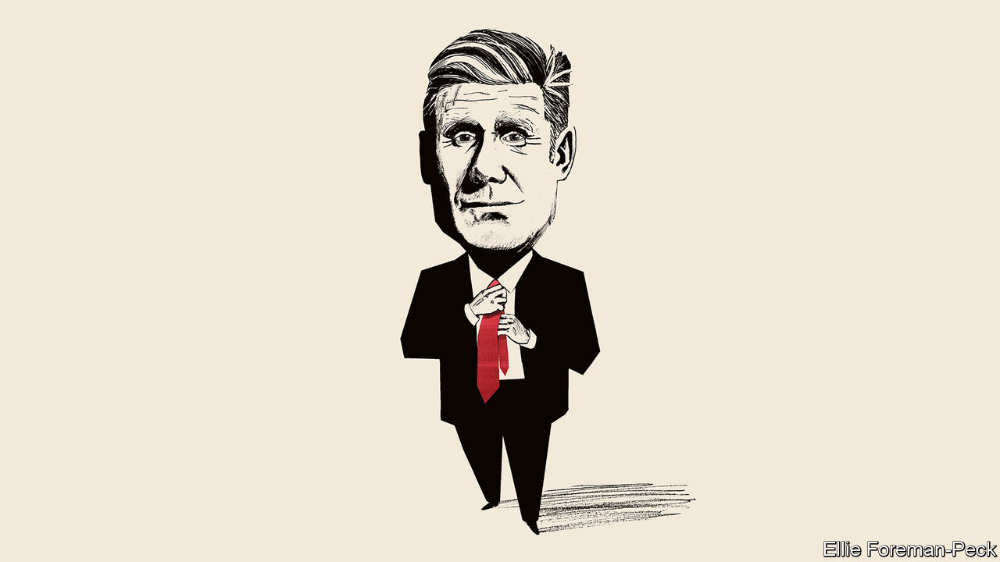

###### Keir thinking

# Is Keir Starmer ready for office? 

##### Britain’s Labour leader has made his party electable again. But there is more to do 

 

> Apr 27th 2023 

It is 26 years since Labour last wrested power from the Conservatives in a British general election. At the moment Sir Keir Starmer, the leader of the Labour Party, is on course to emulate Sir Tony Blair’s achievement in 1997. The next election must happen by January 2025 and is likely to take place sooner. Labour enjoys a big, if narrowing, poll lead and has positioned itself assiduously as a government-in-waiting. That alone is remarkable. Sir Keir became the party’s leader in 2020, soon after Jeremy Corbyn had led Labour to its worst electoral defeat since 1935. Labour has been greatly helped by the Tories’ haplessness in office; even so, to have a good chance of winning is a huge turnaround. 

But to take power, Labour still needs to persuade voters of three things. First, that it is genuinely competent. Second, that it is not a bunch of closet Corbynites, touting pro-business policies before the election and unfurling red flags after it. Third, and most important, that it has ideas for how to fix some of the entrenched problems that Britain faces. On the first two, Sir Keir has good answers. On the third, work is needed.

Competence is core to Sir Keir’s appeal. He lacks Sir Tony’s charisma; he does not excel at the cut and thrust of parliamentary debate. But he does know how to run large public-sector organisations: before becoming an MP in 2015, he was in charge of the Crown Prosecution Service. When asked to , he focuses as much on the “how” as the “what” of government. That is partly in response to the political chaos of recent years—the combination of Brexit, Boris Johnson and Liz Truss has made stability seem sexy. But it is also central to Sir Keir’s diagnosis of what ails Britain: a short-termist and siloed approach to government. 

He has outlined five “missions” for a Labour administration, from achieving the highest sustained growth rate in the G7 to having zero-carbon electricity by 2030. These missions are designed to direct the energies of a future Labour government over the course of a five-year parliament and beyond. Such ambitions might seem like so much wishful thinking, but the insight that a more effective state would make a big difference to Britain is entirely right. A failure to join the dots between government departments helps explain why too many people languish in hospitals rather than being discharged into social care. Health outcomes would be better with a greater emphasis on prevention. The endless churn of policies and ministers is a problem that predates the turmoil of recent years. 

Sir Keir’s overhaul of Labour speaks to the question of competence, too. And it allays the fear that he is much further to the left than he cares to admit. The Tories endlessly remind people that Sir Keir served under Mr Corbyn, and that he won the leadership with a redder set of policies than those he now espouses. But he has been ruthless in . Mr Corbyn will not stand for Labour again; Momentum, a far-left campaign group, would be better named Inertia; the slate of new Labour candidates is relentlessly Starmerite. The hard left ought to be able to recognise a good purge when they see one. 

This is still Labour. It does not think an activist state is a thing to be shunned. But its policies are mainstream social democratic, more Olaf Scholz than Alexis Tsipras. On foreign policy the anti-Americanism of the Corbyn years is gone; this is an Atlanticist party again. Domestically, Sir Keir is at pains to say that tax rises cannot be the answer to every problem; he insists that proposed tax hikes on private equity and private schools are not a harbinger of a war on wealth. Under his leadership Labour accepts that private providers have a role to play in the National Health Service. On industrial policy, there is a real risk that public money will be wasted but the party’s promise is to bring in private capital, not nationalise everything. 

Labour has rightly identified economic growth as the central priority, the only way to ensure that public services can be properly funded without taxes rising and rising. The party is offering a supply-side statism, in which the government works with business to identify specific policies, sector by sector, that will help boost productivity. 

Indeed, the big question is not whether Sir Keir stands for anything or whether he is a closet communist, but whether he will smash enough barricades. Making Labour electable again has required him to radiate a reassuring brand of centrism. That offered a credible path to victory while Mr Johnson and Ms Truss were doing their slapstick routines in Downing Street. But now that the competent, pragmatic Rishi Sunak is in charge, it may no longer be enough for Labour to win. 

It is certainly not enough for Britain to thrive. Breaking the queasy equilibrium of low growth, high taxes and creaking services will require Labour to make bold decisions and real enemies. In the area where he can have most impact quickly, Britain’s broken planning system, Sir Keir sounds more willing to have a fight than Mr Sunak, who has caved in to his backbenchers and party members. Yet in other areas, it is not clear how far the Labour leader will go. 

He promises more devolution, for example, but skirts the question of whether local conurbations will get more fiscal responsibility, as they should. He needs a deeper economic relationship with Europe to bolster growth and more migrants to fill gaps in the public-sector workforce, yet hesitates to shout about it. Making the state work better will mean spending more money in some areas. But in trying not to scare the horses on taxes, sensible reforms, such as updating the property valuations that underpin council tax, are left to one side.

Victoria Audacia Crescit

It is understandable at this stage of the electoral cycle for an opposition party to leave some things unsaid. Yet it will not be sustainable for much longer. When Sir Tony won his victory in 1997, the economy was bubbling and Labour was soon able to invest boatloads of money into the public services. Sir Keir would not have that luxury. He has made Labour electable again. But to distinguish himself from Mr Sunak and to change Britain for the better, he still has some hard choices to make. ■


