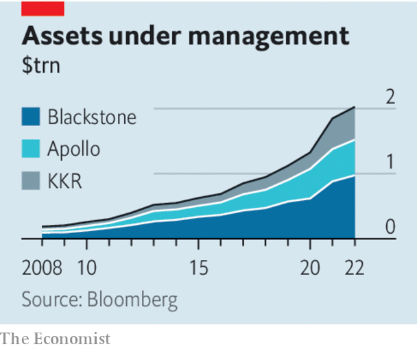

###### Private’s progress

# Private markets remain attractive, even in a higher-rate world 

##### Private credit, not buy-outs, is stealing the limelight 

 

> Apr 27th 2023 

A decade of  turbocharged a spectacular boom in private markets. As pension funds and other institutional investors hunted for yield after the global financial crisis of 2007-09, they ploughed money into private-markets firms, which in turn invested it across private equity, credit, property and infrastructure. The three biggest listed such firms—Apollo, Blackstone and KKR—manage more than $2trn in assets between them, up from $187bn in 2008.

Now, however, the Federal Reserve has  at its fastest pace in four decades. The reversal has already caused turmoil in the banking industry; as we published this, the share price of First Republic, a lender based in California, had been bludgeoned. What does the new world hold for private markets? 

 


Higher rates, together with a cloudy economic outlook, may well humble . The business of buying, managing and selling heavily indebted firms is more difficult today than at any point during the past decade. Returns look far less attractive now that yields have jumped on fixed-income investments. Private-equity managers could once rely on rising valuations and cheap debt to fuel returns. Now they will have to wring efficiency improvements from the firms they own. 

Yet for the private-markets giants, private equity is becoming less of a focus. When Blackstone reported its first-quarter results on April 20th, for instance, the company’s credit funds stole the limelight. During the quarter they received a big chunk of inflows from investors, and assets under management in the firm’s credit-and-insurance arm now exceed those in private equity. In recent years both Apollo and KKR have acquired big insurers, which in turn are big investors in debt.

As banks shy away from some riskier lending activities, private debt markets are helping fill the gap. When credit markets tightened in 2022 and banks pulled back from financing buy-out deals, private credit stepped in. In time it is likely to pop up in more corners of the credit markets, including property and infrastructure. Last year Apollo struck a deal to buy Credit Suisse’s securitised-products business, which lends to other lenders.

For investors, the allure of private markets remains. Those repositioning their portfolios are likely to do so within private markets rather than move away from them. According to a recent survey of institutional investors conducted by BlackRock, an asset manager, 43% were planning to substantially increase their allocations to private equity. This next phase of growth is likely to favour the biggest private funds; they are better placed to attract cash, including from flush sovereign-wealth funds, which are expected to increase their investments in private assets over the next decade.

Private markets are notorious for their opacity. As the private managers grow in size and complexity, and their insurance businesses expand, regulators must be watchful. A significant rise in corporate defaults could also test how judicious a lender private credit has really been. 

Nonetheless, regulators have historically welcomed the transfer of risky lending activities from deposit-taking banks to non-bank institutions, with good reason. The process of maturity transformation at banks exposes them to runs, and ordinary depositors to losses. A shift towards private credit, where sophisticated investors bear the risks instead, is preferable. ■

