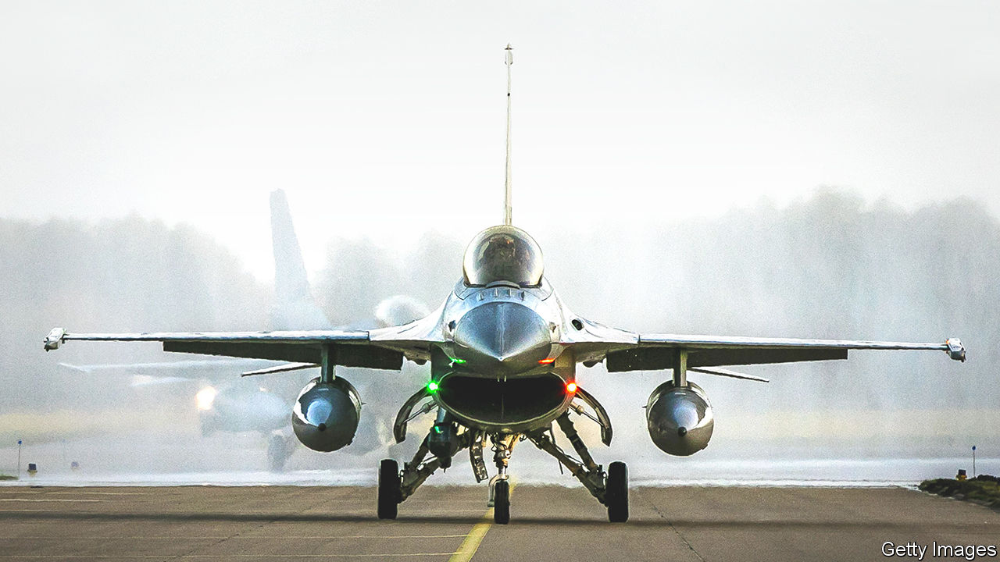

###### The war in Ukraine

# The West should supply Ukraine with F-16s 

##### Or Russian fighter jets may win control of Ukrainian skies 

 

> Apr 26th 2023 


As Ukraine prepares its forces for a crucial counter-offensive, the argument among its Western allies about what equipment to provide chunters on. Having finally received the tanks it had been pleading for since last year, Ukraine has increased the intensity of its demands for fighter jets. Yet its pleas are falling on largely deaf ears. About 30 former Warsaw Pact MiG-29s are on their way from Poland and Slovakia. But what Ukraine says it needs are the American F-16s that have been the backbone of nato air forces for much of the past 40 years.

Ukraine is right. The arguments for denying it  are becoming threadbare. At the start of the war, Ukraine had about 125 elderly combat-capable aircraft, of which a little over half were air-superiority fighters. At least 40% of them have since been lost. Russia can still field roughly five times as many fighters as Ukraine started the war with. Nearly all are newer, with longer-range radars and air-to-air missiles.

Even so, Russia has not been able to establish air dominance over Ukraine. That could change. As well as losing planes, Ukraine is running low on the Soviet-era surface-to-air missiles (sams) on which its ground-based air defence has mainly depended. It is getting more Western systems, but integration takes time. If flying in Ukraine’s airspace becomes less dangerous, Russia could establish air superiority—first over Donbas and then other areas. The chances of Ukrainian land forces retaking territory could evaporate.

Nevertheless, Ukraine’s Western backers say that beefing up its ground-based air-defence system is the priority, and that fighter jets would be an expensive distraction. Even if approval were given to supply F-16s, they say, it would be a year before they became mission-capable because of the time required to train Ukrainian pilots and maintenance crews. F-16s need smooth runways that Ukraine lacks. Finally, they argue, Russia would regard the supply of F-16s as a major escalation.

Getting new sams into Ukraine is indeed vital. But almost everything else about this excuse for inaction is just that: an excuse. Ukraine has more pilots than planes, so training on F-16s could begin right away, and they could be flying before the end of this year. And much of the servicing of F-16s could initially be carried out in Poland and Romania, both of which use the plane.

Runways are more of a problem. Some aircraft could be damaged by debris. Sweden’s Gripen, which requires less maintenance and can take off from short runways and even roads, would be ideal. However, there are relatively few Gripens in Europe—perhaps 126, of which Sweden has about three-quarters (Ukraine reckons Sweden might be able to spare 12 of them, an offer well worth taking if made). That compares with the 4,600 F-16s that have been built since the 1970s.

As to the self-deterring fear of escalation, fighter jets for Ukraine would send a message to Vladimir Putin about the West’s long-term commitment. He might respond with possibly deniable physical sabotage or cyber-attacks, but few observers think that deploying F-16s would prompt the Kremlin to start World War III. And Ukraine’s air force will have to be recapitalised with new aircraft sooner or later, so why wait? President Volodymyr Zelensky is asking for F-16s because his advisers believe that, without them, Ukraine’s skies may fill with Russian bombers. So far they have been better judges of the war than most Western experts. It is past time to listen to them.■

