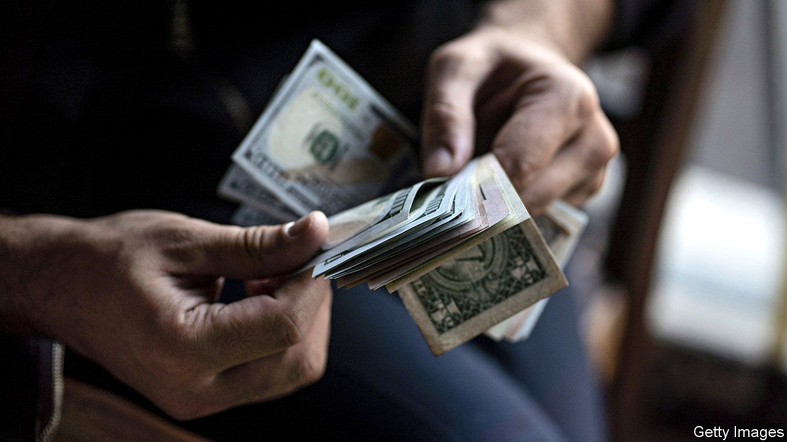

###### Heavy lies the crown

# The power and the limits of the American dollar 

##### The greenback is still king. But those who want to evade it are finding ways to do so 

 

> Apr 27th 2023 

EVERY SO often an appetite surges for an alternative reserve currency to the dollar—and a market booms in predictions of the greenback’s imminent demise. For nearly three-quarters of a century the dollar has at a global scale dominated trade, finance and the rainy-day reserve portfolios of central banks. Yet high inflation, fractious geopolitics and the sanctions imposed by America and its allies on countries such as Russia have lately caused dollar-doubters to become vocal once again.

Often these episodes are fuelled by a world leader’s spasm of anger towards the dollar. In 1965 Valéry Giscard d’Estaing, then France’s finance minister, raged against the “exorbitant privilege” the greenback conferred on America. This time it was Luiz Inácio Lula da Silva, Brazil’s president, who on a recent visit to China called for emerging markets to trade using their own currencies. At the same time, a surging gold price and a fall in the dollar’s share of global reserves has roused other doubters, who can also point to this month’s admission by Janet Yellen, America’s treasury secretary, that over time using sanctions “could undermine the hegemony” of the currency. It does not help that America could soon face a fiscal crisis if Congress fails to raise the ceiling that limits how much the government can borrow.

Yet the doubters’ excitement has become detached from reality. The greenback exerts an almighty gravitational pull on the world economy that has not materially weakened—even if America has recently found that there are real obstacles to exploiting its currency’s pre-eminence. 

The starting advantage of the dollar is immense. Between a third and a half of global trade is invoiced in dollars, a share that has been relatively stable over the long term. It is involved in nearly 90% of foreign-exchange transactions; such is the liquidity of the greenback that if you want to swap euros for Swiss francs, it can be cheaper to trade via dollars than to do so directly. About half of cross-border debt is dollar-denominated. And although the dollar’s share of central-bank reserves has fallen over the long term, it still accounts for about 60% of them. There is no sign of a dramatic recent change, save that which has been caused mechanically by central banks revaluing their portfolios to take account of exchange-rate movements and higher interest rates in America.

No other currency is close to matching this ecosystem’s size, or its fundamental appeal: the supply of safe assets available to dollar investors. The euro zone is fragile and its sovereign-debt market is mostly fragmented between its member states. China cannot possibly satisfy global demand for safe assets so long as it both tightly controls flows of capital and runs current-account surpluses (meaning it is, on net, accumulating financial claims on the rest of the world rather than vice versa). And the dollar, as the dominant currency, benefits from network effects. People want to use the currency everyone else is using.

What is increasingly clear, though, is that individual countries can circumvent the dominant system if they really want to. Though  has been wounded by sanctions, it has not been crippled, in part because 16% of its exports are now paid for in yuan, up from almost none before it invaded Ukraine.

China’s alternative to the SWIFT interbank-messaging system has been growing rapidly. It has also been switching more of its bilateral trade towards settlement in renminbi—an easier task than replacing the dollar in trade flows between other countries. Even many firms in the West now use renminbi for trade with China. New digital-payments technologies and central-bank digital currencies could yet make it easier to move money around the world without involving America.

Balance of power

Moreover, Ms Yellen is right that using the dollar to push countries around is no way to make or keep friends. America has not placed secondary sanctions on countries like India which still trade with Russia, because it fears the backlash that would result. Although a shift to a multipolar system of currencies is not imminent, it could occur later this century as America’s share of the world economy shrinks. Such a system would be inherently less stable than one centred on the dollar—so it would be in the interests of neither America nor the world to hasten the shift. ■

