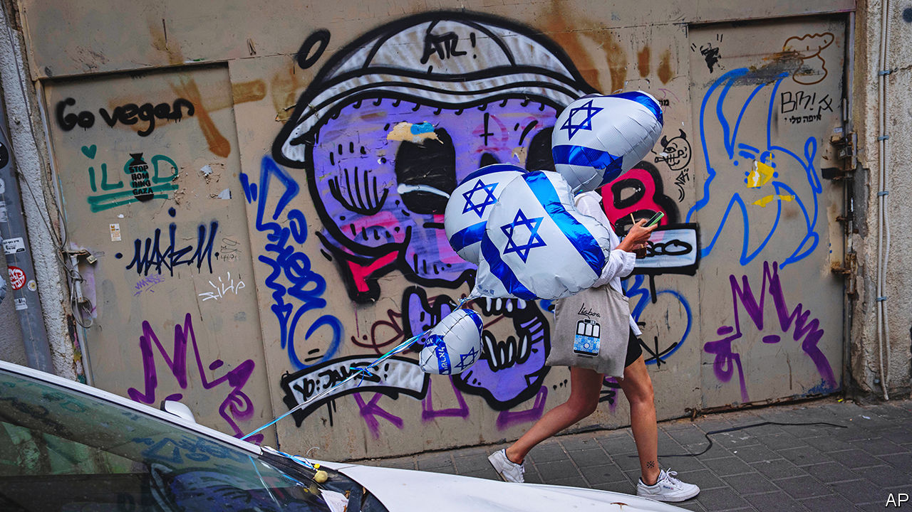
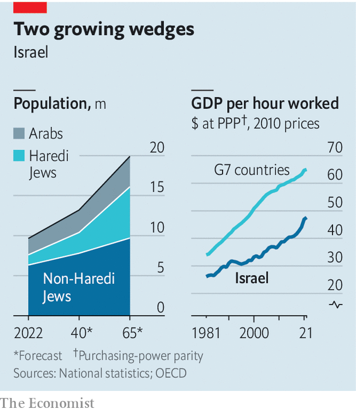

###### A contentious birthday

# Israel’s angsty 75th anniversary 

##### Fierce internal divisions will define the country’s next chapter 

 

> Apr 25th 2023 

EVERY year, around this time, Israel makes an abrupt transition from sorrow to joy. First the country comes to a halt for Memorial Day. Families visit army cemeteries; television channels show the names of fallen soldiers. Then, as day turns to dusk, mourning turns to joy in celebration of Israel’s independence.

There should have been much to cheer at sundown on April 25th, as Israelis marked the 75th anniversary of the country’s founding in 1948. (The holiday follows the Hebrew calendar; the Gregorian anniversary is on May 14th.) A country founded amid war and privation less than a century ago is, today, richer than many Western countries and safer than it has ever been.

Yet this is a contentious birthday. Military families asked ministers not to visit cemeteries and make their customary speeches. Binyamin Netanyahu, the prime minister, pleaded with mourners not to heckle his coalition members. Not all heeded him: there were scuffles at a memorial in Be’er Sheva, where Itamar Ben-Gvir, the far-right public-security minister, spoke. The opposition leader boycotted the official independence-day event.

Mr Netanyahu returned to power in December, after 18 months in the political wilderness, to lead the most right-wing government Israel has ever seen. He quickly sought to ram through a package of judicial reforms that would diminish the power of the Supreme Court. His plans set off the biggest protests in Israeli history. The main labour union called a general strike. Army reservists vowed to stop reporting for duty. The scheme has been shelved, at least for now. But anger at his government remains.

It is impossible to talk about the past 75 years without talking about Mr Netanyahu, who has ruled for fully one-fifth of that time. His pitch to voters has rested on his stewardship of Israel’s security and its economy. Since 2009, when he started his longest stint as Israel’s leader, 136 Israeli civilians have been killed by Palestinians—compared with 269 in 2002 alone, at the height of the second  (uprising). As security improved, so has the economy. Real per-person GDP has grown by 34% since 2009, comfortably faster than America or Germany. Israel’s early years were defined by the challenges of building and securing a young state. Those challenges have now largely been met.


On a recent Saturday night, as they have every Saturday this year, tens of thousands of Israelis marched through Tel Aviv to protest against Mr Netanyahu’s government. To the side were a few greybeards whose t-shirts identified them as veterans of the Yom Kippur war in 1973—arguably the last time Israel faced an imminent existential threat. To them, the current moment in Israeli history felt equally stark: “Did we fight to protect a democracy,” asked one, “only to tear it down ourselves?”

Some Israelis would call this hyperbole. Yet the sentiment and the chaos of recent months point to the issues that may define Israel’s next 75 years. One is how Israel manages changing demographics that will reshape its society and economy. A second, related question is how to resolve political questions that have gone unanswered since 1948. And then there is the question that most Israelis would prefer to ignore: whether an occupation that seems manageable today will remain so.

Start with demographics. Israel is an outlier in the rich world. The overall fertility rate—the number of children a woman is expected to have in her lifetime—is 2.9, the highest in the OECD. (A level of 2.1 is needed for a stable population.) But national figures mask deep disparities. In Modi’in Illit and Beitar Illit, cities populated by  (ultra-Orthodox Jews), the average woman has seven children. In secular places like Tel Aviv it is less than two.

 


The fastest-growing groups, Arab Israelis and ultra-Orthodox Jews, already make up one-third of the population. The Central Bureau of Statistics thinks they could be a majority by 2065 (see chart). Both have higher poverty rates, and lower levels of employment and educational achievement, than the rest of the population.

Many also shun army service.  men have long been allowed to dodge conscription if they devote themselves to religious studies. The high court ruled this system discriminatory in 2017. When the Knesset (Israel’s parliament) returns from its spring recess, Mr Netanyahu hopes to pass a law that will maintain the exemption but pay soldiers more. If he succeeds, though, most observers expect the court will again strike down the arrangement.

Such issues will be harder to solve as Israel becomes more polarised. The Israel Democracy Institute (IDI), a think-tank, projects that parties could take between 28 and 38 of the Knesset’s 120 seats in 2060, up from 18 in last year’s election. Arab parties, which have only once served in a government, may grow too.

Demographics do not have to be destiny. The  have long thrived in isolation: their leaders try to keep their flocks cloistered from the outside world. That was easy in the early decades of Israel’s existence. But it grows ever harder in an online era. Thousands leave the community each year. Politicians fret about losing support (although, so far, around 90% of ultra-Orthodox still vote for parties).

Still, a changing population will widen the gaps in Israel’s society—and its economy. The weekly protests in Tel Aviv end near the defence ministry. Towering over the protesters are skyscrapers that symbolise the new Israel. Their façades bear names like Rapyd, an electronic-payments company, and Imperva, a cyber-security firm, both founded by local entrepreneurs and valued in the billions of dollars.

It employs only 10% of the population, but the high-tech sector accounts for 15% of GDP and around half of goods-and-services exports. It has played an outsize role in Israel’s 21st-century economic growth. Yet it remains the icing on an otherwise unappealing cake: the rest of the Israeli economy is strikingly unproductive.

The average Israeli worked 1,753 hours in 2021, putting Israel in the top third of the OECD. But it is in the bottom half of the bloc for GDP per hour worked. The productivity gap between Israel and the g7 economies has more than tripled since 1975, even as working hours in the g7 fell much faster.

There are many reasons for Israel’s low output. The level of private capital per employee is basically unchanged since the 1980s, according to the Taub Centre for Social Policy Studies in Israel. Public capital has not budged either, which is a drag on productivity. Consider the country’s surprisingly horrible traffic: Israelis own 40% fewer vehicles than citizens in small European countries, but congestion on Israeli roads is almost three times worse, estimates Dan Ben-David of the Shoresh Institute in Tel Aviv.

What did you learn at school today?

Another issue is the state of Israel’s schools. Its score on the Programme for International Student Assessment (PISA), run by the OECD, fell in 2018, compared with the previous test, in 2015. It ranked 39th out of 77 countries, and lower on maths and science. Even those figures are too rosy: the tests barely sampled ultra-Orthodox schools, which tend to stop teaching the core curriculum after eighth grade.

It is hard to sustain a vibrant tech sector with underperforming schools. The ultra-Orthodox make up 13% of Israel’s population but less than 3% of its tech workforce. The gap is even starker for the Arab community. On PISA, Arab pupils performed worse than their peers in Jordan, a country with less than one-tenth the per-person GDP. Not surprisingly, they are also underrepresented in tech: 21% of Israelis but less than 2% of the workforce.

There are, in effect, two Israeli economies. Nationwide, the average nominal monthly salary increased by 35% from 2012 to 2022. For high-tech workers, who now earn more than double the national average, it rose by 67%. Outside a small sliver of well-paid workers, most Israelis struggle with the cost of living. Mr Netanyahu likes to boast that Israel’s per-person GDP is now higher than Britain’s or France’s. Adjust for purchasing power, however, and Israel falls to the bottom half of the OECD. 

In an IDI poll last summer, before the election, a plurality of Israelis (44%) cited the economy as their top concern. Yet Mr Netanyahu has spent his first months in office focused on the judiciary. Polls suggest that he has done grievous damage to his reputation, even among supporters who may back the proposed changes but hate the way they were introduced. One survey, published on April 9th, found that his Likud party would drop to 20 seats (down from 32) if elections were held now. 

Supporters of Mr Netanyahu’s reforms say they are meant to tackle a real problem: the country has no formal constitution, only “basic laws” that the courts have elevated to quasi-constitutional status. This arrangement is a hangover from the state’s chaotic founding. Other fundamental issues, such as the country’s borders and the exact role of religion, were never resolved. 

As with the army and the economy, these questions become more difficult as society changes. Kach, an avowedly racist political party, ran in four elections before it was banned in 1988. It won just one seat, in 1984, with 1.2% of the vote. Its successor, Jewish Power, is part of the Religious Zionism electoral bloc, which has 14 seats and is in the ruling coalition. Optimists on the left hope its electoral success was a blip. But the “national-religious” camp from which the far-right draws its support, which (unlike the ultra-Orthodox) mixes religion with ardent nationalism, is a growing share of the population.

Western diplomats have long argued that Israel faces a policy “trilemma”. It has three options: to control all the land between the Jordan river and the Mediterranean, to keep a Jewish majority, and to remain a democracy. It can choose only two.

For much of the past two decades, an apparently sustainable occupation has allowed Israeli voters to ignore this choice. Just 11% of them told idi last year that security was their main concern. With the occupation entrenched and seemingly permanent, and the “peace camp” reduced to a husk, the occupation is a nearly invisible issue in Israeli elections.

Yet it is also omnipresent. Much of the national-religious camp is united by a belief in “greater Israel”—in keeping the land. Right-wing hostility towards the high court stems in part from its modest role in limiting West Bank settlements. Even the economy is affected: a recent analysis in , an Israeli financial newspaper, found that the transport ministry spends 25% of its budget on roads in the occupied West Bank, home to less than 5% of Israelis. “It’s not a salient issue, but it’s a spectre,” says Dahlia Scheindlin, an Israeli pollster. “There’s nothing that predicts the left-right divide as well as this.”

Meanwhile the Palestinians are undergoing their own changes. The UN projects that the population of the occupied territories will more than double by 2050, to 9.5m. Half (4.7m) will live in Gaza, a besieged, impoverished wedge of land barely able to support its current 2m inhabitants.

Khalil Shikaki, a Palestinian researcher, does quarterly surveys of public opinion in the West Bank and Gaza. This March, for the first time, more than half of respondents said they would support getting rid of the Palestinian Authority, their limited self-government. Many Palestinians, especially young ones, have lost faith in the possibility of a negotiated settlement.

There is no consensus on what to do next. Some 58% now say they support another armed , up from 40% a decade ago. Others support mass non-violent protests. More than one in four want to abandon the two-state solution and push for one binational state. If no one agrees on a new path, though, most Palestinians agree one is needed. The placid situation of the past 15 years will not last for ever.

Predicting the future, in the Middle East, can seem a fool’s game. But some of the trends in Israel look ominous. Demographic changes will hurt the army and the advanced part of Israel’s economy. A rising right will resist giving up the occupied territories. It may also drive out parts of the educated, centrist middle class. The country is on track to rule in perpetuity over an ever-larger number of Palestinians—with a lopsided economy and fewer soldiers. ■

