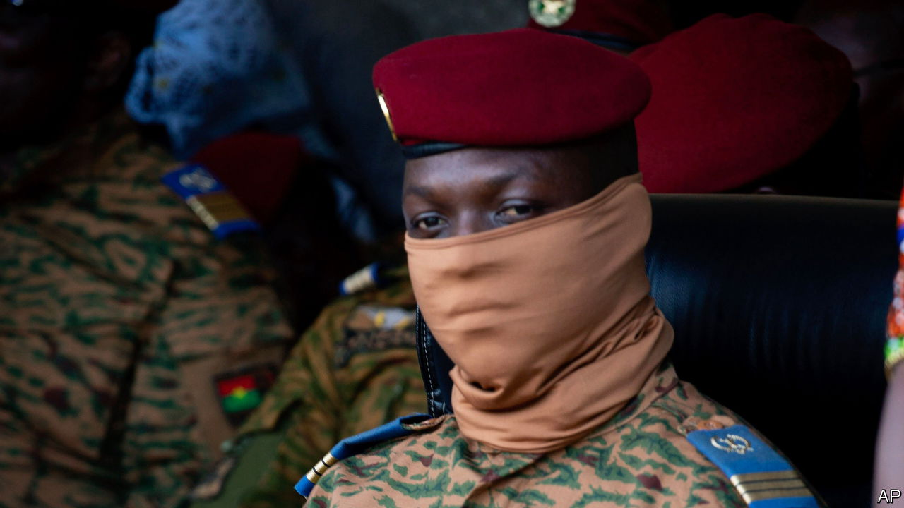
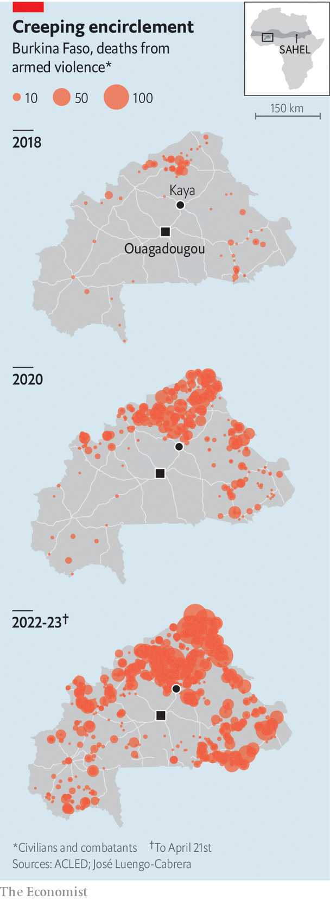
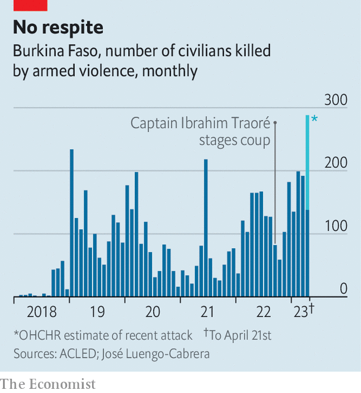

###### Burkina on the brink

# Rampant jihadists are spreading chaos and misery in the Sahel 

##### The army’s “total war” could spiral out of control 

 

> Apr 27th 2023 

“The jihadists killed our neighbour,” whispers a 12-year-old Burkinabe girl, staring at the ground. “His children were my friends.” Her family fled their village immediately afterwards but are still not safe. Jihadists frequently strike nearby. At the local school, three low-slung concrete buildings in a dusty expanse, children regularly practise what to do if terrorists attack. Hundreds of previously smiling kids suddenly pull the window shutters and doors closed and dive under their desks in near total silence. 

 


Burkina Faso is at the centre of a growing jihadist crisis that is engulfing much of the Sahel, an arid strip south of the Sahara. Last year the conflict claimed more than 4,200 lives in Burkina. In just the first three and a half months of this year it has taken about 3,000 more. Neighbouring Niger and, especially, Mali are also being hit by terrorists inspired by a mix of local grievances and links to al-Qaeda and Islamic State. Their progress south means Ouagadougou, the capital, could soon be encircled within a radius of about 125km (see map). In Mali jihadists are once again attacking on the doorstep of the capital, Bamako. Last year Hans-Joachim Lohre, a German priest who had lived in Mali for 30 years, was kidnapped in Bamako. A year earlier he had told your correspondent that his house was watched by the jihadists. 

Western countries have been trying to help with development aid and by sending commandos to train the region’s own armies and to conduct raids. Yet to little avail. France, the former colonial power, has had large numbers of troops in the region since 2013, when it thwarted a drive by jihadists to capture Bamako. In 2021 it still had 5,100 soldiers in Mali helping the government. Yet such efforts have failed to halt a rise in insecurity and a fraying of democracy (see chart). 

 


After a two-step coup in Mali in 2020 and 2021, the junta hired mercenaries from Wagner Group and kicked out all French forces last year. A UN peacekeeping mission in Mali struggles on, but Western governments including Britain and Germany are withdrawing their troops from it. Many believe that Mali is as good as lost and hoped to focus their efforts on Burkina Faso, which they saw as the next defensive line against the spread of jihad.

Yet Burkina Faso has rapidly fallen into much the same chaos. The government controls about 40% of the country. Outside Kaya, a major centre about 100km north of Ouagadougou, hundreds of trucks are parked in the dust, afraid to drive farther north without armed escort. About 24 towns, and perhaps 800,000 people, are under blockade by insurgents.

 


Last year Burkina Faso’s civilian government was overthrown by soldiers, who in turn were ousted in a second coup. In February the new junta leader, the 35-year-old Captain Ibrahim Traoré, threw out 400 French commandos who had been based near Ouagadougou. Some of the French soldiers relocated to Niger. 

The conflict has upended life for millions of Burkinabe. In December 2018 some 56,000 had been forced from their homes. Now 2m people, almost 10% of the population, are displaced. About 200 schools are closing every month. In the Sahel region of Burkina, the far north, almost 90% are already closed. Some children manage to enrol in the places they have fled to but most schools are overwhelmed. At one in Ouahigouya, a regional hub in the north, 198 children cram into a single class. 

Captain Traoré’s response is what he calls “total war”. The government has increased air strikes using Bayraktar TB2 Turkish drones and Russian attack helicopters. Late last year it recruited 50,000 people for volunteer defence forces (known by their French acronym of VDPs), which are essentially armed militias. It recently announced a “general mobilisation” that includes widespread conscription. The decree also allows the government to requisition goods and allows the army largely to ignore human rights. 

Many analysts think that achieving peace requires not just guns but also bringing basic services to abandoned regions, minimising atrocities that fuel jihadist recruitment, and trying to demobilise some fighters through talks. Captain Traoré, though, seems to believe in little but men with guns. Several people asked by the previous coup leader to start talks with jihadist groups to persuade some of them to stop shooting have disappeared. Their relatives blame the intelligence services. 

In Ouagadougou many think total war is already a success, perhaps because state television routinely shows videos of drone strikes pulverising scurrying figures. “IB is popular because he put the war on television,” says one Burkinabe, even though some of the broadcast footage is recycled or faked. Locals sing the praises of “IB”, as they dub Captain Traoré, and talk confidently of peace within a year. That is vanishingly unlikely given deteriorating security. “Bad and getting worse”, is how an American defence-intelligence official flatly describes the situation.

Many are too frightened to criticise the junta. Local journalists are threatened and detained. Some government critics have been arrested and forced to fight on the front. The junta has blocked the broadcast of French radio and television stations and expelled foreign journalists, most recently after é, a French newspaper, reported on a video showing soldiers laughing as one slammed a rock into the head of a Fulani boy as the bloodied, bound bodies of six other boys lay around them. Secret police also curtailed your correspondent’s recent reporting trip in Burkina.

The junta is especially wary of people pointing out the growing number of massacres of Fulani civilians. There is little evidence to suggest that any more than a tiny proportion of Fulanis back the jihadists, yet members of this ethnic group are often butchered by government forces and militias in Burkina Faso and Mali for supposedly supporting the insurgents. Captain Traoré has at times encouraged ethnic profiling. Since he seized power in September most of the victims of arbitrary arrest or extrajudicial killings have been Fulani, says Chrysogone Zougmoré, the head of Burkinabe Human and Peoples’ Rights Movement, a watchdog.

Recently Burkinabe soldiers and militiamen swept into the village of Toessin-Foulbè, rounded up its mainly Fulani inhabitants and killed the men. The security forces often kill people because of their ethnicity, says Héni Nsaibia of Menastream, a risk consultancy. The government’s move to arm thousands of overwhelmingly non-Fulani militiamen may lead to more ethnic polarisation and more atrocities. “People are not afraid to say to my face, we are going to kill you,” says Hassan Diallo, a researcher in Ouagadougou who is Fulani and worries the country may be stepping onto a path towards genocide. This in turn fuels the insurgency by allowing the jihadists to present themselves as protectors of the Fulani. 

Civilians of other ethnic groups are also at risk if they are thought to be associated with jihadists, no matter how flimsy the grounds. On April 20th perhaps 150 civilians were shot by men in Burkinabe army uniforms in a village near Ouahigouya. (A public prosecutor has launched an investigation.) Some believe the villagers were killed as a reprisal for a deadly jihadist attack on soldiers nearby a few days earlier. 

Into this bloody mix could soon come more violent men: Russian mercenaries from Wagner Group. Some analysts believe there are already a few dozen Wagner instructors in the country, where many locals seem welcoming, especially those who frequent the “Maquis Wagner VIP” bar in Ouagadougou. “When a lion is hunting you, you climb any tree, even if it has thorns,” says Alexandre Sankara, a politician who used to be part of the ruling coalition. “We’ve seen what they’ve done in Ukraine.” Yet the junta seems to be hesitant about a big Wagner deployment because Western countries would probably halt aid and security assistance in response. 

That would be disastrous. The jihadists are unlikely to try to take and hold capital cities in Burkina Faso and Mali, but are increasingly likely to mount large terrorist attacks in them as well as in other capitals such as Dakar, in Senegal. They are also spreading across borders into Ghana and Ivory Coast, threatening to destabilise west Africa’s wealthier and more densely populated coastal strip. 

Jihadists also frequently attack Niger, a Western ally with the Sahel’s last democratically elected government. Although it has had some success in tackling the local grievances that jihadists exploit, its politics look fragile. One Western intelligence official worries about the possibility of a coup against President Mohamed Bazoum. 

Even more likely is another coup in Burkina or perhaps Mali. The current military leaders in both countries say that they grabbed power to improve security. Yet having failed to do so they have tried to deflect blame onto previous leaders, the French, journalists and Fulanis. Now humanitarian workers are the latest target of social-media campaigns, of unknown origins, with preposterous claims that their trucks may be supplying guns to the jihadists. Soon there will be few others left to blame. In Burkina protests recently erupted over insecurity in parts of the south and east. Its army is already riven after two coups. Another putsch attempt would almost certainly be very bloody indeed. ■

