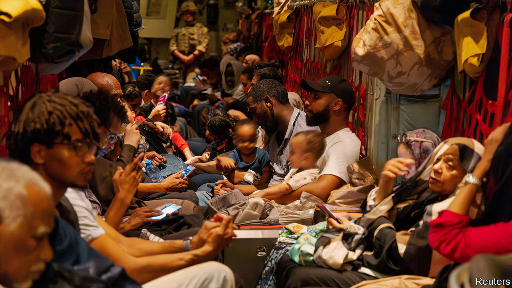

###### Ghost town

# The battle for Khartoum is just the beginning of Sudan’s nightmare 

##### Some warn that deepening divides could lead to tribal war 

 

> Apr 27th 2023 

Another day, another ceasefire. For the ever-shrinking number of civilians still left in Khartoum, Sudan’s war-wracked capital, it is becoming a wearily familiar pattern. The latest truce between Sudan’s warring factions, announced by America’s secretary of state, Antony Blinken, shortly before midnight on April 24th, was supposed to last 72 hours. The following morning residents once again reported hearing heavy gunfire and explosions. 

Since April 15th, the city has been the centre of a battle between the two most powerful figures in Sudan’s military government. General Abdel Fattah al-Burhan, the country’s de facto leader since a coup in 2019, leads the army. Muhammad Hamdan Dagalo, a warlord, heads the Rapid Support Forces (RSF), a paramilitary unit that grew out of the Janjaweed militias accused of genocidal acts in Darfur in the mid-2000s. Their fight for control of Khartoum and the country has already left hundreds of civilians dead and many more injured or homeless. Now the fear is that these two rival armies will level the city. 

In the days before the ceasefire—the fourth so far—almost all foreign diplomats were evacuated. American special forces in Chinook helicopters rescued 100 embassy staff in less than an hour on April 22nd. Britain’s Royal Air Force followed suit the next day. On April 24th a convoy of more than 750 un officials and aid-workers arrived safely in the Red Sea city of Port Sudan. Earlier a French diplomatic convoy had been attacked, and a Qatari one looted, on the same route. 

Thousands of Sudanese civilians have also escaped. Some have gone by bus to neighbouring countries such as Egypt, where large numbers are now gathered at the border. Others have fled to the countryside around Khartoum. Hamid Khalafallah, a political analyst, chose to stay in the capital with his family. But he reckons about a third or more of the population may already have abandoned the city. Those who remain risk death “by bullets or by hunger”, says one fearful resident. Partly because RSF forces have been taking over private homes for use as fortifications, whole districts have been reduced to ashes. Banks are closed. Hospitals have been looted and bombed. Food, water and medical supplies are rapidly running out.

The vast western region of Darfur, home to Mr Dagalo and the RSF, is ablaze. Some 20,000 civilians have crossed into Chad. Fighting around the city of el-Geneina has killed nearly 200 people and forced thousands from their homes in recent days; police there reportedly called on civilians to arm and defend themselves. 

In south Darfur, militias linked to the RSF have taken advantage of the security vacuum to rob and attack people in their homes, says Mohammed Osman of Alberdi, a Sudanese rights group based in the city. Soldiers from the national army are also stopping and sometimes beating people from the Arab tribes associated with the RSF. This is a troubling sign of “the tribal war which is to come”, he warns. On April 24th, António Guterres, the UN secretary-general, urged the UN Security Council to do whatever it could “to pull Sudan back from the edge of the abyss”.

Amid the gloom there are faint glimmers of hope. In el-Fasher, the capital of North Darfur, religious leaders and local activists brokered a truce between the army and the RSF units fighting there. During the most recent ceasefire in Khartoum the fighting died down for a while. On April 22nd, a weary-sounding General Burhan suggested the two sides sit and talk. But it is hard to believe he is serious. After all, barely half a day into the ceasefire his drones were back in the sky and bombing the capital once again. ■

