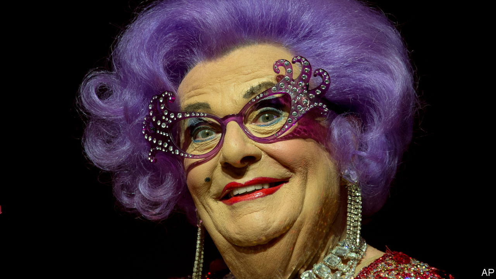
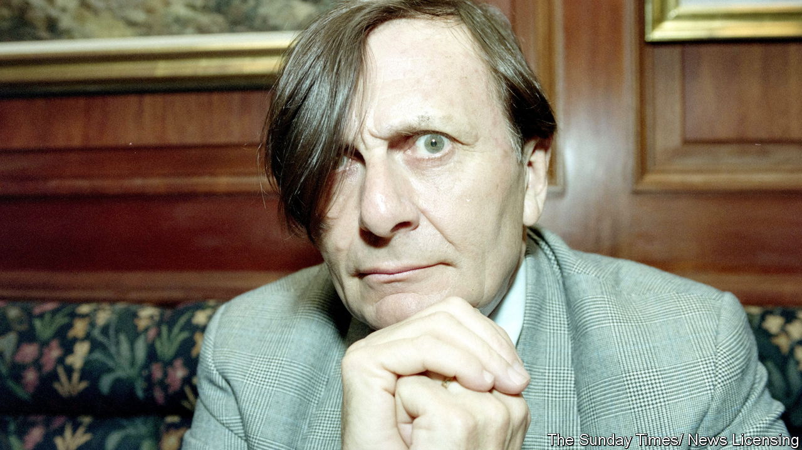

###### Two lives entwined

# Barry Humphries, creator and manager of Dame Edna Everage, died on April 22nd, aged 89 

##### Those who thought they were the same person were not entirely wrong 

 

> Apr 27th 2023 

The garden Barry Humphries walked through was not in the best part of Melbourne. Moonee Ponds was low-lying, swampy and the wrong side of the tracks. The lawn, with no effort at gentility, was of scratchy buffalo grass. There were few flowers, and they were ones he particularly disliked: gladioli, with their disagreeably optimistic thrusting spears and scentless flesh-pink florets. Little did he know that in years to come he would be ordering thousands of them every month, and that his distrust would have grown into burning hate. 

He was there because of a postcard, written in green ink in a studied but childish hand, from a woman called Edna, inviting him to a Passion play in the local hall. She was playing Mary Magdalen, shrilling “Christ, your feet look awful! Let me give them a bit of TLC”, before anointing them with Vicks VapoRub and drying them with her wisteria-coloured hair. She had written to “Mr Humphrey”, then touring in “Twelfth Night” with the Melbourne Theatre Company, hoping to get noticed. He had noticed, they had lunched on creamed corn, and now he was approaching her front door. Almost at once, he found himself advising her. 

So occurred, in 1955, the entwining of two lives. He took charge of this young mother, watching her transform from a mousy figure in a blue frock and flatties into a towering vision in glittering silver lamé, butterfly-wing glasses and a perfect bouffant. By the 1990s she was the toast of Britain and America as well as Australia, a groundbreaking reinventor of stage and TV talk shows, a swami, a chanteuse, taste-maker to the legions of women who slavishly copied her outfits or, like her, splashed on Boots haemorrhoid cream to banish wrinkles, and a confidante to world leaders. She had homes in Sydney, London, Gstaad and Beverly Hills. It was a rise unprecedented in the history of housewifery. 

 


As her manager, he shared in that fame. But it was hardly the sort he craved. He might have been honoured for his vast library, his rescue from oblivion of the music of the Weimar Republic, his collection of Charles Conder paintings on silk, and especially for a career as a serious actor. That faltered, once Edna was on the scene, though he did play Fagin in the London revival of “Oliver!” in 1967. With enough encomiums, he might have been Lord Humphries of Melbourne. Instead he found himself hitched to a vulture disguised as a bird of paradise who, thanks to an Australian prime minister, was actually a Dame. 

Some made the pretty insulting assertion that they were the same person. There were, he admitted, slight resemblances. They were roughly the same height and had the same inside-leg measurement. If she failed to turn up for a show he could just about wear her snug dress and force his voice into her fluty falsetto. Thanks to his mother, and their Sunday afternoon outings to view the new Lovely Homes springing up around Melbourne, he shared some of her suburban sensibilities: an appreciation of Frigidaires and Sunbeam Mastermixers, burgundy carpets and cut-moquette sofas, aqua bathrooms and glass screens etched with reindeer. He too tended to view the world through dusty venetians. Despite their ceaseless mocking of Australia they were both, at heart, patriots, nostalgic when abroad for asparagus rolls and lamingtons, terylene golfing hats and vanilla slices, though Edna took unkindly to recent immigrants. Both of them found Les Patterson, the drink-and-food-spattered Australian cultural attaché with Restless Penis Syndrome who was also, sometimes, within Mr Humphries’s control, completely disgusting, and neither of them would appear in public with him.

Yet there similarities ended. Mr Humphries was an intellectual who, since boyhood, had combed the secondhand bookshops of Melbourne for rare editions of Samuel Beckett or Oscar Wilde. His university studies were in fine arts, philosophy and law, with the legal part swiftly eclipsed by musical soirées where he immersed himself in Menotti, Prokofiev and Satie. He championed the almost unknown music of Jean-Michel Damase, commissioning him to write for the horn-player Barry Tuckwell, who was a friend. (Edna favoured Mantovani.) He was friends too with Patrick White, John Betjeman and Francis Bacon, and painted a bit himself. Edna’s background contained not one scintilla of intellectual stimulation. There was, though, an echo in her of Barry’s fondness for Dadaist shock-theatre, such as dressing as a tramp and rummaging horribly through a public bin to draw out a secreted bottle of champagne. In fact, Edna’s whole show was an example of the Dadaist slogan, “Thought is born in the mouth”. In this case a mouth well caked with her very own lipstick in Kanga Rouge. 

Barry’s cultivation she found frankly irritating. He was always droning on, and had put her on stage only to belittle her. He wrote novels; she produced a seminal autobiography, “My Glorious Life”, a Bedside Companion, a Coffee Table Book and an “Ednapedia” about all things Australian. From the moment she cried “Hallo Possums!”, her audience ate from her hand. He was a poor would-be comedian and a sick man, often the worse for drink, a habit he didn’t conquer until, in the mid-1970s, he spent a night unconscious in the gutter. His first three marriages were failures, too; her sole marriage to dear Norm, with his wretched prostate and testicular murmur, had been a model of caring. As mega-stardom grew she would gladly have got rid of Barry, except that he handled her bookings and wrote her scripts. Relations were strained even before The Great Betrayal, when in “Handling Edna”, in 2009, he claimed that she was difficult. He also exposed to the world the fact that Kenny, her favourite son, designer of all her costumes and a practising homeopath (as she thought he said), was the result of a date-rape by Frank Sinatra. The book began, “I wish I had never met Edna Everage.” So hurtful, so unfeeling. 

In later years, therefore, they did not communicate. In 2012 he announced a farewell tour, but she kept going. Once she actually fired him, but he would not accept dismissal. It was a blessing, in the end, that Fate took them on the same day. ■

