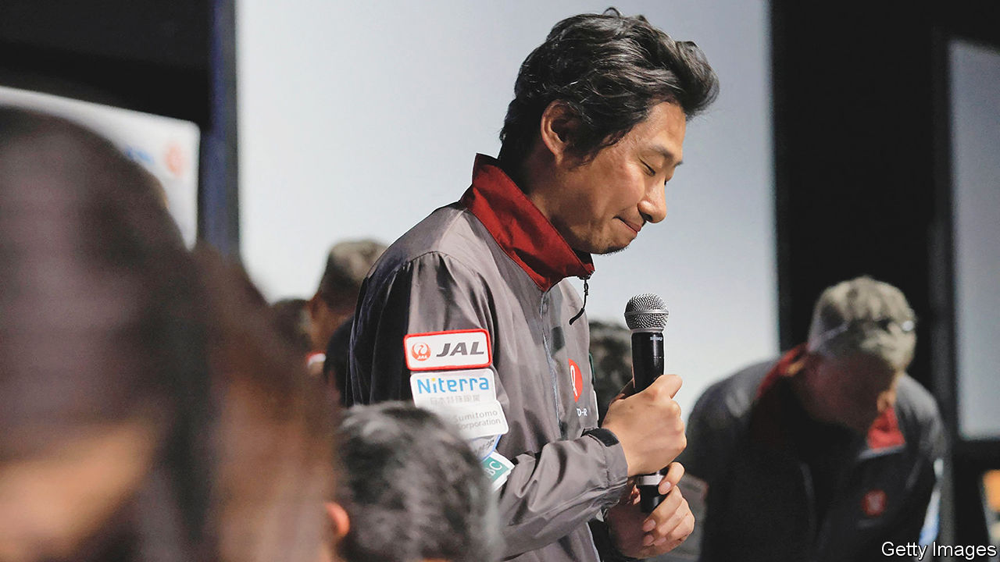

###### Harsh lessons from a harsh mistress

# After half a century, there is a commercial market for Moon missions 

##### A Japanese firm’s failure marks the first of many private-sector attempts 

 

> Apr 26th 2023 

“THE MOON is a Harsh Mistress”, by Robert Heinlein, was not just the most influential novel about the Moon published in the 20th century. It was also the one with the raciest title. In the body of the book, though, the Moon’s role is less dominatrix, more docent: what Professor Bernado de la Paz actually says in the speech from which the title-words stem is that the Moon “is a stern schoolmistress” who teaches “harsh lessons”. And this, it seems, is true. 

The latest pupils to walk out of one of her tests with only a new crater to show for it are the team at ispace, a Japanese company, which tried, and failed, to land  on the edge of  on April 25th. The spacecraft, launched last December, had performed nicely as it took a slow, energy efficient trajectory out to the Moon, inserted itself into orbit, and adjusted that orbit until it was circling at 100km just as intended. On the final journey from orbit to surface, though, its engine cut out a little too early and it plummeted to the surface. 

Quite why the spacecraft ran out of fuel a bit before the finish line is not clear. But it is not the end of the story. Managing to get to within a few kilometres of the Moon’s surface may sound like something of a pyrrhic victory, but it shows that most of the company’s engineering works. What is more, the mission was insured (one of various ways in which it was the first of a kind), though whether the crash falls within the scope of the policy has not been announced. And though the company’s share price dropped by 20% on the day after the crash, at the end of the day it was still comfortably above the level at which it listed on the Tokyo Stock Exchange Growth Market just a couple of weeks ago. The company is at work on a second HAKUTO-R spacecraft for launch next year, and it is providing a Moon lander of a different design as part of a team working on a mission for 2025.

As the listing and the orderbook bear witness, the biggest difference between ispace and the entities that have landed on the Moon before is that it is a private company. All previous landings have been by national space agencies. Companies did not attempt them because there was no commercial opportunity. Now, though, there is. America’s space agency, NASA, is buying delivery-to-the-Moon services from a range of startups and joint ventures. The first two such landers, built by Astrobotic of Pittsburgh and Intuitive Machines of Houston, are set to be launched this summer. A third will use ispace’s 2025 lander. 

America is not the only customer. There are countries which would like to do research on the Moon that have no lunar spacecraft of their own and do not relish the hassle of developing them. , a rover developed by the UAE’s space program, was a paying passenger on . , the first Astrobotic mission, will carry a set of five micro-rovers developed by Mexico’s space agency. 

The loss of  can but add to the next missions’ jitters. History shows that most teams trying to land on the Moon fail on their first attempt. The Soviet Union did so in the 1960s; the Indian space agency and an Israeli mission did so in 2019. Five entities are set to try and land spacecraft on the Moon be: the two American companies, the Japanese space agency, the Indian space agency (its second attempt) and the Russian space agency. The chances of them all making it down in one functional piece seem remarkably slim. The Moon will boast new craters. An ever more diverse student body back on Earth will learn new lessons. ■


