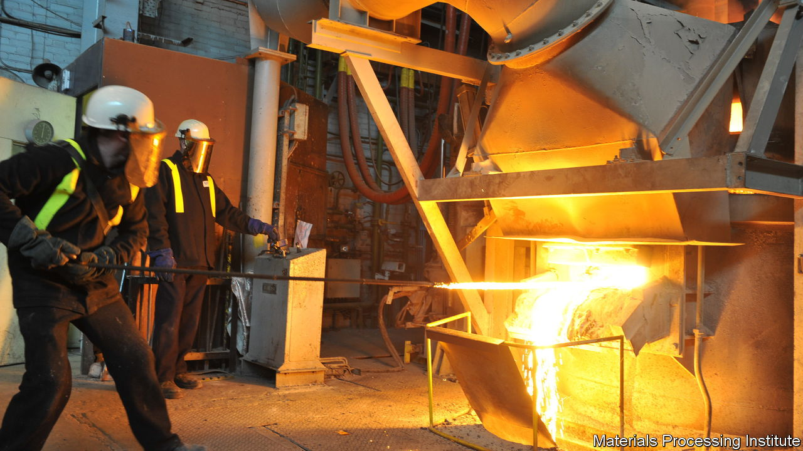

###### Tackling global warming

# How to make low-carbon concrete from old cement 

##### If the cement industry were a country, it would the third-biggest carbon polluter 

 

> Apr 26th 2023 

The world gets a little greyer every year. According to a paper published in 2014 concrete—an aggregate material made by mixing cement, sand and gravel—is the second-most consumed substance in the world after water. Around three tonnes of the stuff are poured each year for every person on the planet. 

All that building affects not just the surface of the Earth but its atmosphere as well. The annual production of around 5bn tonnes of cement, the essential ingredient in concrete, is responsible for around 8% of the world’s man-made emissions of carbon dioxide, the main greenhouse gas. Were the cement industry a country, it would be the third-biggest carbon-dioxide polluter after China and America.

Researchers are trying to find ways to cut those emissions, but it is not easy. Alternative materials, such as , can replace concrete in some buildings. Additives can reduce the amount of cement needed to make concrete, but do not solve the problem completely. Cement-makers are also looking at capturing the carbon their factories emit and sequestering it underground. But despite a few small-scale trials with power stations and oil rigs, capturing carbon remains a mostly untried technology.

Fortunately, another idea is taking shape. In early May six tonnes of what is claimed to be the world’s first zero-emissions cement will be made at the Materials Processing Institute, an industry-backed research centre in Middlesbrough, north-east England. This might seem a paltry amount, but it should be enough to demonstrate how well the cement works. If all goes to plan, Cambridge Electric Cement, the firm behind the idea, plans to scale up production and use the stuff in a real construction project.

Reuse and recycle

The reason cement is so hard to decarbonise lies in the chemistry of how it is made. The key ingredient is limestone, which is mainly calcium carbonate. It contains both oxygen and carbon. The limestone is mixed with silica-bearing clay and other materials then heated in a rotating kiln to more than 1,400ºC. A chemical reaction called calcination drives the carbon from the limestone, producing lime. The carbon then combines with oxygen to form the unwanted carbon dioxide. 

What is left behind are lime-based lumps of a material called clinker. This is cooled and then milled into cement powder. Around half the carbon-dioxide emissions from cement making come from the calcination reaction alone (the rest coming mainly from quarrying the limestone and heating the kiln). All told, around one tonne of carbon dioxide is produced for every tonne of cement. 

Cyrille Dunant and his colleagues at the University of Cambridge, who founded Cambridge Electric Cement, hope to sidestep that troublesome chemistry by recycling old cement from demolished buildings. Liberating cement from scrap concrete is not, in itself, a new idea. But attempts to recycle it through a cement kiln have tended to produce a poorer-quality product than using fresh ingredients.

Dr Dunant and his team think they have solved that problem with help from another heavy industry: steel recycling. They noticed that the chemical composition of old cement powder is virtually identical to that of the lime flux used in electric-arc furnaces to recycle scrap steel. As the steel melts, the flux forms a slag that floats on the surface, where it prevents the liquid steel reacting with air and creating impurities. 

The Cambridge team found that a paste made from old cement can perform the same job just as well—and that the heat from the furnaces can turn it back into good-quality clinker at the same time. “The cement paste that was put in came out as new cement,” says Dr Dunant. And unlike cement kilns, which are heated by flames, electric-arc furnaces zap their contents with high-powered electrical currents to heat them. That means they can be powered by zero-carbon electricity. 

So far, the team has made tens of kilograms of their recycled, zero-carbon cement. The results are promising, says Philippa Horton, another of the company’s founders. The biggest potential snag is that the quantity of cement that can be produced will depend on how much can be recovered from the demolition of old buildings, bridges, roads and the like, as well as on the availability of electric-arc furnaces. But Dr Horton reckons that, in Britain alone, it might one day be plausible to produce enough cement to meet a quarter to a half of total demand. 

In the meantime, a number of construction firms are working with the researchers to get the project off the ground. They include the Day Group, a British supplier of construction materials, which is developing a crusher that can recover old cement from rubble in the form of a paste. Celsa, a Spanish steel company, is converting an electric-arc furnace at its plant in Cardiff to produce the first lot of Cambridge Electric Cement on a commercial scale. 

Once all that infrastructure is ready, perhaps next year, Atkins and Balfour Beatty, two building and civil-engineering firms, will oversee the construction of the first building to use the recycled cement, which will be the ultimate test of its worth. One idea is to use cement recovered from a demolished building to construct its replacement on the same site. That would be a neat demonstration of the green benefits of a circular economy. ■


