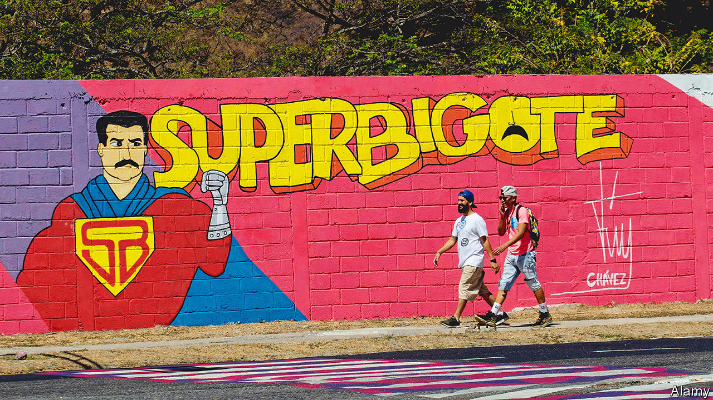
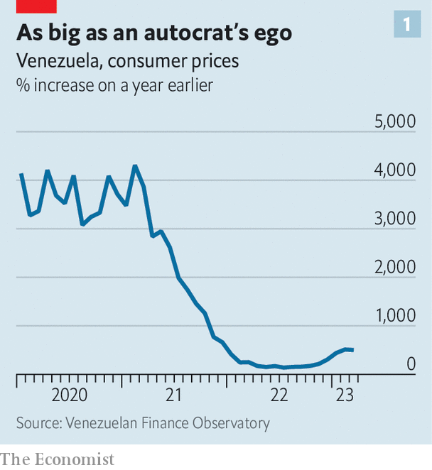
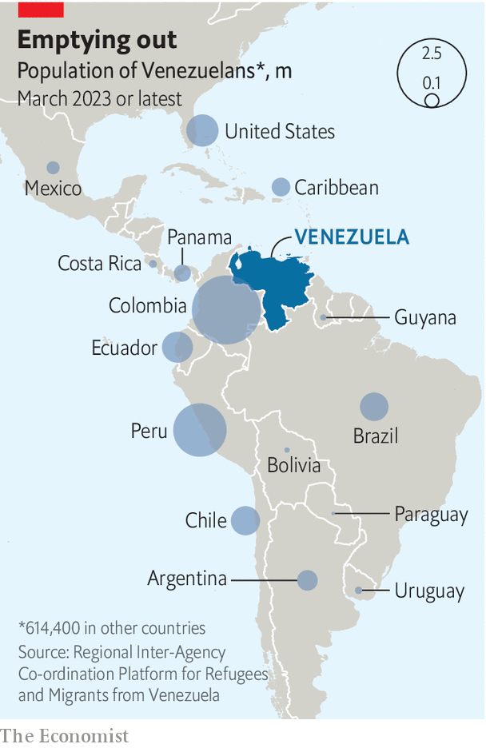

###### A sticky dictatorship

# Nicolás Maduro, Venezuela’s autocrat, is winning 

##### Juan Guaidó, the main opposition politician, has just fled the country 

 

> Apr 25th 2023 

His propagandists call him “Super Moustache”, and his government has handed out plastic toys depicting him as a hero in a cape. But in reality Nicolás Maduro, Venezuela’s despotic president, has only one superpower: an extraordinary ability to cling to office regardless of the wishes of his compatriots, as events this week have shown. 

The economy has collapsed by 75% during his decade in power. A quarter of the population has emigrated: some 7m Venezuelans. In 2018 he rigged an election. The next year Donald Trump, then president of the United States, imposed  on Venezuelan oil and finance, in a bid to restore democracy. Yet still Mr Maduro shows no sign of budging. Politically, he seems to be growing stronger. 

A former rival has now gone into exile. , an opposition politician, had been recognised by more than 50 democratic governments in 2019 as the rightful president of Venezuela. On April 24th he said he had secretly travelled overland to Colombia to meet delegates at a conference the next day, hosted by Gustavo Petro, Colombia’s left-wing president. The aim of this conference was to bring together representatives of various governments to discuss Venezuela. Colombia accused Mr Guaidó of entering the country “irregularly” and says he agreed to fly to the United States. Mr Guaidó says he was deported. “The dictator’s persecution these days reaches Colombia,” he grumbled as he left. 

The hollowing-out of Venezuelan democracy began under Mr Maduro’s predecessor, , who died in 2013. Since Mr Maduro succeeded him, he has systematically undermined the country’s institutions. After another set of uncompetitive elections in 2020 he established a National Assembly which rubber-stamps his decrees. He keeps the army loyal by looking the other way while officers run lucrative rackets. Other autocratic regimes, such as Cuba’s, have helped to prop him up. 

 


Mr Maduro, a former union boss, describes himself as a socialist, and has enjoyed support from extreme left-wingers globally, partly because of his enmity with the United States. A better description of his regime would be: bullying and corrupt. Mr Maduro’s cronies are doing fabulously well. Venezuela is now the most unequal nation in Latin America, according to researchers at the Andrés Bello Catholic University in Caracas, the capital. Hyperinflation, originally caused by the regime’s money-printing, has subsided somewhat, falling from an almost unmeasurable peak in February 2019 to 500%. This is because Mr Maduro’s government has encouraged those who can to give up on the local currency and use American dollars instead (see chart 1). 

Criticism of Mr Maduro’s miserable record is seldom broadcast, since the regime dominates the airwaves. Earlier this month “With Maduro”, a weekly TV show, was launched. The president hosts it with Cilia Flores, his wife, and an AI presenter called “Sira”, who merges the looks of a Miss Venezuela contestant with the soothing authority of a real newsreader. The show is probably a soft launch of his campaign for re-election in 2024. That poll is unlikely to be fair.

Two international developments have played to Mr Maduro’s advantage. The first is the war in Ukraine, which has led to a global scramble for alternatives to Russian oil. Eager to boost global energy supplies, President Joe Biden’s administration has reassessed its relationship with his regime and begun to unwind some of Mr Trump’s sanctions. Last year Mr Biden twice sent envoys to meet Mr Maduro. His administration has allowed Chevron, an American oil giant, to receive Venezuelan oil in payment for debts it is owed by PDVSA, the state oil company. Partly as a result of the easing of sanctions the IMF expects the economy to grow by 5% this year.

 


The second shift which has aided Mr Maduro is the recent election of several left-wingers in Latin America. Mr Petro, a former member of the M-19 guerrilla group, swiftly moved to restore relations after  last year. He has met Mr Maduro several times. Armando Benedetti, the first Colombian ambassador to Venezuela in three years, was sent to Caracas days after Mr Petro took office. In January the 2,200km (1,400-mile) border between the two countries was reopened to cars after being mostly shut for seven years.

Mr Petro has become an unofficial channel between the United States and Venezuela. On April 20th he talked with President Joe Biden about the aims of his conference, which included the lifting of sanctions. The meeting on April 25th brought together representatives from at least 19 governments from Europe and the Americas. At the event Jon Finer, the US deputy national security adviser, made it clear that further sanctions could be lifted if Venezuela took steps towards restoring democracy and holding elections that are free and fair. This would involve recognising all opposition candidates and accepting independent election observers. Mr Finer told reporters that the Biden administration does not want to keep sanctions on Venezuela “in perpetuity”. 

The conference also agreed that official talks between the regime and the Venezuelan opposition, held in Mexico but brokered by Norway, should restart. These have been stalled since November. Mr Maduro’s government claims that a humanitarian fund, which it agreed with the opposition would be created out of around $3.2bn of frozen government cash, has been blocked by the United States. The truth is more complicated: there is legal wrangling over how the fund should be administered and protected from creditors.

Mr Petro has his own incentives for cosying up to Mr Maduro. One of his election promises last year was to bring “total peace” to Colombia. A key obstacle to that is the National Liberation Army (the ELN), a left-wing guerrilla group, which since its formation in the 1960s has been continuously battling the Colombian government. The ELN’s operations, which include drug-trafficking and illegal mining, are not limited to Colombian territory. The group has bases in Venezuela, too, where it operates with near total impunity. 

One rumour in Caracas is that Mr Petro offered Mr Maduro a deal: he would persuade Mr Biden to lift sanctions on Venezuela in return for which Mr Maduro would persuade the ELN to negotiate peace with the Colombian state. “It sounds win-win, except both are offering something they can’t necessarily deliver,” says a Western diplomat in Caracas. (On April 26th, Mr Petro reshuffled his cabinet after his coalition in Congress fell apart.)

Cape of no hope

Why would Mr Maduro agree to any concession that might lead to him losing an election? One explanation is that he believes he could win a vote deemed fair in the eyes of the outside world. That is not implausible: the opposition, which is currently arguing about if and how it will hold a primary contest in October, may fail to unite around a single candidate. Support for Mr Maduro in February stood at 22%, according to Datanálisis, a polling company. That is low, but not as low as it has been. 

Another explanation is that the dictator sees the negotiations as a route to more power. Mr Maduro is “not nearly as strong as he would want to be”, says Geoff Ramsey of the Atlantic Council, an American think-tank. “Going into an election year he is desperate for cash, and the only way that Venezuela can hope to recover its economy is through some form of sanctions relief.”

 


The economy is barely a quarter of the size it was in dollar terms before Mr Maduro took office in 2013. Recently it has shown some signs of recovery, but it is still in a precarious condition, not least as oil production has fallen (see chart 2). State pensions, paid in the local currency, are now worth less than $5 a month at the official exchange rate. State-school teachers have been protesting about their salaries of less than $20 a month.

An acute shortage of hard currency may be one reason why the regime launched  into PDVSA. This has led to the arrest of 61 business leaders and politicians, the investigation of hundreds of others and the resignation, on March 20th, of Tareck El Aissami, the oil minister and once one of the most powerful men in Venezuela. Mr El Aissami has not been accused of any crime. 

The scandal began to emerge last year when an audit of PVDSA’s accounts ordered by Delcy Rodríguez, the country’s vice-president, revealed that 84% of the oil it had shipped since 2020 had not been paid for. Shady intermediaries, contracted by the company in an effort to bypass sanctions, appear to have taken advantage of the situation to fleece the firm of billions.

Since Mr El Aissami’s resignation he has not been seen or heard of in public. Some claim that Mr Maduro, in league with his powerful advisers, Ms Rodríguez and her brother Jorge Rodríguez, the head of the sham National Assembly, decided that he was becoming too powerful. “The PDVSA guys had become a threat so [they] needed to be removed,” says one Caracas-based businessman. On April 21st it was announced that one of those detained as part of the probe, Leoner Azuaje, formerly the head of Cartoven, the state packaging company, died while in the custody of state security. The government says he killed himself. Members of his family say they are scared for their own lives.

They have reason to be concerned. On April 20th the International Criminal Court (ICC) released details of its consultation with alleged victims of human-rights abuses in Venezuela. This is part of a formal investigation to establish whether crimes against humanity have been committed by Mr Maduro’s regime, including against its political opponents, which might result in prosecutions. The document, the result of more than 1,700 testimonies, includes reports of torture at the hands of state-security thugs. 

The ICC investigation was mentioned in Mr Maduro’s new TV show on April 24th. Mr Rodríguez went on it and spelled out five things he said were necessary for talks with the opposition to restart. Alongside a lifting of all sanctions, he called for an immediate end to the court’s investigation. This is despite the fact that Venezuela is a signatory to the statute which established the ICC. After a decade in power, Mr Maduro’s tyrannical regime now sees itself as entirely above the law. ■

