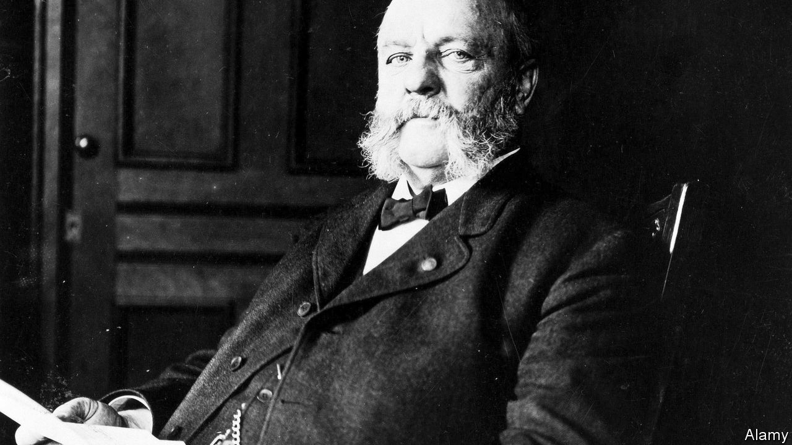

###### The Economist explains

# How a 19th-century law could upend abortion access in America 

##### The Comstock Act banned the posting of abortion supplies—and was never fully repealed 

 

> Apr 27th 2023 

WHEN THE Supreme Court ruled last year that America’s constitution does not , it returned the matter to lawmakers. In the months since activists have pushed for a national prohibition. This Congress, which is divided on the issue, will not soon pass a law limiting access to abortion across the country. So pro-life campaigners have turned to one that is already on the books: the Comstock Act, a 150-year-old anti-vice law. This historical oddity, never fully repealed, could severely curtail access to abortion. What is the Comstock Act—and how might it be resurrected?

Anthony Comstock (pictured), the law’s main proponent, was a 19th-century morality campaigner. Repulsed by the easy availability of smut, Comstock pushed Congress to pass a federal anti-obscenity law. In 1873 to rally support he set up an exhibition of offending items at the Capitol, which included obscene engravings, sex toys, contraceptives and abortion aids. Within months the Comstock Act was passed. The sweep of items it affected was broad, but the means were focused; the act itself did not ban the materials but prohibited sending them by post. It covered anything “obscene, lewd, lascivious or vile”. The act was later amended to clarify that this includes anything designed or “adapted” for abortion.

It had a big impact. In the late 19th century the law was used to block the distribution of everything from reproductions of neoclassical nudes to anatomy textbooks, as well as contraceptives and drugs that induce an abortion. But as case law expanded freedom of speech and privacy rights, the Comstock Act fell out of use. When  established a constitutional right to abortion in 1973, that overrode the last meaningful elements of the act. It became a legal fossil. 

Recently it has been dug up. It was cited by an anti-abortion group suing the Food and Drug Administration (FDA), America’s regulatory agency for medicines, over its approval of , one of the two drugs used to induce abortions. (In recent years, the FDA has allowed the pill to be distributed by post.) Matthew Kacsmaryk, the federal judge in Texas who ruled against the FDA in that case on April 7th, agreed that the Comstock Act “plainly forecloses mail-order abortion”. 

Reviving the act would have implications beyond the posting of abortion pills directly to women. Enforcing it to the letter would also mean banning factories from shipping pills and medical supplies to clinics, even if they use private mail carriers. Some anti-abortion advocates have been pushing this interpretation: 20 Republican attorneys-general wrote to national chemist chains in February urging them not to offer abortion pills at all—on the basis of the Comstock Act. In New Mexico, a state with liberal abortion laws, some conservative city and county governments have cited the act in their efforts to ban abortion. Pro-life activists hope that the uncertainty surrounding the law will lead to a case before the Supreme Court that will result in an order to enforce it strictly. In the meantime, they hope the law will have a chilling effect on abortion providers. Laurie Sobel, an expert on women’s health care at KFF, an American non-profit organisation, warns that because clinics do not make their supplies on-site, a Supreme Court ruling requiring a strict enforcement of the law “could essentially shut down abortion nationwide by just shutting down the distribution system”.

The Department of Justice argues that legal precedents have narrowed the scope of the Comstock Act. Under the standard established in a humorously named case from 1936,  the Comstock Act can only stop the distribution of supplies meant for an “unlawful” use. The department further argues that, as there are many legal uses for the medications and supplies used in abortion, in practice the law cannot be enforced. 

A legal wrangle could be avoided if Congress repealed—or at least clarified—the act. But, just as it is unlikely to ban abortion, so it is unlikely to tamper with this law. That means that it could be left to the Supreme Court to decide which interpretation to use. Legal precedent is clear, says Mary Ziegler, a legal historian: she believes that anti-abortion advocates are relying on obsolete law. But a court “that is indifferent to precedent and legislative history and defines itself as textualist” may rule their way nonetheless, she adds. It would fit with the post- standard—the justices could argue that it is legislators’ job to repeal the law, not theirs. Even then, new limits would have to be defined and it would be up to the Department of Justice to enforce them. That is unlikely to be a priority for President Joe Biden’s administration. The next president, however, might feel differently. ■

