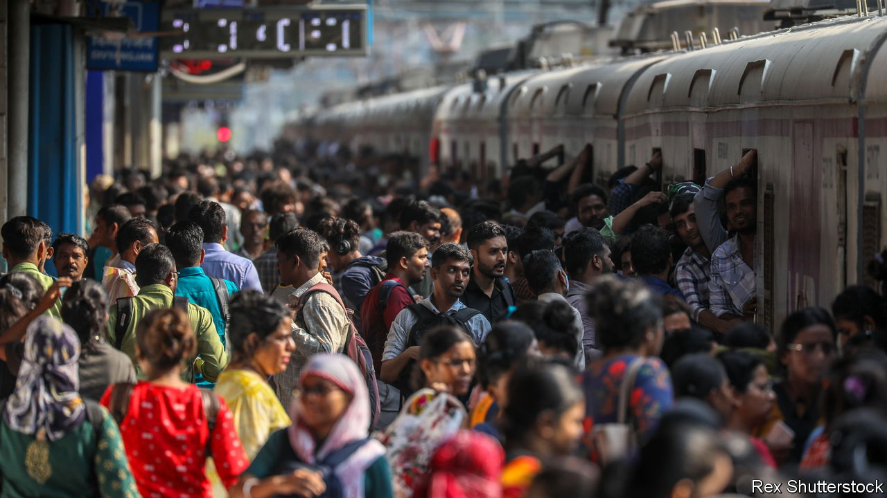

###### The Economist explains

# Why India’s population is about to overtake China’s 

##### For the first time in recorded history, China will not be the world’s biggest country 

 

> Apr 26th 2023 

INDIA’S POPULATION is  China’s. No one knows exactly when: India’s government  due in 2021 (because of the covid-19 pandemic, it says), so its numbers are not as exact as they might have been. But, according to the United Nations, a reliable guide on demographic matters, India and China had the same population in April 2023 (1,426m). Since China’s population is  and India’s is rising, it is a safe bet that the latter will overtake the former imminently. 

That has been widely expected. Less understood are some of the lessons of this event: that changes in fertility influence population trends for decades; that attempts to change fertility rates directly, especially coercive ones, almost always fail; and that improvements in living standards are the surest, as well as the most humane, route to a stable population.


In 1970 China’s population was 823m and India’s was almost one-third lower, at 558m. But in other respects the two giants were similar. In both people below the age of 25 accounted for the same share of the population, 60%. The working-age population (those between 25 and 64) was roughly the same, too, at just over 35%. And the total fertility rates of the giants were nearly identical at about six (this is the number of children a woman could expect to have during her life). That was high. Only one country—Niger—has such a rate today.

The giants had one other thing in common. Both were convinced, egged on by Western governments, that they needed to reduce fertility drastically. They chose coercive birth control as the way to do it, forcing women to have intrauterine devices (IUDs) or men to have vasectomies. China’s restrictions were more draconian, long-lasting and (in one sense) effective. In the early 1970s the country began a policy called “later, longer and fewer”, meaning late marriage, a long gap between births and few children (two, maximum). In the 1980s, this was replaced by the notorious “one-child policy”, which allowed most Han Chinese couples a single baby (the rules were slightly more relaxed for ethnic minorities). Between them, these policies halved China’s fertility rate in just ten years (from six to three) and gradually pushed it lower still. It reached 1.2 by 2022, far below the rate at which the population falls in the absence of mass migration. China’s population fell for the first time in 2022, though by that time an alarmed Communist leadership had scrapped the one-child policy. 

In contrast, India’s coercive measures were shorter, lasting about six months in 1976-77, and (because of India’s federal system) were less rigorously applied in the south than in the north. So Indian fertility fell gradually, reaching 2.0 in 2022, just below the so-called “replacement fertility rate” at which a population remains constant. As a result India’s population structure, measured by the relative size of different age groups, looks more stable than China’s. China is ageing alarmingly. Its over-65-year-olds will outnumber under-25s within about 15 years. In India that will not happen for almost 60 years. By 2080, the over-65s will be the largest age cohort in China; in India, they may never be. 

Coercive controls are not the only explanation for the falls in fertility. Massive improvements in living standards, health and education in both countries meant that families no longer felt the need to have many children as a sort of insurance policy. Fertility would have fallen anyway, as happened in the prosperous southern states of India where compulsory sterilisations were much less common than in the “vasectomy belt” of the north. Fertility in the south is now below the national average. If the Chinese had put more trust in the gentler influences of economic growth and social improvement, their population might now have a more balanced age structure. It might also still be the world’s largest. ■

