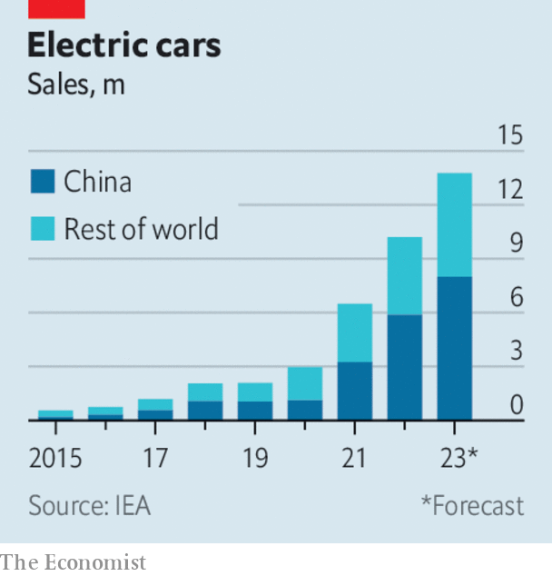

###### Business

# Business 

#####  

 

> Apr 27th 2023 

Another regional bank in America teetered on the brink of collapse. , based in San Francisco, said it was “pursuing strategic options” after revealing that customers withdrew some $100bn in deposits amid the turmoil surrounding the failure of Silicon Valley Bank. Although outflows stabilised in April, First Republic is reducing its workforce by up to 25% to cut costs. The bank’s already enfeebled share price fell by 50% in a day. 

Compare and contrast

Customer outflows at  reached $69bn in the first quarter, mostly in the days leading to its collapse and takeover by  at the behest of Swiss regulators. Many customers redirected their money to UBS, which reported $28bn in client inflows. 

America’s tech giants began announcing their latest results.  reported solid earnings. Revenue from cloud computing rose by 16%, year on year, a slower rate than in previous quarters but faster than markets had expected given the pullback in corporate IT spending. And advertising sales at  Google business bounced back following two disappointing quarters. The stock of both companies has risen by about 20% since the start of the year, outperforming the S&amp;P 500. 

 proposed $75bn takeover of was blocked by Britain’s competition regulator, potentially sounding the death knell for the deal. Regulators around the world worry that Microsoft’s purchase of Activision, whose video games include “Call of Duty”, would make it dominant in gaming. America’s Federal Trade Commission sued to stop the takeover in December. 

 quarterly revenue rose by 3%, year on year, the company’s first increase in sales in nine months. The Reality Labs division, tasked with developing the metaverse, made another heavy loss. Still, investors seem pleased with Meta’s strategy, sending its stock up by 74% this year. 

America’s Supreme Court declined an appeal from an inventor over a refusal to grant two patents for products created by . Stephen Thaler registered his DABUS AI as “inventor” for the patents, which was rejected because only humans can obtain copyright. Mr Thaler is fighting that law in America, Britain and Europe. He believes that DABUS has sensory experiences, and even a stream of consciousness. 

 share price soared on its first day of trading on the Tokyo Stock Exchange. The internet banking pioneer raised $625m, making it Japan’s biggest initial public offering since 2018. 

 central bank raised its main interest rate again, to 3.5%, and said it would increase the rate again in June or September. 

The Bank of England’s chief economist, Huw Pill, urged people to accept that they are worse off because of  and not seek higher pay, and said firms should stop trying to pass on their higher costs to consumers. Trying to “pass the parcel” would just add to inflationary pressures, he said.

Breaking apart news

Two years after winning a Pulitzer prize for its reporting on Xinjiang’s internment camps,  decided to wind down its stand-alone news division as part of a cost-cutting drive across the whole group. Like other digital-news providers that are mostly free to use, BuzzFeed has seen a sharp fall in revenue from advertising. 

 


Global sales of  rose by 25% in the first quarter, year on year, according to the International Energy Agency. EVs are expected to count for 18% of total car sales by the end of 2023 as more affordable models become available, up from less than 5% in 2020. The “exponential growth” of EV sales is being driven by China, which accounts for 60% of the market. Sales tripled in the emerging EV markets of India and Indonesia last year, though they are still dwarfed by sales of petrol cars in those countries. 

After months of struggling to stay afloat,  threw in the towel and filed for bankruptcy protection. The retailer fascinated Wall Street with its fight for survival and attempts to raise funds. Its status as a meme stock helped it ride out previous brushes with insolvency. The company never rose to the challenge of the digital age. “We missed the boat on the internet,” said one of its founders. 

Anheuser-Busch placed two executives on leave amid a furore over linking  with a high-profile transgender activist. The brewer sent Dylan Mulvaney a gift can of the beer with her face on it, which she promoted in a video. That prompted a backlash from conservatives: sales of Bud Light drooped by 17% in a week. “We never intended to be part of a discussion that divides people,” said AB’s boss. 

