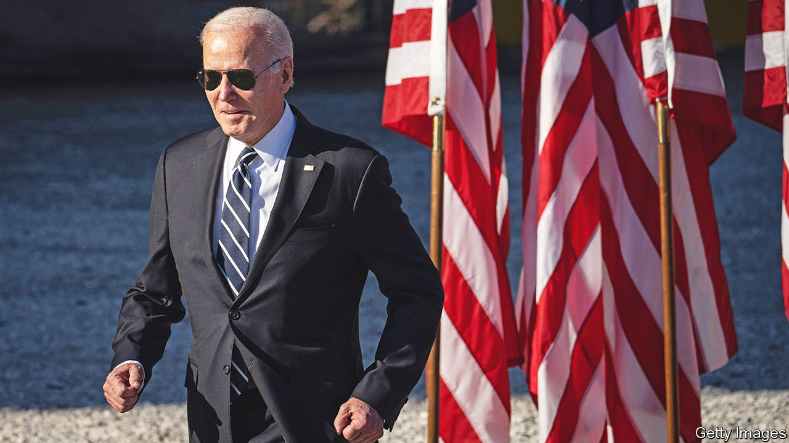

###### The world this week

# Politics 

#####  

 

> Apr 27th 2023 

 launched his campaign to be re-elected president of America. Some Democrats had questioned whether he would run again, given that, if he wins, he will be 82 at his re-inauguration. Mr Biden said America was still in a battle for its “soul” with Republican “extremists”; his announcement video replayed the violent attack on Congress by Donald Trump’s supporters in January 2021. If Mr Trump can stay out of jail before the election he seems on course to be the Republican candidate. Polling shows that most voters want neither man to run again. 

The Supreme Court decided that mifepristone could continue to be sold while it faces legal challenges in lower courts. That overturned a ruling by a judge in Texas to stop the sale of the  pill in a case focused on its approval in 2000 by the Food and Drug Administration. Mr Biden will make abortion an issue at the election. 

All Tuckered out

, America’s best-known right-wing pundit, was abruptly sacked by Fox News. It was unclear exactly why Mr Carlson, for years a thorn in the side of liberals, was defenestrated. There was speculation that Fox News considered him to be a liability, soon after it paid $787.5m to Dominion Voting Systems for broadcasting fake claims about its election machines. 

The House of Representatives passed legislation that increases the cap on the , but also calls for deep spending cuts. The bill was supported by Republicans, but rejected by Democrats, who don’t want any conditions attached to raising the debt ceiling. The government has already hit that ceiling and is using “extraordinary measures” to pay its bills. 

Disney filed a lawsuit against Ron DeSantis, the governor of , claiming he was behind “a targeted campaign of government retaliation” against the company when it came out against the state’s “Don’t Say Gay” bill. Disney was stripped of its special self-governing status amid the row over the bill, a decision it says threatens its business. 

Elon Musk said he was hopeful that another launch of his  could happen within a few months. Space X ordered the 120-metre rocket-spacecraft combination to destruct four minutes after its debut launch in Texas when it encountered problems. 

An Islamic State terrorist who planned the bombing of Kabul airport in August 2021, killing more than 170 people, including 13 American troops, has been killed by the Taliban, according to America’s National Security Council. IS renewed its campaign of violence in  after the Taliban returned to power in 2021, launching attacks on civilians and Taliban fighters. The Taliban has responded by killing key IS commanders. 

 visited Washington for the first state visit to America by a  president in a decade. Joe Biden renewed his country’s commitment to protect South Korea from North Korean aggression, announcing the deployment of more nuclear-capable aircraft to the country and promising more consultation on nuclear strategy. South Korea pledged not to develop its own nuclear weapons. 

 Labor government announced the biggest shake-up to the country’s defence priorities in decades. A strategic review pointed to competition between America and China in the Indo-Pacific as “the defining feature of our region and our time”, which had “the potential to threaten our interests”. Improved long-range missile technology means Australia can no longer rely on its remoteness to avoid attack. The government said the first guided missiles to be made in Australia would start production in 2025, earlier than expected. 

 executed a man for arranging to smuggle 1kg of cannabis into the country in 2013. Human-rights groups and his family claim the man’s conviction was unsafe. The authorities insist that he received a fair trial. 

,  president, held an hour-long phone call with Xi Jinping,  leader, the first direct talks between the two since Russia’s invasion of Ukraine. This came after China’s ambassador to France caused a diplomatic spat by saying that former Soviet states, including Ukraine, “do not have an effective status in international law”. China’s foreign ministry disowned the ambassador’s remarks.

Nine European countries, including Britain, signed an agreement to boost offshore wind power in the . On the day the deal was signed Norway’s prime minister, Jonas Gahr Store, warned that Russia was increasing its maritime intelligence surveillance in the area, which he described as a threat. 

Aggressive, or assertive?

Dominic Raab resigned as  deputy prime minister after an independent inquiry found some of his behaviour towards staff as foreign secretary and justice secretary counted as bullying. Mr Raab noted that all but two complaints had been dismissed, and said he had been targeted by “activist civil servants”. His defenders said the inquiry set a low bar for bullying and would make effective government more difficult. 

Gustavo Petro,  left-wing president, asked his cabinet to resign after it became clear that he had lost his majority in Congress. Mr Petro spooked markets by ditching José Antonio Ocampo as finance minister. He is a moderate and was seen as a stabilising force in the country’s first leftist government. The new finance minister is Ricardo Bonilla, who is an ally of Mr Petro and seen as less independent than Mr Ocampo. 

In  Gabriel Boric, the left-wing president, launched a plan to create a state-run lithium company. Chile is the world’s second-largest producer of the metal. A bill to formalise the creation of the nationalised company will be presented this year.

In  fighting continued between two rival generals, despite efforts to broker a ceasefire. Several countries including America, Britain, France and Germany have evacuated their nationals. Thousands of residents of Khartoum, the capital, have fled to the countryside or neighbouring countries.

Men wearing uniforms of the  army surrounded a village and killed 150 unarmed people in the latest of a series of atrocities against civilians. The killings came after a jihadist attack on a nearby army position.

 government got itself into a twist over the country’s membership of the International Criminal Court. The court has issued an arrest warrant for Vladimir Putin, putting pressure on South Africa to arrest him if he attends a summit in August. Cyril Ramaphosa, the president, said he would withdraw from the ICC. His office said he had spoken in error. 

 


 celebrated the 75th anniversary of its founding. In a speech Binyamin Netanyahu, the prime minister, highlighted Israel’s achievements since its birth and called for unity. Meanwhile more big protests were planned against his government’s push to reform the judiciary. The government has put the reforms on hold but is expected to reintroduce them when the Knesset comes back into session on April 30th.

