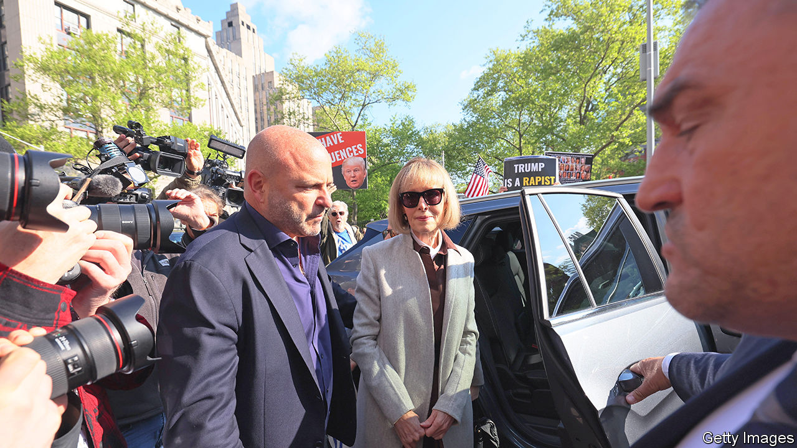

###### Lookback in anger

# A New York jury will be asked if Donald Trump is a rapist 

##### Another case against the former president gets under way 

 

> Apr 25th 2023 

After years of denial and months of—in the words of the presiding judge—“absurd” delay tactics, on April 25th the civil (as opposed to criminal) trial of a former president of the United States began for the alleged rape of a woman over 25 years ago. The accusations are the most serious of this nature that Donald Trump has had to confront. If Mr Trump, who strenuously denies the allegations and says they are part of a wider witch-hunt against him, beats this case he will probably come out stronger. A guilty verdict would harm his chances of returning to the White House.

Mr Trump’s accuser, E. Jean Carroll, a former columnist, claims the rape took place in a New York department store in the mid-1990s. Ordinarily such an accusation would be long past its statute of limitation. But last May New York state enacted a “lookback window”, which grants adult victims of sexual assault a year to file historical claims in civil court. Ms Carroll helped lobby for this Adult Survivors Act (ASA) and was one of the first people to file a case when the grace period started in November. In addition to sexual assault, she also accuses Mr Trump of defamation for calling her, among other things, “a complete con job” on social media.

A jury was selected and opening arguments aired in Manhattan on April 25th. Jurors will remain anonymous during the trial due to the sensitivities of the case and concerns about their safety. Although all eyes will be on what it means for Mr Trump, the case is about more than that. 

As the first prominent lawsuit heard under the ASA, it will be watched closely by victims of sexual assault who have not yet decided whether to come forward with historical allegations. And it will be studied by other states. Although several states have provided one-off lookback windows for victims of child sex abuse, only California and New York have done so for adults. “The ASA builds on the understanding that there are many reasons for someone not to have come forward in the past,” says Deborah Tuerkheimer, a law professor at Northwestern University, “and why in the post-#MeToo era many may choose to come forward now, if given the chance.”

In many ways the case is a typical “she said, he said” claim of sexual assault. As these often lack “hard” evidence such as medical records or camera footage, they come down to whether the jury believes the victim’s account. So lawyers typically rely on establishing, or attacking, the accuser’s credibility. In this instance the alleged attack happened long ago and was not reported to police at the time, making it even . Mr Trump’s legal team will try to sow further doubt by picking at any gaps in Ms Carroll’s memory. They have already pointed to the lack of eyewitnesses , and have accused Ms Carroll of political and commercial motives. 

However, Ms Carroll has several things going for her. First, this is a civil case, where the burden of proof is lower than in the criminal kind. Her lawyers need only convince the jury that it is more likely than not that the assault happened. Second, she has corroborating witnesses: two friends in whom she confided shortly after the alleged attack and who have since confirmed her version of events. Third, the judge has allowed her lawyers to show the jury the infamous Access Hollywood tape, recorded in 2005 and widely circulated in 2016, in which Mr Trump boasts of grabbing women “by the pussy”. (In her testimony on April 26th Ms Carroll alleged that “his fingers went into my vagina, which was extremely painful.”) The jury may also hear from two women who say they too suffered sexual misconduct by Mr Trump. 

The latter is particularly significant, says Andrew Stengel, a New York defence attorney. It will probably be used to suggest a pattern of behaviour by Mr Trump—“when a person said ‘no’ and didn’t consent, he’s acted like this in the past.” Similar additional testimonies were critical in helping put Harvey Weinstein and Bill Cosby, two Hollywood bigwigs, behind bars.

But Ms Carroll’s trump card is likely to be Mr Trump himself. In the run-up to this trial he has, unsurprisingly, made his lawyers’ job harder. He has changed his stance several times—initially saying he had never met Ms Carroll, suggesting she wasn’t his type and then (discrediting the second claim) confusing her in a picture with his second wife, Marla Maples. His deposition in October 2022 was a car crash. The parts that have been released include Mr Trump calling his accuser a “nut job” and suggestions that she thought “rape was sexy”. 

If the jury is persuaded by the credibility of the five women expected to take the stand, the immediate consequence for Mr Trump will be little more than monetary. But as the (also civil) conviction of O.J. Simpson in 1997 demonstrated, the general public might not make that distinction. A finding against him would presumably hurt him in an election, no matter how much he tried to portray himself as the victim. But, given how hard it is to prove sexual-assault claims, there is every chance that the case will deliver him not only a legal win, but a political one too.■


