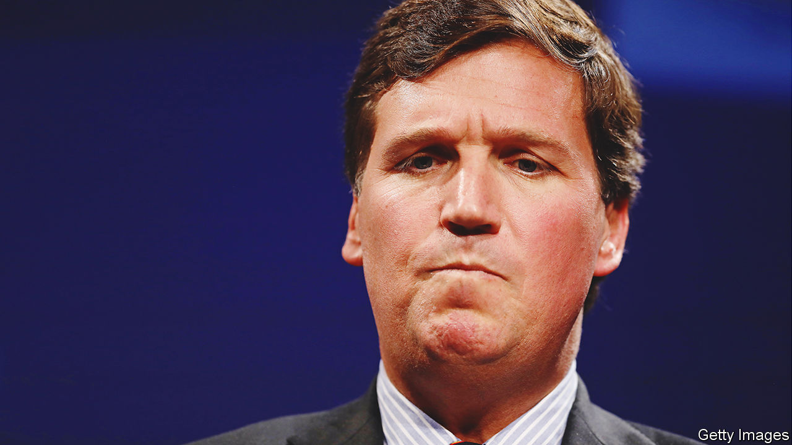

###### Later, Tucker

# Fox News shows that not even Tucker Carlson is bigger than the network 

##### Its most popular anchor was always an unlikely populist 

 

> Apr 24th 2023 

Six years ago the most popular cable-television host had a prime-time show on Fox News. Liberals abhorred him; conservatives tuned in to see him rail against “political correctness” and other liberal pieties. But after the  reported that Fox had paid out $13m to settle lawsuits from five women accusing him of sexual harassment or inappropriate behaviour, and more than 50 advertisers abandoned his show, the network  Bill O’Reilly to the kerb (Mr O’Reilly has long denied the charges).

History does not repeat itself, but it sometimes rhymes. On April 24th Fox parted ways with Tucker Carlson, currently the most popular host on cable television, who also rouses liberal ire. Fox is also facing a lawsuit, this time brought by one of his former producers, Abby Grossberg, accusing the network and Mr Carlson’s staff of sexism and anti-Semitism—charges that Fox and Mr Carlson deny.

Expensively and coastally educated, Mr Carlson was always an . His stepmother is heir to a frozen-goods fortune. Earlier in his career he worked for PBS and MSNBC, both liberal stalwarts. Mr O’Reilly affected an outer-borough pugnacity; Mr Carlson’s blue blazers, repp ties and cocksure delivery made him appear the embodiment of an old-school, East Coast establishment Republican.

That species, though, is as endangered as the blue whale. Mr Carlson’s political views are, by contrast, a strange mixture of cranky and hard-edged. Like many on the new right, he has fawned over the corrupt, illiberal regime in Hungary. He has argued that Democrats are “trying to replace the current electorate…with new people, more obedient voters from the third world”—a theory that finds favour on the far right. He has downplayed the attack on the Capitol on January 6th 2021, airing selectively edited video and claiming the rioters were “meek” “sightseers”. He has been relentlessly hostile to Ukraine’s president, Volodymyr Zelensky. And he has reliably supported Donald Trump.

In private, however, his feelings about Mr Trump were not so warm. Just two days before the Capitol riot, he texted his producer: “I hate him passionately.” To another colleague, he wrote: “We are very, very close to being able to ignore Trump most nights. I truly can’t wait.” These texts emerged as part of a  filed by Dominion Voting Systems, which Fox settled on April 18th. Mr Carlson had some interesting things to say about Fox’s management, too. “Those f-s are destroying our credibility,” he wrote. It is not yet clear if he was fired because he was caught misleading his viewers or because he was caught badmouthing his bosses. Perhaps it was neither: Gabriel Sherman, a noted Fox watcher, reported in  that Mr Carlson was a favourite of Rupert Murdoch’s now ex-fiancée, Ann Lesley Smith.

Some see Mr Carlson’s unceremonious departure—he and his executive producer, who is also out, reportedly had no inkling of their fate—as a tacit admission of wrongdoing, intended to reassure investors and pre-emptively staunch an advertising outflow of the sort that hit Mr O’Reilly’s show. Just a few days earlier, Fox parted ways with another Trump-boosting host, Dan Bongino. Perhaps Fox is cleaning house and needs a couple of severed heads to remind its employees of the distinction between pandering to its base, as partisan political programmes on both Fox and MSNBC frequently do, and defaming people or companies that might sue. Perhaps it was related to Ms Grossberg’s lawsuit.

Whatever the reason, Mr Carlson’s departure, like Mr O’Reilly’s, is a reminder that while Fox News may nurture and create stars, it is not beholden to them. When their antics become too costly or embarrassing, they are shown the door. Markets were unimpressed: Fox’s stock dropped sharply this week. But there is a lesson here for gleeful lefties too. They danced on Mr O’Reilly’s grave, and Mr Carlson sprang up to replace him. Fox News is still the most-watched cable network in the country, and has seen off threats from upstart rivals on the right. It won’t take Fox long to find someone else to thrill its viewers and enrage American liberals. ■


