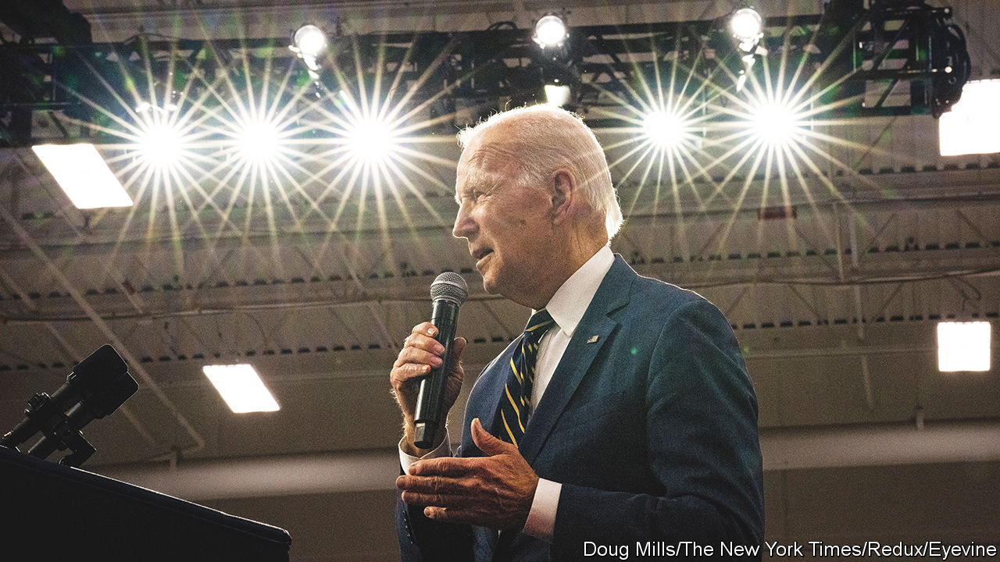
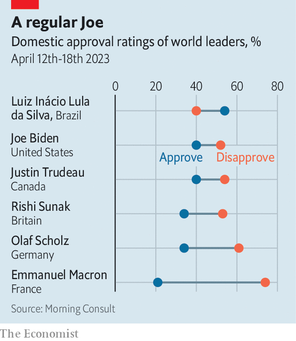

###### Take four

# Joe Biden fires the starting gun on the presidential race 

##### America’s future, and the West’s cohesion, rest on octogenarian shoulders 

 

> Apr 27th 2023 

The presidentiaL election of 2024 will feature Joe Biden against the Republican nominee. The polls suggest that person will be Donald Trump, giving America the sequel it does not want. Mr Biden announced his re-election bid on April 25th, the fourth anniversary of the start of his previous presidential campaign. Though in fact this will be the fourth time Mr Biden has run for president: his first attempt came before the fall of the Soviet Union or, for those who measure time by Michael Jackson’s discography, between “Bad” and “Dangerous”. Were he to win and complete a second term, he would be 86 when he leaves office. America’s population is younger than that of other Western democracies, its economy more vibrant. Its politics, however, are gerontocratic.

Those two facts—Mr Biden’s familiarity and his age—help explain why 70% of Americans do not want him to run again, a number that includes 50% of Democrats. Were he an inspiring campaigner, the span between his first presidential bid and his first successful one might not have been 32 years. In 2020 Mr Biden’s candidacy was the answer to a problem the Democratic Party had created for itself. The early front-runner in the primaries, Bernie Sanders, would have been a huge risk for the party to take, given his hard-left policies and the likelihood that he would have lost to President Trump. Who among the field had the greatest chance of holding off Mr Sanders and then beating Mr Trump? It was the guy who had always been there, the man whose appeal was that, in a time of too much political excitement, he was a bit dull.

Four years on, the Democratic Party has a similar dilemma. Incumbent presidents always run again if they think they will win their primaries. The Democratic Party has plenty of talent. Gretchen Whitmer, the governor of Michigan, Raphael Warnock, a senator from Georgia, and Andy Beshear, the governor of Kentucky, to name a few, have all shown the ability to win in places where Republicans are competitive. But Democrats are a more orderly bunch than Republicans these days. No serious candidates wish to destabilise a sitting president’s campaign. And so Mr Biden’s only primary challengers so far are a former spiritual adviser to Oprah Winfrey and an anti-vaccine campaigner. If the field stays like that, there may be no Democratic primary debates next year at all.

 


And yet this is not as sorry a position as it might seem. Yes, most Americans do not want Mr Biden to run again. But reluctant Democrats will line up behind their nominee. And, more importantly, an even higher number do not want another four years of Mr Trump. Among voters in general, Mr Biden’s numbers (minus ten points if you subtract those who feel negatively about him from those who feel positive) beat Mr Trump’s (minus 19). Nor is Mr Biden’s approval rating as bad as it seems if the point of comparison is not just past American presidents but the current presidents and prime ministers of other rich countries. Western voters are hard to lead in the 2020s: Justin Trudeau in Canada, Rishi Sunak in Britain and Emmanuel Macron in France all have even lower approval ratings than Mr Biden (see chart).

In theory, sitting presidents run on their records. Were that the case, Mr Biden could feel more confident ahead of next year’s vote. He has done more than almost anyone to prevent Russia from taking over Ukraine, without deploying any American troops. At home his big idea has been to pursue an industrial policy aimed at increasing the domestic manufacture of semiconductor chips, thereby easing American dependence on Taiwan, and to hand out subsidies aimed at speeding up the decarbonisation of America’s economy. This may be unwelcome to free-traders (and to some allies), but it goes with the mood of a country that has profited richly from globalisation while remaining convinced that it is under threat from foreign trade. As president, Mr Biden’s boast that he could make deals with the Senate that others could not—because he had spent 36 years working there—turned out to be true.

In practice, though, elections are not just referendums on the achievements of the incumbent. Campaigning matters. And Mr Biden is not very good at it. His vice-president, whose autocue sometimes seems to be controlled by Armando Iannucci, is not much help either. In 2020 big gatherings of people were prevented by the spread of covid-19. That suited Mr Biden, as did the economic slowdown.

Next year will be different. If the economy stays strong, Mr Biden has a good chance of winning. Put another way, a Biden-Trump rematch would be much more uncertain than it should be, relying on factors beyond Mr Biden’s control. If Mr Trump is indeed the nominee, he promises a revenge presidency (“I am your retribution,” he declared to fans at a recent gathering); and his second White House would be staffed with true believers. The task of preventing that will fall again on Mr Biden’s octogenarian shoulders. Every stumble he makes over the next year and a half will be a reminder of that burden. ■


