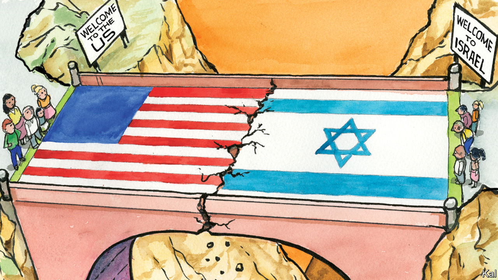

###### Lexington

# Why Israel is becoming a partisan cause in the United States 

##### It goes to the essence of the Jewish state, and of the American one 

 

> Apr 27th 2023 

The 75-year partnership between America and Israel stems partly from the friendship between just two men. After the first world war broke out, Edward Jacobson, a son of Lithuanian immigrants in Kansas City, Missouri, enlisted with an artillery unit and caught the attention of his lieutenant. “I have a Jew in charge of the canteen by the name of Jacobson and he is a crackerjack,” wrote the lieutenant, Harry Truman, to his fiancée. 

The two men became so close that after the war they started Truman &amp; Jacobson, a haberdashery in Kansas City, which prospered until the Depression upended it. The failure did not shake the friendship, nor did the subsequent divergence in their careers. Jacobson became a travelling salesman, whereas Truman began his improbable political ascent.

As the end of the British mandate in Palestine approached in May 1948, President Truman was inclined to support a partition that would create a Jewish homeland. But the State Department opposed the idea, and the president himself felt insulted by lobbying from Jewish advocates of statehood. (“Jesus Christ couldn’t please them when he was here on Earth,” he snapped at one cabinet meeting, “so how could anyone expect that I would have any luck?”) Chaim Weizmann, Zionism’s elder statesman, sailed to America to make the case; Truman refused to see him. 

Jacobson had never asked a favour of his friend. But he flew from Kansas City and, without an appointment, walked into the West Wing one Saturday. Jacobson recounted in a letter shortly afterwards that Truman showed “a brother’s interest” in his business, as ever, but became angry at mention of Palestine.

Jacobson made an impassioned plea for Mr Weizmann and reminded Truman of his own steel: “It doesn’t sound like you, Harry, because I thought you could take this stuff they have been handing out to you.” Truman drummed his fingers on his desk. He spun away in his swivel chair, gazed out at the rose garden. Finally he swivelled back. “You win, you baldheaded son-of-a-bitch,” he said. Jacobson left, found a bar and, for the first time in his life, downed two double bourbons.

At his meeting with Truman, Weizmann got the commitment he hoped for. Though the administration’s public stance would shift, Truman did not falter, and on May 14th 1948 America became the first country to recognise the first Jewish state in almost 2,000 years. Truman said Jacobson’s role was “decisive”. 

A pattern was set: the relationship between America and Israel has always been close, seldom been easy. President John Kennedy threatened to review America’s security commitments to Israel over its refusal to allow inspections of its nuclear reactor at Dimona. President George H.W. Bush threatened to cancel loan guarantees unless Israel stopped settling Jews in occupied territory. 

Less than a month after the attacks of September 11th 2001 Israel’s prime minister, Ariel Sharon, said that President George W. Bush risked appeasing “the Arabs” just as Europe appeased Hitler. The ensuing furore was such that Lexington, then the Jerusalem bureau chief of the , found himself granted a rare interview with Sharon. He was even more astonished when Sharon, the toughest politician he has covered, expressed regret five times in under five minutes. “Unfortunately, the metaphor in my words was not understood, and I am sorry for that,” he said.

The frostiness between President Joe Biden and Israel’s current prime minister, Binyamin Netanyahu, then, is nothing new. Though he rebuked Mr Netanyahu in March for his effort to undermine Israel’s Supreme Court, Mr Biden has shown no interest in pressing Israel. After 75 years, the strain building between Israel and America is not between the governments. It runs deeper.

Progressive unease with Israel dates at least to the occupation of the West Bank and Gaza Strip in the six-day war, in 1967. But the stalemate that denies basic rights to Palestinians, America’s polarisation and the mutual embrace of Mr Netanyahu and Donald Trump have made that view mainstream among Democrats. In March Gallup reported that Democrats’ sympathies had, on balance, shifted to the Palestinians for the first time since it started asking the question in 1988. (Republicans overwhelmingly sympathised with Israelis.)

Strange lands

The American left’s objections go beyond Israel’s policies to the very nature of the state. As living memory of the Holocaust fades, many progressives, including Jews, see a contradiction between struggling for a multiracial democracy at home and supporting a Jewish state in the Middle East. “Many younger progressive Jews see white Christian nationalism as a form of ethnocracy that parallels Zionism,” says Peter Beinart, an eloquent critic of Israel whose intellectual evolution over the past 15 years has tracked, and advanced, the shift on the left. 

Fully one in four American Jews agreed with the statement that “Israel is an apartheid state”, according to a poll in 2021 by the Jewish Electorate Institute, and one in five supported settling the conflict by creating a single state. “We’re moving from being brothers to being cousins,” a top adviser to Sharon once mused of Israeli and American Jews. “And in the next generation we will be distant cousins, with some sense of shared history.” He made that remark roughly a generation ago. 

Jacobson did not consider himself a Zionist, but he was moved by the horrors of the Holocaust. He might find the moral case less stark today. It is a sign of progress that the old debate over where Jews can be safe—in Israel under siege from Arabs, or in America under siege from assimilation—is being supplanted, at least on the left, by one over where Jews, menaced everywhere by anti-Semitism, can count on their children being able to live morally sound lives. Would that either Israeli or American democracy, today, offered an example that confidently answers that question. ■


