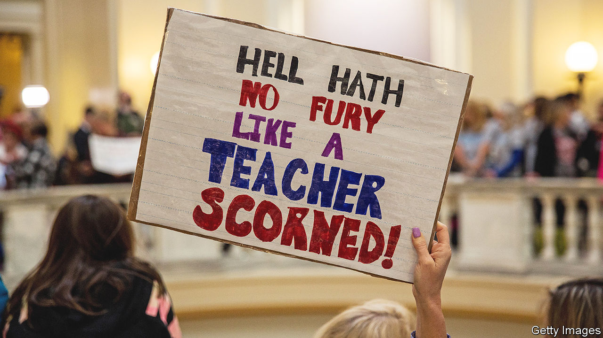

###### Classroom politics

# Why Republicans are giving huge pay rises to teachers 

##### They do so, despite many worrying about critical race theory and indoctrination 

 

> Apr 22nd 2023 

IN APRIL 2018, teachers in Oklahoma staged an insurrection. Angry at dismal pay, they walked out of their classrooms for nine days and converged on the state capitol to demand more money. This was part of a wave of teachers’ strikes that year in Republican-dominated states, including Arizona, Kentucky and West Virginia.

Five years later, things are different. The Oklahoma legislature, which has a Republican supermajority, passed an average salary increase of $6,100 in the days before the strike; then a smaller increase of $1,200 the next year. It is currently debating a further increase of $3,000-6,000, depending on seniority. From the sitting room of the governor’s mansion, Kevin Stitt, the recently re-elected Republican governor, is upbeat about the pending pay-increase legislation and dreams of paying the best teachers in the state “up to $100,000” by the end of the year.

Oklahoma is hardly the only Republican-dominated state shovelling money at teachers. This is happening even as the party has been banging on about the problems of public schools, accusing teachers of indoctrinating children with  (CRT) and gender ideology.

Ron DeSantis, the Florida governor, has placed himself in serious contention to be the party’s next presidential nominee by campaigning against wokeness ; yet he also crows about increasing starting salaries for teachers by $7,000 since 2020 and spending $2bn on teachers’ pay. Sarah Huckabee Sanders, the governor of Arkansas and the pugnacious former press secretary for Donald Trump, signed a remarkable bill in March to increase minimum teacher pay in the state from $36,000 a year to $50,000 (by one measure, moving its ranking from 48th in the nation to sixth). Glenn Youngkin of Virginia was one of the first to pioneer the winning anti-CRT strategy in 2021. Yet he also proudly signed a 10% pay rise for teachers in 2022 and is pushing this year for an additional $100m in spending on teacher-retention bonuses.

Some might suggest this presents a paradox. Mr Stitt argues that it is the emergence of a coherent, competing Republican agenda that can undo the narrative that Democrats are the best party for education. “We believe in merit pay,” he says, “but I’m still not supportive of the big unions, because I don’t think they’re doing teachers a service and not focusing on the kids.” In addition to higher pay for teachers in traditional public schools and safeguards to assure that there is no wokery, he says, parents should also be furnished with tax credits to send their children to private school if they wish. “I’m always saying let’s fund the students, not the system. Let’s empower parents because they know what’s best for their kids.” 

That is what is happening in other states, too. The recent pay-increase legislation in Arkansas creates a voucher scheme, establishes a merit-pay programme to reward high-performing teachers with bonuses of up to $10,000, raises standards for literacy, bans the promotion of CRT and prohibits the discussion of sex for pupils below the fifth grade (roughly age 11).

A few other factors help explain the trend. State budgets were flush after a deluge of federal dollars arrived during the covid-19 pandemic even as an unusually strong economy produced high revenues. A shortage of teachers, which remains a problem in Oklahoma, would only get worse if the state could not keep up with wages offered by its neighbours (and even the ones offered by employers such as Amazon). Schools remain the centre of many rural communities and many rural educators are Republicans; letting them flounder out of spite against potential indoctrination would be unpopular. Effective campaigning and effective governance are rather separate.

But some blur the lines. Ask Ryan Walters, the freshly elected Oklahoma superintendent of public instruction, what the biggest problem in the state’s schools is and he replies without a moment’s hesitation: “the left-wing mentality that education should be used to indoctrinate kids and push a perspective on them”. In school districts “where the teachers’ unions have a more heavy influence”, he says, “you see a much greater push for pornographic materials for conversations about transgenderism in the early grades, conversations around race that are inherently racist”.

No dark sarcasm in the classroom

After lawmakers queried Mr Walters’s allegations he emailed a 56-page memo documenting books in school libraries with sexually explicit illustrations—including one graphic memoir titled “Gender Queer”. Several lawmakers, Republican and Democratic, had printed the memo and thrust it angrily at your correspondent when he visited their offices and inquired about the education superintendent. “I asked for him to appear before my committee. I didn’t ask for him to choose what the subject matter was,” says Mark McBride, a Republican state representative and chair of the education budget subcommittee. “Why are we continuing what I would call campaign rhetoric? I can’t answer that. I have no idea,” says Ronny Johns, another Republican representative and a former teacher who is advocating for “more than a $2,500 pay raise”.

But even Mr Walters says: “I absolutely believe teachers should make more.” He is adamant that this must be through merit pay, not the current rigid pay schedule that ties compensation to years of experience, which he describes as “socialist”. 

The new policy regime is receiving a mixed reception from teachers—despite the increased money. The rhetoric “is like a dagger in your heart,” says Katherine Bishop, president of the Oklahoma Education Association, the state’s largest teachers’ union, who says it is harder to be a teacher today than it was before the walkout, as a result of the pandemic disruptions and the lack of personnel. “We’re like King George. We’re going to send fully armed battalions to show teachers our love. We’re going to give them raises sometimes, but we’re also going to say terrible things,” says John Waldron, a Democratic state representative and former teacher in Tulsa. 

Others don’t like the added conditions. “My hesitation about the pay raise is it’s tied to vouchers, which is just a slap in the face to those of us that are running fully public schools,” says Cecilia Robinson-Woods, the superintendent of Millwood Public Schools, a small, largely African-American school district in Oklahoma City. The scrutiny and requirement that lesson plans be posted have made her teachers “nervous wrecks”, she says. She notes a recently passed bill that would make it easier for educators to have guns in school. “These are the same leaders that don’t trust us with library books, but want to arm us?”

What the detractors might miss, however, is the possibility that Republicans craft a new education policy that proves to be genuinely popular. Republicans are now willing to spend money on both traditional public schools and tax credits for private schools. Their new conditions—that there not be any social-justice indoctrination in the classroom—poll well even if they also institute onerous monitoring. No parent bristles at the idea of parental rights and empowerment. ■


