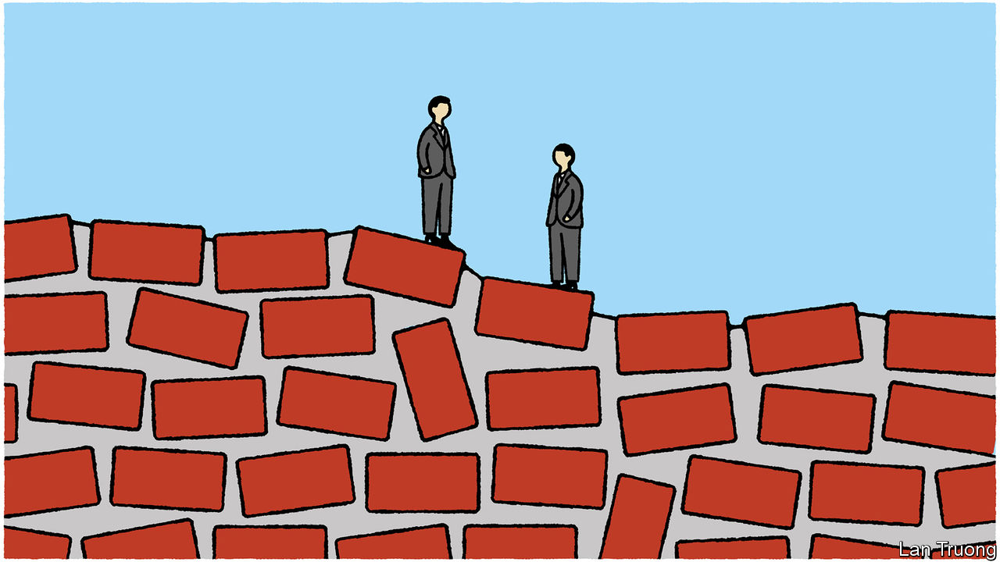

###### Banyan

# America’s closest Indo-Pacific allies are cosying up 

##### But the rapprochement between South Korea and Japan is brittle 

 

> May 4th 2023 

WHEN Kishida Fumio arrives in Seoul on May 7th, he will become the first Japanese prime minister to make an official visit to South Korea in more than a decade. His trip is testament to how fast the testy relationship between the neighbours and American allies has improved since early March, when Yoon Suk-yeol, South Korea’s president, announced a plan to end a festering dispute over Japanese wartime forced labour and then jetted to Tokyo for a summit.

After bonding over , a nostalgic Japanese egg dish, the two leaders set to work. Their governments revived an intelligence-sharing agreement signed in 2016 but put on ice under Mr Yoon’s predecessor. They lifted export controls and trade barriers imposed when the forced-labour dispute heated up. A bilateral security dialogue took place last month for the first time in five years; the two countries’ finance ministers met this week for the first time in seven years. Japanese and South Korean tourists are flocking to each other’s countries.

The improvement in two-way ties has enabled closer three-way co-operation with America. That is why President Joe Biden, who desperately wants his allies to stop bickering about the past and focus on present-day challenges from China and North Korea, hailed Mr Yoon’s plan as “groundbreaking”. A trilateral defence dialogue restarted last month after a three-year hiatus; two days later, the three countries’ navies staged exercises in international waters between South Korea and Japan. Mr Kishida’s trip to Seoul serves as a prelude to a trilateral leaders’ summit during the G7 gathering in Japan later this month, which Mr Yoon will attend as a guest. If America, Japan and South Korea could co-operate effectively, it would have big implications for the balance of power in the Indo-Pacific. 

Yet the rapprochement rests on shaky foundations. Diplomatic sources rate the negotiations over the forced-labour dispute a clear win for Japan—an unfortunate impression given that compromise is essential. Mr Yoon’s plan aims to avert a threatened liquidation of Japanese assets seized by South Korean courts. It involves creating a South Korean government-backed fund to compensate Koreans forced to work in Japanese factories during the colonial era. South Korean officials hoped Japan would apologise anew to the victims and encourage its firms to chip in to the fund, even though Japan considers the matter settled by a treaty signed in 1965. Mr Kishida, hesitant to upset the right of his party, did not budge. So Mr Yoon decided to “take the initiative, and let Japan respond,” says Park Cheol-hee of the Korean National Diplomatic Academy. 

The result is that 60% of Koreans oppose the plan. Only ten of the 15 families involved in the main court case on the issue have accepted money from the new fund; all three living victims have refused it. Mr Yoon reinforced a perception that he truckles to Japan when he told the  that his country’s former colonial ruler should not have to “kneel” for forgiveness “because of our history 100 years ago”. Critics in Seoul call Mr Yoon “Japan’s number one salesman”, a riff on his pledge to be “South Korea’s number one salesman”.

Mr Kishida has a chance to steady the foundation during his visit. Yet the two sides have different views of what constitutes a “sincere” offering, says Nishino Junya of Keio University in Tokyo. Mr Kishida may bring nothing more than a decision to restore South Korea to Japan’s preferred trading-partners list. That would dismay many Koreans, who will be judging what he says about history, says Choi Eun-mi of the Asan Institute for Policy Studies, a think-tank in Seoul. At the least, Mr Kishida should offer the victims “words of comfort”. 

Officials in Tokyo, Seoul and Washington hope to overcome any disappointment. China’s rise and North Korea’s sabre-rattling are powerful reasons to get along. Mr Yoon, who will be in office until 2027, is committed to his policy on Japan. Yet there are plenty of potential flashpoints, from territorial disputes to controversies over textbooks. Another of the forced-labour cases is making its way through South Korean courts. 

Moving beyond the cycles of recrimination will require a willingness to speak about the past and future simultaneously, rather than viewing troubled history as a problem to be fixed and forgotten. “You can’t just put a bow on it and move away from history,” argues Tom Le of Pomona College in California. Instead, South Korea and Japan must find ways to “move with history”. The future of their region depends on it.■


