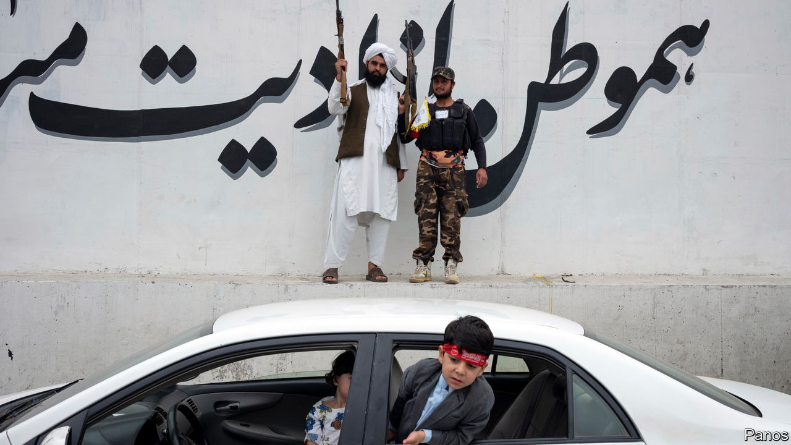
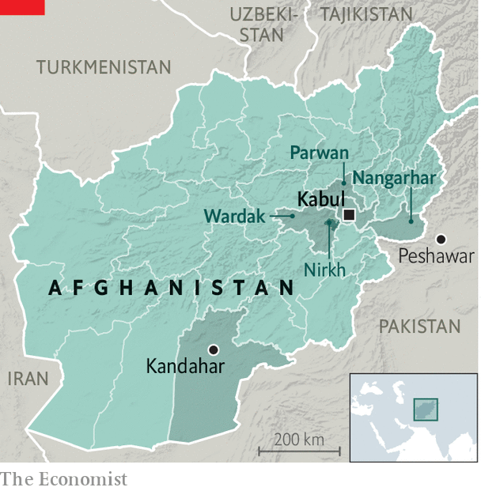
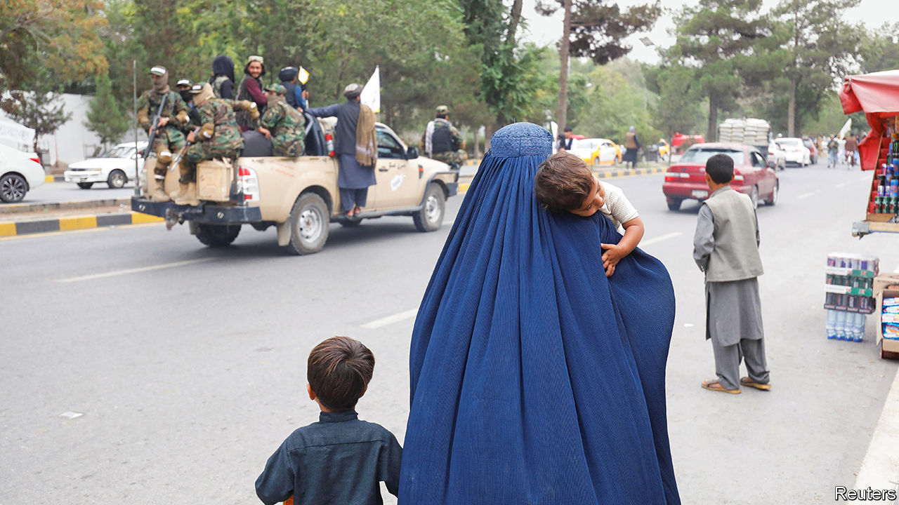

###### Afghan reality

# Life under the rule of the Taliban 2.0 

##### For half of Afghans the mullahs’ regime is less bad than feared 

 

> May 1st 2023 

FOR TWO decades America and its allies expended thousands of lives and some two trillion dollars in Afghanistan to stop, they said, the Taliban returning the Central Asian country to al-Qaeda plotting and chaos. After the Islamist militants 20 months ago, it was feared that would be Afghanistan’s fate. The reality is a little different.

Ask the  dealers, operators of a vast money-transfer market, clustered in a warren-like bazaar beside the Kabul river. Having for years helped the Taliban finance their insurgency, these well-connected moneymenwho are estimated to provide twice the volume of commercial loans that Afghanistan’s banking industry does, thought they had nothing to fear from them. The had foiled previous efforts by Ashraf Ghani, the country’s last NATO-backed leader, and his predecessor, Hamid Karzai, to regulate their largely untaxed trade. Yet the Taliban government has proved a more committed reformer. It has forced the  to keep computerised records and follow “Know Your Customer” requirements. Non-compliant businesses have been shut down. The boss of the money-changers’ union was stripped of his licence to operate. “With these guys, you do what you’re told,” says Babarak Amiri, a veteran .

The picture in Taliban-governed Afghanistan is not straightforward. The militants’ return has in many ways been disastrous for its 40m people. For women and girls, the disaster has been unambiguous. Afghanistan is now the only country where it is  beyond secondary-school level, or to . According to the UN, 80% of Afghanistan’s 2.5m school-age women and girls are not being educated.

Much of the country has been plunged into hunger, due to a combination of volatile global food prices and an economic crisis triggered by the withdrawal of Western support. It led to a collapse in foreign investment and remittances. With foreign banks refusing to facilitate transactions with the country, Afghanistan’s economy shrank by 35% between 2021 and 2022, according to the World Bank. 

The Taliban, predictably, have refused to share power with their local rivals. The mullahs are mostly Pashtuns, members of Afghanistan’s biggest ethnicity; many of their opponents belong to the Tajik group, the second-biggest. This raises the risk of a return to the ethnic conflict that ravaged the country in the 1990s, precipitating the Taliban’s first takeover. Extrajudicial killings have accompanied their efforts to stamp out opposition.

Yet the Islamists are in some ways surpassing the—admittedly low—expectations for their rule. Take their approach to terrorism. They do not appear to be trying to constrain al-Qaeda’s remnants in Afghanistan; the group’s former leader, Ayman al-Zawahiri, was living in Kabul when he was killed by an American drone last year. But al-Qaeda is globally at its lowest ebb, superseded by Islamic State (IS), a terrorist outfit spawned by the wars in Syria and Iraq. And the Taliban are attacking IS’s local affiliate—which they consider a deadly rival—in its rugged hideouts in eastern Afghanistan and elsewhere. Consequently, as Zalmay Khalilzad, a former envoy to the Taliban for Joe Biden and Donald Trump, recently noted, the threat of terrorism launched from Afghanistan has not increased.

 


Some of the Taliban’s efforts to govern Afghanistan are at least as good as their recent predecessors’. When the country’s currency, the Afghani, crashed to record lows in December 2021, the clerics turned for advice to a central bank stuffed with Western-trained bureaucrats. It did not have the means to stabilise the currency through bulk-buying, as America had frozen $9.5bn of Afghanistan’s foreign-currency reserves. The Taliban therefore stanched the flow of dollars leaving the country by imposing harsh capital controls, a crackdown on smuggling and the overhaul. The Afghani stabilised and is now just 7% lower against the dollar than it was the day before Kabul fell.

The Taliban have improved economic-law enforcement across the board. Tighter controls at the border led to a big increase in recorded exports and customs revenues. Overall revenues for the year ending March 2023 were $2.3bn, up by 10% on the year ending March 2021. The threat of sharia-law punishments, including hand amputation, deters customs officials from taking bribes, notes an adviser to Mullah Baradar, the deputy prime minister in charge of economic strategy. “The core competency of the Taliban government is the enforcement of laws and orders,” he says. “If we find you are doing corruption and we implement sharia laws on you, you will not do corruption again.”

To acknowledge such progress is less a tribute to the Taliban’s harsh methods than an indictment of the corrupt, NATO-backed governments the Islamists replaced. In Kabul, a city of 4.5m, there are many signs of better law enforcement. Roadworks held up for years by illegal squatters have been pushed through by Hamdullah Nomani, the city’s mayor. Street vendors have been corralled into designated areas. Drug addicts have been taken off the streets and into rehab. Roundabouts have been beautified, filthy restaurants closed and 30,000 street dogs inoculated against rabies.

The proportion of businesses that bribe customs officials is down from 62% to 8%, according to a recent World Bank survey. Sanzar Kakar, an Afghan-American entrepreneur who owns the country’s biggest auditing company, says his staff are no longer asked for bribes during their regular visits to the finance ministry, previously “a daily headache”. The departure of a “whole crop of corrupt people”, including MPs, cabinet ministers and intelligence officials is “one of the biggest blessings”.

Though Afghanistan has lost the 75% of its budget formerly donated by foreigners, the Taliban have raised enough revenue to pay 800,000 government employees. Some have received back-pay to make up for a bumpy early couple of months after Mr Ghani’s government collapsed.

The Taliban are most concerned, their limited budget disclosures suggest, about paying their fighters. A mini-budget last year earmarked 41% of spending for defence and security. That is a vast outlay for a country no longer at war. With an army of 150,000 and 200,000 police, the Taliban have more forces than Mr Ghani’s government. The Taliban army chief of staff says they aim to recruit another 50,000 soldiers and buy anti-aircraft missile systems to knock out American drones.

Too late for the Bamiyan buddhas

Crackpot as they can seem, the Taliban are winning solid reviews from surprising quarters. The boss of a Kabul-based media company, no fan of the mullahs, reckons “Afghanistan is better managed today than Pakistan”. He also believes Afghan TV stations are freer to report the news than those in India and Turkey. A dogged band of foreign and local archaeologists and curators of Afghanistan’s rich heritage, who remain in Kabul, credit the Taliban for backing restoration of pre-Islamic sites.

Zia ul Haq Amarkhil, governor of Nangarhar province before the Taliban takeover, says they are running things “properly”. Like many others in Kabul, he is irritated by the narrative of unremitting doom perpetuated by rights groups and Afghans who fled in 2021. “My brother Afghans outside the country do not agree, but they are not here, they do not know the reality. I am here, I know the reality.”

Any improvement in the Taliban’s performance partly reflects the different circumstances in which the mullahs are governing. In the 1990s Afghanistan’s treasury was a safe-box in the Kandahar compound of Mullah Omar, then their leader. The Afghan state is vastly more capable today. But the Taliban have improved, too. Their reclusive leader, Hibatullah Akhundzada, is a malign figure, responsible for ratcheting up curbs on women from his Kandahar base. Yet the Taliban cabinet in Kabul includes able pragmatists.

Afghanistan’s rulers are also assisted by the fact that they, unlike their immediate predecessors, do not have to contend with their own insurgency. It killed an estimated 69,000 soldiers and police between 2001 and 2021 and made economic development perilous or impossible in much of the country. Because companies no longer have to pay for private security, the cost of building projects has fallen by more than 50%, say businessmen in Kabul. In rural areas, telecoms companies can use masts the Taliban had switched off to prevent locals from reporting their movements.

Despite such improvements, suffering is rife. The UN estimates 700,000 have lost their jobs. Middle-class families employed in the sectors that most depend on foreign support—including NGOs, business services, hospitality and the media—are especially hard hit. Fahima, a 26-year-old TV presenter who used to cut a glamorous figure in entertainment and news shows, now sells sex in Kabul to support her family. Finding her first customers, while adhering to Taliban dress code, was tricky, she says in a phone interview. She had to flash glossy high heels from under a burqa. Another longtime sex worker describes an influx of competitors from middle-class families. “This work has become more secret and more dangerous as it’s not possible to bribe police any more,” she adds.

In the countryside, home to 75% of Afghans and blighted by years of drought, conditions are tougher. “We no longer have to risk our lives to get our crops to market,” says Mohammed Tahir, a farmer in Nirkh, a district in central Wardak province that saw heavy fighting as the Taliban advanced. “But everyone is cutting back how much they buy, how much they eat.”

 In 2019, 6.3m Afghans were considered in need of humanitarian aid; now 28m are. The UN reckons 97% of Afghans live below the poverty line. Some areas are on the brink of famine. The UN’s World Food Programme (WFP) has set up food-distribution centres across the country, including in a dingy sports hall in Kabul where 2,500 people recently queued for food. They each emerged with 50kg of flour, a bag of pulses, a bottle of cooking oil and a pouch of salt. Nawaz Ali, a disabled head of a family that includes five daughters, says the ration won’t get them through the month.

 Last year the UN spent over $3.25bn on humanitarian aid. This year it has so far raised $425m of the $4.6bn needed. Due to a shortage of funds, 4m people were recently cut from the list of those being targeted for food aid. The WFP is preparing to stop providing assistance later this month, absent an urgent infusion of $900m.

The aid is dispersed through UN agencies and NGOs. UNICEF, the children’s fund, has paid stipends to nearly 200,000 teachers; the International Committee of the Red Cross is paying 10,000 medical staff. The Taliban are naturally irate. “Barely 10% of UN money gets to the people,” claims a Taliban finance-ministry official. “Giving it to the government would drastically reduce overheads.”

Some UN officials agree that the emerging “republic of NGOs” is unsustainable—and undermines two decades of efforts to build Afghan institutions. Inevitably, it also helps the Taliban. The millions of dollars of cash the UN regularly flies into Kabul backs the Afghan currency. SIGAR, an American government watchdog, says the Taliban is also skimming off aid money through “licences”, “taxes” and other “administrative fees” imposed on NGOs.

Two big things stand in the way of the Taliban winning a modicum of international acceptance. First, their uneven counter-terrorism efforts. Though they attack IS’s local affiliate, the Islamic State Khorasan Province (ISKP), they are still said to be pally with their old terrorist ally, the remnants of al-Qaeda, and clearly pally with a newer one, the Pakistani Taliban (TTP), which launches attacks into Pakistan from Afghanistan: in January it blasted a mosque in Peshawar, killing nearly 100 police. Pakistan has mulled launching military raids in retaliation. In April China, Iran, Russia and several Central Asian states moaned about Taliban links to groups that threaten regional security.

Equally damaging to the Taliban’s hopes of recognition are their curbs on women and girls. Even Saudi Arabia, one of the few countries to recognise the Taliban’s first government, condemned the decision on March 22nd to bar them from Afghan secondary schools and universities. The Taliban have also this year banned women from working for NGOs and UN agencies.

Most of the Taliban’s ministers are said to oppose these measures. During their long exiles in Pakistan and Qatar, some educated their daughters. But Mr Akhundzada, a former judge who once recruited his own son to become a suicide-bomber, has a veto on the issue. Beyond his personal views, he is considered anxious to keep the Taliban rank-and-file on-side. Some have defected to the more hardline ISKP. If the Taliban are seen to have gone soft on women’s rights, more may follow.

This difference led the powerful interior minister, Sirajuddin Haqqani, to make a rare public dig at Mr Akhundzada in February. “Monopolising power and hurting the reputation of the entire system are not to our benefit,” he said in a speech at an Islamic school. Mr Haqqani and other Taliban big shots, including Mullah Yaqoob, who is the defence minister and Mullah Omar’s son, have their own power bases within the movement. Their pictures are displayed at Taliban checkpoints.

But there seems little prospect of their forcing a showdown with Mr Akhundzada, who has a bodyguard of thousands of his fellow Noorzai tribesmen in Kandahar. “All the Taliban ministers I meet are shaking their heads over girls’ education,” says Mr Amarkhil, the former provincial governor. “But at the end of the day they don’t have the courage to confront him.”

No place for women

Disagreement with the anti-women policies has led to patchy implementation, especially in Kabul and elsewhere outside the Pashtun south. Some NGOs and UN agencies, particularly in health services, have been granted exemptions by individual ministers and governors. Women are banned from working at NGOs, but not in important private companies, including banks and telecommunications firms. They are supposed to work in separate spaces; but segregation is usually observed only when the vice-and-virtue police visit.

 


Thousands of girls are being educated underground. A women’s activist tookto visit a secret school in a Kabul side-street. Because she was forbidden to ride in a car with an unrelated man, she arrived separately by taxi, driven by a different unrelated man. She fears this nonsensical loophole will soon be closed. “They are going to come for all of us eventually,” she said. The school, a dimly lit room in a rented house, which is part of a countrywide network, passes itself off as a . When the Taliban come knocking, the teacher switches from maths to the Koran.

Despite such brave anomalies, it is appalling to witness the freedoms of millions of Afghan women being asphyxiated. Tahira, a 28-year-old in Kabul, formerly worked as a teacher and personal trainer in a now-shuttered women’s gym. (Women have also been barred from parks and women-only public baths.) Now her life consists of housework and daily visits to an actual . “My parents say I have to obey the new rules,” she says. “They used to be so open-minded, but they have changed.”

It is also demoralising to many men. “I have two daughters and a wife who trained as an engineer and is a teacher,” says a senior civil servant who, unlike many of his peers, decided to stay on after the takeover. If the women’s education ban is not overturned by the end of the year, he will join the exodus, further enfeebling the bureaucracy. A digital system introduced by the Ghani government has already been abandoned. “Everyone used to have a laptop on their desk, now we have to do everything with these,” he says, holding up a piece of paper slowly gathering signatures as it crawls around his department.

Other problems for the Taliban loom. Revenues may not hold up; some businessmen say punitive taxation will force some firms to close. Despite the movement’s fierce reputation, economic desperation is pushing up street crime, many Afghans say. In Kabul even electricity cables are being stolen, says an NGO worker, who has been robbed of two mobile phones at gunpoint in the past year.

ISKP is proving resilient, despite the Taliban’s success in killing its commanders. In recent months, this IS affiliate has attacked prominent targets in the capital, including a hotel frequented by Chinese visitors. In March a suicide-bomber blew up a provincial governor as he sat in his heavily guarded office. ISKP operatives are hard to detect because so many are Taliban defectors. Bearded, long-haired young men now receive the most scrutiny at the Taliban’s roadside checkpoints.

Even so, the Taliban face no serious challenge for now. Their armed rivals control no terrain. The vast majority of Afghans are exhausted with conflict and resigned to Taliban rule. If the mullahs, taking note of public sentiment, could only accentuate their unpredicted positives, that might not end up too badly for Afghanistan. This is the Taliban’s opportunity. If instead they defy public opinion, predicts Mr Amarkhil, disenchantment with the mullahs will build and opposition grow—”from people who are starving, from those the Taliban are suppressing, from those who just want education for their daughters and sisters.”■

