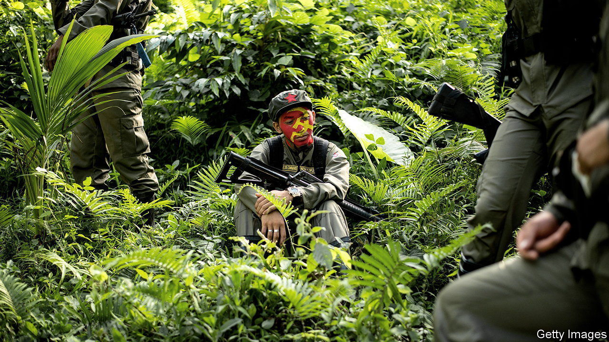

###### The revolution is over

# The Philippines’s once-proud Maoist insurgents are out of ammo 

##### The New People’s Army is a relic of all sorts of political stupidity 

 

> May 4th 2023 

LaST MONTH the guerrilla leaders of the New People’s Army (NPA) ordered its units all over the Philippines to give a 21-gun salute to two fallen heroes. Yet this martial display was diminished by an instruction to give the salute silently, either because the army is out of bullets or for fear a fusillade would alert the police. The few hundred fighters who duly lined up (and presumably whispered “bang”) are all that remains of a once-formidable Maoist insurgency. The NPA was launched 54 years ago to overthrow an American-backed president, Ferdinand Marcos. It is now on the brink of yielding to his son and successor, Ferdinand “Bongbong” Marcos. 

The guerrillas are a relic of all manner of idiotic politics. At its strongest, the NPA, the armed wing of the shadowy Communist Party of the Philippines (CPP), had an estimated 25,000 fighters. It threatened American troops stationed in the Philippines during the cold war. It was cited by Marcos to justify his long and increasingly tyrannical rule. Yet after he was toppled by a popular uprising in 1986, in which the guerrillas played no part, the restoration of democracy and faster economic growth made armed revolution less appealing to young Filipinos. As the NPA‘s ranks dwindled, its leaders became increasingly lost in arcane ideological debate (leading to important revisions, such as the purgative “Second Great Rectification Movement” of the 1990s). Their fighters meanwhile turned to extorting “revolutionary taxes” from local firms.

Despite the group’s manifest unseriousness, America paid it another compliment in 2002. In search of adversaries for its global war on terror, it branded as terrorists the Communist Party, their extortionist guerrillas, and groups of Filipino jihadists and Islamist separatists. The NPA gravely threatened reprisals against American targets. But this last gasp of notoriety did not arrest the Maoists’ decline.

Following a rout of the jihadists and a negotiated end to the Islamist separatist movement, the NPA is now considered the Philippines’s last internal security threat. But Bongbong Marcos need not worry overly. The group is estimated to have about 2,000 fighters and no surviving national leader. The CPP’s aged founder, Joma Sison, died in exile last December. The party’s other foremost leaders, Benito Tiamzon and his wife Wilma Austria, were the subject of last month’s silent salute. The government says they were killed at sea when their boat blew up during a chase with the armed forces. The guerrillas claim the government murdered them and blew up their corpses. Either way, the revolution didn’t work out. ■

