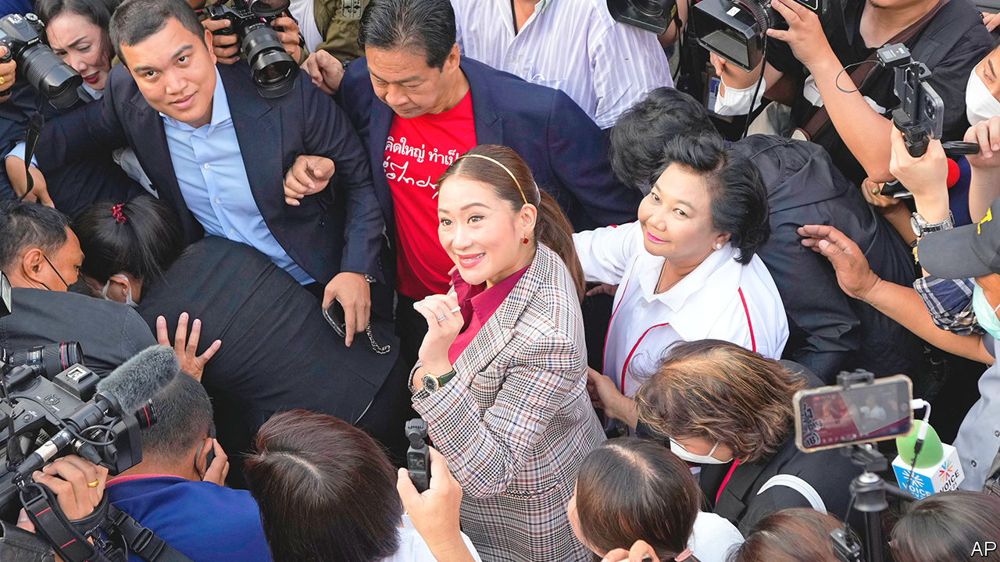

###### A tepid taste of freedom

# The opposition looks set to win Thailand’s election 

##### But the army and the monarchy will remain in control 

 

> May 4th 2023 

In 2021 Thailand’s prime minister, Prayuth Chan-ocha, was asked what he thought of a rising star in the country’s largest opposition party, Paetongtarn Shinawatra. “Who?” he replied. Less than two years later, Ms Paetongtarn leads Mr Prayuth in opinion polls ahead of a general election due on May 14th.

Ms Paetongtarn is the daughter of Thaksin Shinawatra, a tycoon-turned-prime minister, who was ousted in a military coup in 2006. Parties linked to Mr Thaksin have won every Thai election since 2001, running on populist platforms. The impending one looks likely to go the same way. This time the party vehicle is called Pheu Thai, with Ms Paetongtarn as its candidate for prime minister. It is expected to sweep to victory.

Mr Prayuth, a 69-year-old former general, seized power (from Mr Thaksin’s younger sister) in a military coup in 2014. Even if Pheu Thai wins the election, the army establishment he represents will make it hard for the party to form a government. Thailand has a history of seesawing between periods of vibrant electoral democracy and military dictatorship; it has witnessed 12 army coups since the replacement of its absolute monarchy with a notionally constitutional one in 1932. 

When Mr Prayuth seized power, he promised to strengthen the economy. Instead, his leadership has been defined by incompetence and corruption. Thailand’s post-covid economic recovery is the slowest in South-East Asia. Over the past decade, the country has attracted less foreign direct investment than its regional competitors, including Vietnam and Indonesia. Voters are nostalgic for the early 2000s, when Mr Thaksin first won elections, pushing populist economic policies, argues Thitinan Pongsudhirak of Chulalongkorn University. “The last time people remember that Thailand was going somewhere was in 2003. That was peak Thailand.” The first country in South-East Asia to become a democracy, it was at that time considered a regional leader.

A younger, increasingly well-educated generation of Thais fears its future is being squandered. Thousands of student protesters took to the streets in 2020 and 2021 calling for Mr Prayuth’s government to resign and for reform of the monarchy, an erstwhile taboo topic in Thailand, where denigrating the king can lead to 15 years in prison. The government retaliated, charging at least 240 people under  laws, according to a local group, Thai Lawyers for Human Rights. 

But the protests changed Thai society. Topics that were once off-limits, including the role of the monarchy and reducing the size of the armed forces, are now openly debated over the dinner table and in public. The upcoming election, it is widely believed, will determine whether the country of 71m slips deeper into democratic decline, controlled by its army and monarchy, or launches a comeback. Many of the student protesters are working as activists for a political party called Move Forward, founded by young, progressive Thais in 2018. It is the only political party that has said it wants to amend the law that criminalises criticism of the monarchy. 

At a recent Move Forward rally beside the Chao Phraya river that runs through Bangkok, Thailand’s capital, hundreds of supporters in bright orange T-shirts gathered to cheer Taopiphop Limjittrakorn, a well-known craft-beer champion and Move Forward MP. Mr Taopiphop’s efforts to make his own beer, inspired by watching YouTube videos of American home-brewing enthusiasts, are the Thai equivalent of Mohandas Gandhi’s salt-making. They were in defiance of Thailand’s strict alcohol laws, which make it extremely tough for smaller breweries to enter a market dominated by two powerful companies, makers of Singha and Chang beer.

In 2017 Mr Taopiphop was arrested and fined for brewing illegally without a permit. To take his struggle up a notch, he ran for and was elected to parliament. But his bill to reform the alcohol laws—and so “make Thailand more normal”—was blocked by the government. “It is crazy that only two companies get a share of this 400bn baht [$12bn] industry,” he laments. He is running for re-election, to push his bill again. It is an important effort. The military government has coddled monopolists in industries from agriculture to sugar and telecommunications. And it has favoured firms with ties to the army. All this has come at the expense of smaller, more dynamic businesses.

Pheu Thai and Move Forward are expected to win, respectively, the largest and second-highest number of votes at the election. But they are unlikely to be able to form a government. Under the constitution, which the junta forced through in 2016, Thailand’s senate, which is packed with military loyalists, has an outsized say in selecting the prime minister. To overcome this bias, an opposition prime-ministerial candidate would need to win three times as many seats in the lower house as a pro-military one.

Making matters worse, the country’s constitutional court, electoral commission and anti-corruption commission are crammed with loyal appointees of the military government. Rumours are swirling that, having been thwarted twice before, Pheu Thai is now in conversation with the army establishment over a possible power-sharing agreement. That might be palatable to the army and monarchy. It would sit less well with Thailand’s voters. ■

