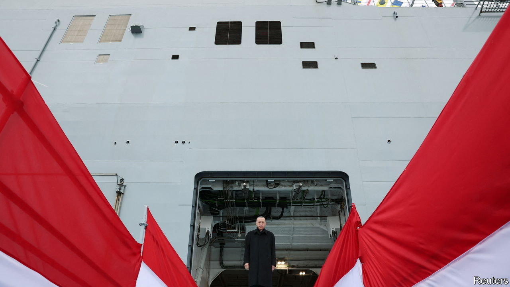
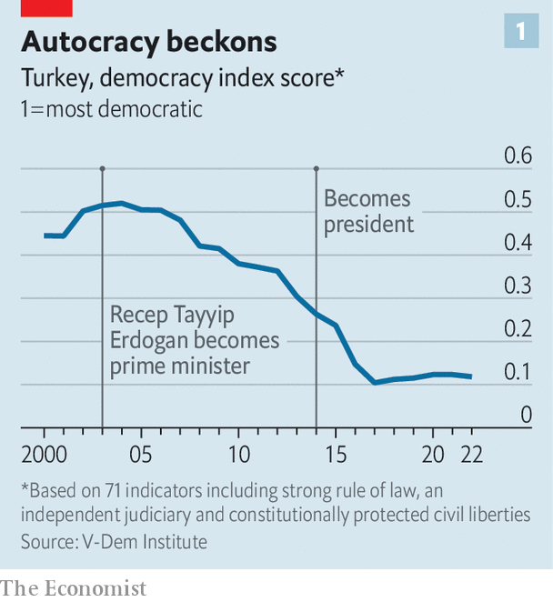
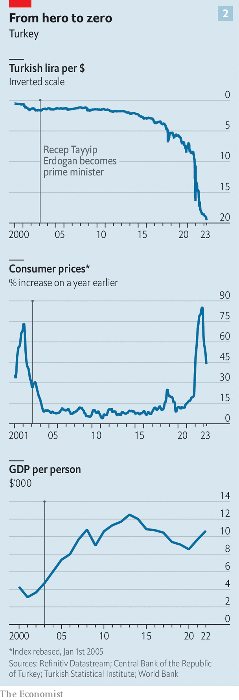
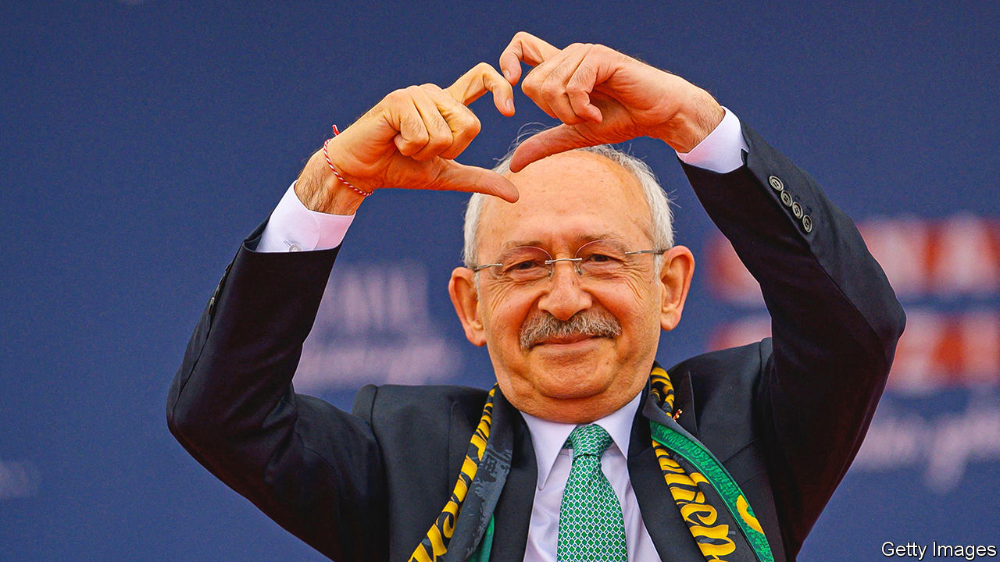

###### Crossroads at a crossroads

# Could Erdogan be ousted in Turkey’s coming election? 

##### His exit would reshape the country and reverberate around the world 

 

> May 4th 2023 

He was jailed and barred from public office, yet managed to overturn the ban and came to dominate Turkish politics. He has won five parliamentary elections, two presidential polls and three referendums. He has even faced down a military coup. But on May 14th Recep Tayyip Erdogan’s grip on Europe’s second most populous country may slip. The polls suggest that the united opposition could wrest control of parliament from Mr Erdogan’s Justice and Development (AK) party and its allies. What is more, Mr Erdogan himself appears to be trailing in the presidential election to be held on the same day.

A loss for Mr Erdogan would not just be the end of an era. It would initiate enormous upheaval in Turkey, with loud reverberations in the region and around the world. Turkey is, after all, the world’s 11th-biggest economy, after adjusting for the cost of living, ahead of Canada, Italy and South Korea. It is a pivotal and awkward member of NATO, both close to the front lines of the war in Ukraine and yet, under Mr Erdogan, disconcertingly chummy with the regime of Vladimir Putin, Russia’s president. It stands between Europe and the chaos of the Middle East, and plays a crucial role in moderating the flow of refugees to the EU. It is also one of the few genuine democracies in the Muslim world, although Mr Erdogan has been undermining Turkish institutions for a decade or so. 

 


The high stakes are matched by the Shakespearean drama of Mr Erdogan’s rule. He started in politics as a dissident underdog, persecuted by Turkey’s secular establishment for campaigning to lift restrictions on expressions of piety in public life. Now he has become the persecutor, locking up opponents on flimsy charges, cowing the media and deposing elected officials. Turkey barely deserves the label democracy, in the eyes of many observers (see chart 1). 

Mr Erdogan’s economic management, too, has come full circle. The first decade of his rule saw inflation banished and incomes soar. In the second, inflation has returned and gdp per person has fallen by 15% in dollar terms (see chart 2).

Mr Erdogan has performed a similar volte face with regards to Turkey’s big Kurdish minority, which he courted in his early years in power but whose political leaders he now dismisses as terrorist stooges. And he has fallen out with America and the EU, which at first feted him for helping to strengthen Turkey’s democracy, but now castigate him for weakening it. In all of these realms—upholding democracy, righting the economy, managing social cleavages and conducting foreign policy—the election offers a stark choice between a reforming opposition and the ever more entrenched and intransigent Mr Erdogan.

Sarays and lamentations

 


On the face of things, it is odd that Mr Erdogan and the AK party are even in contention, given the state of the economy. The lira has lost 60% of its value against the dollar over the past two years. Money is flooding out of the country: foreign investors owned 64% of Turkish equities and 25% of Turkish government bonds only five years ago, but only 29% and 1% now. The current-account deficit hit a record $10bn in January. Runaway inflation—it reached 86% year-on-year in the autumn, and remains over 40%—has impoverished millions of Turks. Moreover, the drop in inflation in recent months is thanks in part to the central bank’s unsustainable bolstering of the exchange rate. It is selling perhaps $1bn a day, much of it borrowed, to slow the lira’s slide. Taking into account the dollars it owes other central banks and domestic commercial banks, it is thought to have negative foreign reserves, of almost -$70bn. Further devaluation of the lira, and therefore higher inflation, seem inevitable when it runs out of dollars to sell.

Mr Erdogan is trying to distract attention from all this by pointing to the many advances Turkey has made on his watch. Over the past month alone, he has inaugurated the country’s first nuclear plant, celebrated the tapping of a big gasfield in the Black Sea, jumped behind the wheel of Turkey’s first electric car and unveiled its first aircraft-carrier. The message such projects are meant to convey is that Mr Erdogan has defied the West to transform Turkey into a world power, and that the best is still to come. “If you’re wondering why he still hovers at more than 40% [in the polls],” says Galip Dalay, an analyst, “one reason is this idea and this language of grandeur.”


It is not all hollow rhetoric. Mr Erdogan took power in 2003, on the heels of an inflationary spiral and a banking crisis that had trampled the economy. He initially presided over steady growth, in the economy as a whole and in the middle class. Many Turks benefited enormously and remain loyal to Mr Erdogan as a result.

Spinning like a Topkapi

Mr Erdogan has used his influence over the media to persuade supporters that the economy’s troubles have more to do with foreign conspiracies to keep Turkey down than with his government’s mismanagement. He is also adept at exploiting divisions within Turkish society. Many of those who benefited from his early economic policies were conservative, middle-class, provincial types who had long felt ignored or sneered at by the secular, metropolitan elite. For years he has been telling them that the freedoms they have won on his watch, including the right to wear the Islamic headscarf in universities and state institutions, depend on his remaining in power. He characterises the election as a contest between proudly pious and nationalist Turks and a rabble of whisky-sipping, godless elitists, Kurdish separatists and sexual deviants, all slavishly seeking to embrace imported Western values.

But none of this can hide the fundamental problem: Mr Erdogan is sabotaging the economy. He believes, perversely, that high interest rates fuel inflation, and that lowering borrowing costs will help stabilise prices. By packing the central bank with yes-men, he has imposed this view on the country, leading to feverish inflation. And because low interest rates make credit ludicrously cheap (the central bank’s main lending rate is more than 35 percentage points below the rate of inflation), it has to be rationed through government regulations. Critics see this as a recipe for cronyism. “The central bank decides who gets to buy dollars, the banking authority decides who is eligible for loans, and the government decides whose debts are forgiven or postponed,” complains Kerim Rota, a former banker and a deputy chair of Future, a small opposition party.

Mr Erdogan’s only remedies are sticking-plasters. The recent discovery of a big gasfield in the Black Sea, says Numan Kurtulmus, AK’s deputy chair, will cut Turkey’s bill for imports, easing pressure on the lira. Meanwhile, since the end of 2021, the government has increased the basic monthly state pension fivefold to 7,500 lira ($385) and tripled the minimum wage to 8,500 lira, bringing it close to median earnings. It promises to raise the minimum wage again in July, after the election. 

The opposition, in contrast, promises a return to economic orthodoxy. It is led by Kemal Kilicdaroglu, a former official in the finance ministry and head of a state-pension agency, whose understated personality offers a striking foil to Mr Erdogan’s grandstanding. (While Mr Erdogan cuts the ribbon on one megaproject after another, Mr Kilicdaroglu records videos in his modest kitchen, with tea towels draped over the oven handle and a lone onion as a prop to discuss inflation. )

Mr Kilicdaroglu says he will restore the independence of the central bank, which will inevitably lead to sharp increases in interest rates. That, in turn, is likely to slow the economy down, if not prompt a recession. Meanwhile, inflation will take some time to quell. Under Mr Erdogan it has become so sticky that the opposition has had to revise its timeframe for bringing it down to single digits from one year to two. 

Opposition politicians say that social spending will mitigate some of the pain, as will foreign capital, which they expect to flood into Turkish equity and bond markets as soon as a new economic team takes charge and rates start rising. Direct investments in firms and factories will take longer, but will return too, the opposition argues. Turkey’s is the largest economy between India and Germany, after all, and benefits from a customs union with the EU, making it an excellent base from which to export to Europe. Conversations with fund managers flocking to Istanbul ahead of the elections suggest such hopes are not unfounded. “I know what needs to be done,” says Bilge Yilmaz, a possible economy minister if the opposition prevails, “and delaying it is only going to increase the pain in the long term.”

In terms of institutional reforms, too, the government and opposition offer starkly different programmes. Mr Erdogan has strongly centralised power in the presidency, which used to be a largely ceremonial office, while abolishing the job of prime minister and diminishing the role of parliament. He has also used the state’s power in extremely partial and punitive ways. He has stiffened and abused a law against insulting the president, which is now punishable by up to four years in prison. There have been some 200,000 investigations of this crime during his time in office. In a haunting echo of the banning of Islamic parties and politicians before he came to power, his prosecutors are pushing for the dissolution of the Peoples’ Democratic Party (hdp), the main Kurdish party. In the meantime, he has summarily evicted many elected Kurdish mayors from office. Tens of thousands of followers of Fethullah Gulen, a cleric with whom Mr Erdogan was once allied politically, have been dismissed from government jobs or jailed on paper-thin charges backed by risible evidence, after Mr Gulen was accused of instigating an attempted coup in 2016.

Mr Kilicdaroglu promises to reverse much of that. He says he will restore the independence of the courts, hand power back to parliament and repeal the law on insulting the president. The opposition also pledges to end Mr Erdogan’s policy of sacking elected mayors and to compensate those wrongfully dismissed after the coup. It says it will pursue crooked officials, too, including those suspected of massaging the inflation numbers and awarding lucrative contracts to government cronies.

Sublime support

One of the likely beneficiaries of such a policy would be Selahattin Demirtas, the imprisoned former leader of the HDP. Since the breakdown of talks with the Kurdistan Workers’ Party (PKK), a Kurdish insurgent group, in 2015, AK has become increasingly hostile to Turkey’s Kurdish minority, who make up around 15-20% of the population. Since 2018 it has governed with the support of the National Movement Party (MHP), which fiercely opposes any concessions to Kurds.

The opposition alliance also contains a nationalist outfit, the Good Party, which formed after a split in the MHP. Its manifesto therefore features few clear concessions to Kurdish sentiment. But whereas Mr Erdogan dismisses Kurdish political parties as fronts for the pkk in his speeches, Mr Kilicdaroglu condemns Mr Erdogan for caricaturing all Kurds as extremists. Simply by restoring the rule of law, the opposition would make life much easier for Kurdish activists. The HDP has formally endorsed Mr Kilicdaroglu. Although his election would not resolve all its grievances, it would markedly lower tensions.

 


On foreign policy, too, the government and the opposition differ dramatically in tone, at least. Mr Erdogan’s disregard for civil liberties and his stridently nationalist tone make relations with the West awkward, despite a recent effort at rapprochement on both sides. Mr Erdogan has blocked Sweden’s bid to join NATO, arguing that it harbours Kurdish terrorists. And his government depends on Mr Putin for all manner of economic help, from cheap imports of gas to loans and expertise to build the nuclear-power plant that Mr Erdogan recently inaugurated.

An aide to Mr Kilicdaroglu says Sweden could join NATO within a month if his boss wins the election. The opposition has promised to improve relations with the EU, too—although this depends as much on Europe getting over its fears about migration from Turkey as it does on Turkey improving its record on human rights. And the opposition is almost as sceptical as Mr Erdogan about unqualified support for Ukraine, arguing that the war can end only through negotiation. Turkey, in short, will still see itself as a regional power deserving a degree of deference if Mr Kilicdaroglu becomes president, but it should become less reflexively prickly and pugnacious.

All these changes, however, will only be possible if the opposition prevails. It is a mixed bunch. Mr Kilicdaroglu’s Republican People’s Party (CHP) had for decades clung to the statist and secular legacy of Turkey’s modern founder, Kemal Ataturk, and opposed any outward expression of Islamic faith. The Good Party’s leader, Meral Aksener, served briefly as interior minister in the 1990s, when human-rights abuses in the Kurdish south-east were at their worst. Other prominent opposition leaders include Mr Erdogan’s former prime minister, his erstwhile economy tsar and an avowed Islamist who only years ago argued that Turkey should ditch ties with Europe in favour of an Islamic union.

This motley assembly have gradually set aside their differences and moderated their views. Mrs Aksener has rebranded the Good Party as centre-right. Mr Kilicdaroglu has begun transforming the CHP from a Kemalist fossil into a modern social-democratic party (which has helped make him more palatable to Kurdish voters). At Mr Kilicdaroglu’s insistence, the opposition alliance has drawn up a 200-page manifesto after months of negotiations. It also agreed on Mr Kilicdaroglu as a joint presidential candidate, despite misgivings about his lack of charisma. 

The opposition is certainly capable of winning elections. Four years ago, thanks in part to the Kurdish vote, its mayoral candidates handed Mr Erdogan a stinging defeat, beating AK in four of Turkey’s five biggest cities. The latest polling suggests close races in both the parliamentary and presidential elections.

To win the presidential election in the first round of voting, a candidate must secure more than 50% of the vote. With two other candidates running in addition to Messrs Erdogan and Kilicdaroglu, that is unlikely. So the race is likely to go to a run-off on May 28th.

Some opposition supporters fear that Mr Erdogan will refuse to hand over power if he loses. “My people will not hand over this country to a president supported by [the PKK],” he thundered on May 1st. A few days before, the interior minister warned of “a political coup attempt backed by the West” on election day.

Such rhetoric is stoking concerns that Mr Erdogan, perhaps at the behest of members of his inner circle, may subvert the election or challenge the results, especially in case of a narrow loss. The AK party tried this, after all, in the most recent mayoral election in Istanbul, persuading the courts to order a re-run. AK lost again, by a bigger margin. Three years later the victorious candidate was convicted of insulting government officials.

Opposition politicians, however, wave aside such concerns, saying they are confident in the integrity of the vote, and that Mr Erdogan would not dare challenge the people’s will, on which his legitimacy depends. “He can try anything,” says Mr Kilicdaroglu. “But no matter what he does, this nation has made its decision.” If Mr Kilicdaroglu is right, the election will mark a watershed, for Turkey and the world. ■

