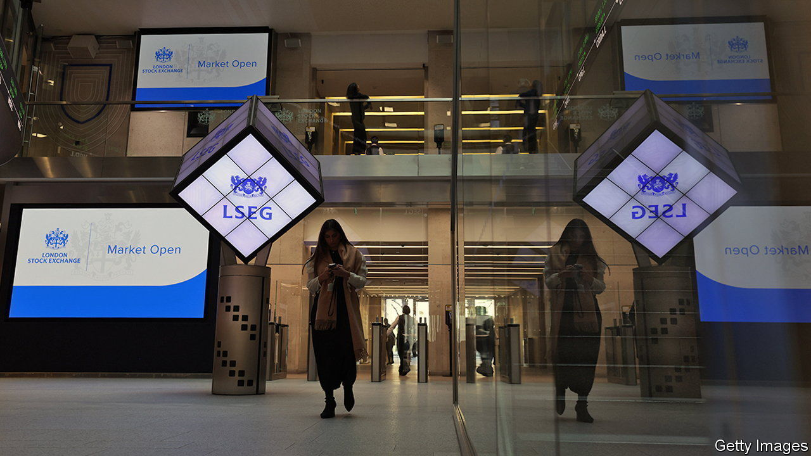

###### Bourse correction

# Britain is liberalising its stockmarket-listing rules, again 

##### And again, it won’t help much 

 

> May 3rd 2023 

Julia hoggett has an unenviable task. She started running the  (lse) in 2021. The previous year the value of Apple, an American tech giant, had overtaken that of the entire ftse 100 index of London-listed shares. At that time she was a senior official with the Financial Conduct Authority (fca), a regulator; she remembers sitting down and scribbling out a list of all the things about Britain’s stockmarket that needed fixing. Then she became its boss.

Ever since Ms Hoggett has been busy working with the fca to put those bullet points into action. Rules on dual-class shares, which grant directors extra voting rights and are popular with startup founders, have been relaxed. Early investors can now hang on to more of their shares when a firm lists, rather than having to sell. Prospectus requirements are becoming less onerous and the process for raising follow-on capital more streamlined.

On May 3rd the fca proposed its latest set of changes, which it will consult on over the next two months. These aim to simplify the structure of the stockmarket. At present it is split into four “segments”, each of which has a different set of rules for issuers. The fca wants to merge the top two (“standard” and “premium”), which contain the largest firms listed on the lse.

This targets two long-standing gripes among investors and companies. First, that Britain’s stockmarket looks offputtingly complicated to outsiders. Second, that the distinction between the standard and premium segments does more harm than good. Firms in the standard tier are subject to less burdensome rules but feel tarred by its inferior brand; they are also ineligible for inclusion in indices like the ftse 100. That makes their shares less attractive to fund managers who benchmark their performance against such indices. 

Firms in the premium segment ought to benefit by comparison. But in recent years only the standard segment has grown, suggesting that issuers do not value a premium listing enough to make up for the extra regulation it entails. Nor do investors: in general, premium-listed firms see no valuation benefit compared with rivals following laxer rules abroad.

In other words, the new reforms would be a step in the right direction, just like the other measures taken by the lse and the fca over the past two years. Unfortunately—and again like all the other recent rule changes—it would be a small step. To see why, consider how far Britain’s stockmarket has deteriorated even as its administrators and regulators have rushed to shore it up. In 2022 just 1% of the capital raised through global initial-public offerings (ipos) was raised in London. At its peak in 2006, the City’s share was 18%.

Meanwhile, lse’s existing denizens are leaving. Barely a month goes by without another ftse 100 or ftse 250 firm deciding to de-list; in 2022 companies worth £80bn ($100bn, or 3.6% of gdp) did so. Giants are now following: Flutter, a betting firm, and crh, a building business (each worth £28bn). Arm, Britain’s most successful young tech company, which was taken private in 2016, will this year re-enter public markets in America rather than Britain.

The reason is that  goes far deeper than its rule book. Ageing, risk-averse domestic pension schemes have all but disappeared as a source of capital. Founders and their bankers find City investors hostile, citing the number who lined up publicly to declare they would not back Deliveroo, a food-delivery firm, at its ipo in 2021. Executives complain that British shareholders insist on far smaller pay packets than American ones. Dealmakers, after Brexit, no longer see the lse as a gateway to European capital, so they recommend the vast pool of it available in  instead. Ms Hoggett’s original list was surely a long one. But much of it is beyond her power to fix. ■


