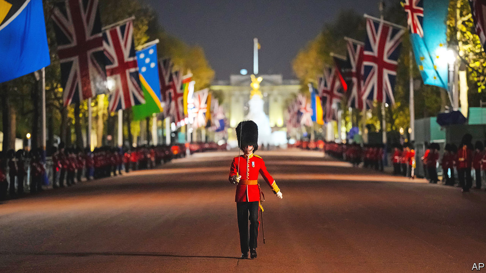
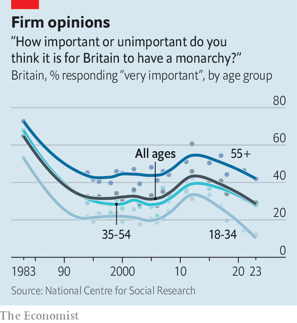

###### A coronation

# Britain readies to crown Charles III as its new king 

##### The preparations involve scones, jam, chrism and carriages 

 

> May 4th 2023 

ON May 6th, in London, a man will be given a hat. He has never seemed that keen on this hat. At the age of 20,  described the realisation he would be king as dawning upon him “with the most ghastly inexorable sense”. His predecessors were little keener. King Edward VIII described kingship as “an occupation of considerable drudgery”; King George VI awoke on the morning of his coronation with “a sinking feeling”. Britons themselves seem similarly nonplussed. According to YouGov, a pollster, almost half say they are unlikely to watch the coronation, yet everyone has been talking about it for weeks. 

The coronation, as the royal website explains, is “a solemn religious ceremony”. The reminder is needed, for the list of those participating this weekend includes people with such titles as the Rouge Dragon Pursuivant, the Rouge Croix Pursuivant and the Portcullis Pursuivant. It involves a Garter King of Arms and people with titles so antique that their adjectives appear to be on back-to-front (the Lords Spiritual and Temporal of this realm). It involves beadles, heralds, princesses, kings, queens and His Most Godly Beatitude Theophilos III, Patriarch of Jerusalem and All Palestine. There are “Game of Thrones” episodes with more sober cast lists. 

The ceremony that will unfold in Westminster Abbey is little more sensible. It includes a Stone of Destiny, a Sword of Spiritual Justice and oil made with olives harvested from the Monastery of Mary Magdalene in Jerusalem. It demands bowing, scraping, chanting and anointing with chrism from a special Coronation Spoon. It involves far too many men in tights. It has caused the British government’s website—which usually offers clarification on such things as self-assessment tax-return deadlines (January 31st)—to start offering clarification on what the Earl of Erroll will be carrying on the day (a silver baton).

Monarchy, as even monarchs are apt to point out, doesn’t belong in the modern world. “Really, the day for kings and princes is past,” wrote the future Edward VIII in 1920. “Monarchies are out-of-date.” The 20th century tended to agree. It opened with King Umberto I of Italy being shot by an assassin in 1900. For many royals, things only got worse. The assassinations of the kings of Portugal, Greece and the Tsar of Russia followed; others were booted out. In 1948 King Farouk of Egypt observed that: “Soon there will be only five Kings left…the King of Spades, the King of Clubs, the King of Hearts and the King of Diamonds”—and the King of England.

Things did not turn out quite as badly as Farouk predicted. Today, 22% of the world’s countries still have a  as their head of state. Though things are not quite as striking as that statistic implies, since many of those monarchs are Charles, who is sovereign of 15 countries. At least for now. Several of his realms have hinted that they may get rid of him. 

 


Some think Britain should join them. The number of Britons considering the monarchy to be “very important” has, according to the National Centre for Social Research, fallen from 65% in 1983 to 29% today (see chart). PR disasters rather than pitchforks are what unsettle modern monarchies—and the royals have had many. There has been money in suitcases. There has been Prince Andrew. 

Republic, a pressure group that campaigns for the abolition of the monarchy, argues that the royals fall “well short of the standards we should expect in public life”. Pro-royal outlets such as the  and  offer advice on coronation scones; Republic offers a recipe for protest. It encourages people to come to Trafalgar Square on May 6th, bring placards and shout “Not my king” as Charles goes past. It promises speeches and an earnest, principled stand against the monarchy. 

Which is the big problem with republicanism. “So long as the human heart is strong and the human reason weak,” argued Walter Bagehot, a renowned Victorian editor of this newspaper, “royalty will be strong…and Republics weak.” As Bagehot realised, the identity of the person who wears the hollow crown is, in a way, irrelevant. What matters is the sparkle. 

The  might be anachronism incarnate; it might offer uncomfortable imperialist echoes and entrenched inequality. But it also offers chrism and crowns, scones and jam, and men on horseback with tubas. The proportion of Britons who want to abolish the monarchy has risen over the years—from 3% in 1983 to 14% now; among 18-34 year-olds the figure is over 20%. But this is scarcely the stuff of revolution.

And working royals do work. They hardly toil in mines but they do visit unenviable numbers of regional manufacturing centres. On a single day in March Princess Anne visited a stable and an industrial park in Birmingham while Charles went to Hamburg-Dammtor Railway Station in Germany and the “future site of the Green Energy Hub Hamburg” to hear about its “ongoing transition to a carbon-free port”.

They do so without complaining. Mostly. In 1984 Princess Margaret made a guest appearance on “The Archers”, a long-running Radio 4 soap opera. On it, she acted as herself, attending a charity fashion event. When she finished reading her lines, the producer offered her guidance. “That’s very good, ma’am,’ he said. “But do you think you could sound as if you were enjoying yourself a little more?” Princess Margaret replied: “Well, I wouldn’t be, would I?”

The people watching a coronation rehearsal one night earlier this week, as the clocks of London strike midnight, are enjoying themselves. The roads around Trafalgar Square are unusually quiet. They have been shut to allow the military to practise. There is a shout. Suddenly the street fills with soldiers, sailors, horses and the sort of scene that demands vocabulary more commonly seen in Horatio Hornblower novels—bayonets, breeches, postilions and rapiers. The overall effect is less as if an army has marched by than as if the 18th century has. 

The watching crowd includes students from Nigeria; tourists from everywhere; local drunks; and Andrew Lloyd Webber, the composer (he loves a brass band, his wife says). More horses appear; a military band oompahs off towards Big Ben. A royal coach drives past, lights blazing, entirely empty inside. The drunks and tourists look thoroughly delighted. ■


