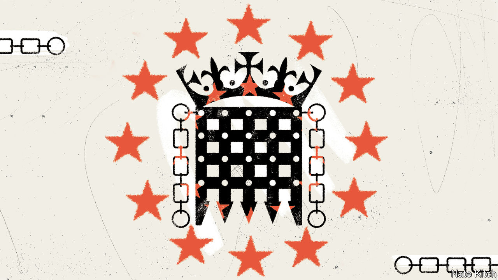

###### Fixing the state

# Britain takes a more sensible approach to post-Brexit regulation 

##### After seven aimless years, Rishi Sunak identifies some more productive targets 

 

> May 4th 2023 

“Here is Regulated EU Man, waking from his regulated slumber to start his regulated day,” recites Martin Durkin, the star and director of “Brexit: The Movie”. This zippy piece of low-budget agitprop was watched 1.5m times on YouTube, and widely circulated on DVD, ahead of the EU referendum of 2016. His cry for freedom shows Mr Durkin starting his day hemmed in by laws like “invisible barbed wire”. There are 109 relating to his pillows, he claims; 31 about his toothbrush and 12,000 affecting the milk on his cereal. 

“Brexit: The Movie” is an important artefact. It captures the appeal of Brexit to frustrated small-town voters. It also explains much of what has gone awry with the government’s approach to regulation since. Only recently, under Rishi Sunak, has a  emerged. 

Boris Johnson embraced a “cakeist” approach to Europe, claiming Britain could have it all—jettisoning EU laws while keeping deep market access. What Britain ended up with was “anti-cakeism”: it surrendered market access and kept the laws. “Relatively little has come to fruition and changed how we do things,” says Joël Reland, who runs a “divergence tracker” at UK in a Changing Europe, a think-tank. 

That is partly because companies operating in both Britain and the EU resisted too much divergence. British voters are also hostile to anything that smacks of deregulation in areas such as working rights or food standards. But it is also a story of political failure. Few detailed proposals for regulatory reform have spilled from the offices of Brexiteer MPs. What has predominated is a half-remembered version of Thatcherism that assumes an automatic connection between cutting “red tape” and increasing growth.

David Frost, Mr Johnson’s Brexit minister from March 2021 to December 2021, saw EU regulation primarily as a constitutional affront and propounded what he called a “sovereign approach”. His office produced a 105-page prospectus ranging from truly ambitious ideas, such as reforming gene-editing rules, to the purely symbolic, such as restoring the use of imperial measures. But, in the main, attempts to impose a distinctly British regime floundered: deadlines to impose onerous new domestic approval regimes for cars, food imports and  have been postponed by years, as manufacturers warned that Britain’s small market made the burden of additional bureaucracy unaffordable. 

Mr Sunak backed Brexit, claiming regulatory nimbleness would be better for Britain. Yet he is also a pragmatist, who has attempted to patch up relations with business and with Brussels since coming to office. The first sign of moderation concerns the , a piece of legislation introduced during Liz Truss’s brief premiership. It aims to jump-start deregulation by striking down some 4,000 pieces of European law at the end of this year (unless preserved or amended by ministers). Yet opposition in the House of Lords, and the sheer effort involved in reviewing all those laws, means the actual cull will be less fierce. Michael Gove, a cabinet minister, says that the “overwhelming number” of laws will be retained.

The pace of divergence with the EU has slowed even further under Mr Sunak, notes Mr Reland, but it has become more targeted. Jeremy Hunt, the chancellor of the exchequer, has sought to focus the government’s efforts on a few fast-growing sectors where rule books and investment patterns are still in flux, particularly green technology and life sciences. A light-touch approach to the regulation of artificial intelligence was published on March 29th. 

Another change is Mr Hunt’s emphasis on regulators over rule books. Ministers have belatedly noted that Britain’s speedy launch of a covid-19 vaccine was because of the agility of the Medicines and Healthcare-products Regulatory Agency (MHRA), Britain’s drugs regulator, rather than any bonfire of red tape. From next year the MHRA will fast-track drugs that have already been approved in Japan, America and Europe, in order to allow it to focus on assessing more innovative products. 

This shift is long overdue. The notion that Britain would need smarter and better-funded officials if it were to outpace the EU was absent from the “Brexit: The Movie” narrative of self-interested paper-shufflers. At best, regulators were recognised only as a part of the administrative plumbing rather than powerful shapers of Britain’s economic strategy. Several complain of being too under-resourced to be able to keep pace with the EU’s handsomely staffed agencies. 

From bonfire to spotlight 

The surprise decision on April 26th by the Competition and Markets Authority (CMA) to block , a games-maker, has brought home the extra clout that Brexit handed to British regulators. The CMA was exercising powers granted by Parliament to vet mega-mergers that had previously been the exclusive preserve of Brussels. Yet the agency is subject to less scrutiny by lawmakers and weaker review by judges than its EU counterpart, observes James Webber of Shearman &amp; Sterling, a law firm. 

MPs are becoming more interested. The Regulatory Reform Group, a new caucus of Tory lawmakers led by Bim Afolami, proposes that regulators be subject to tighter guidance from the government and scrutinised by a new parliamentary committee. Seven years on, a proper debate about how Britain should be regulated, and by whom, is only just beginning. ■


