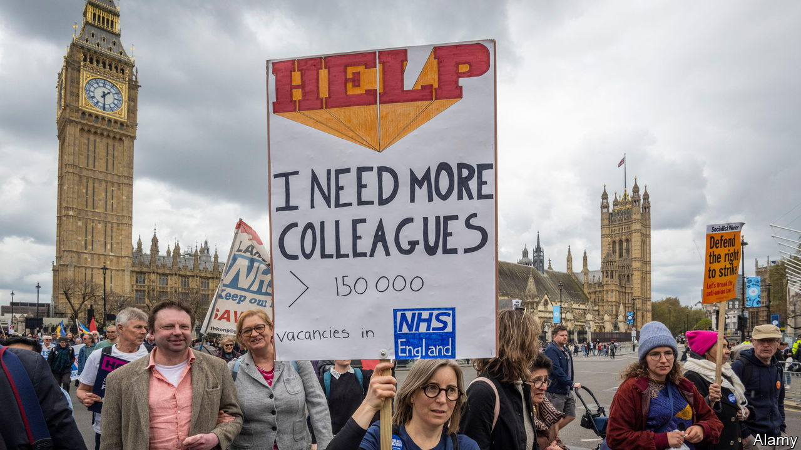
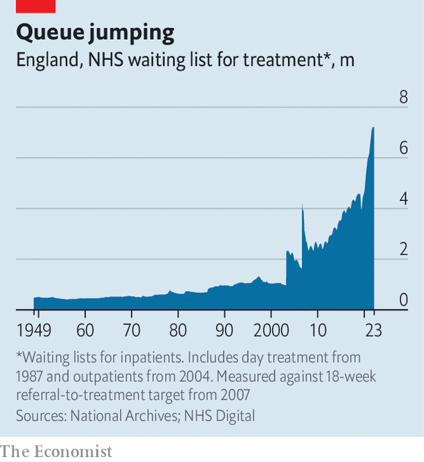

###### Striking difference

# Britain’s NHS has never seen industrial action on this scale 

##### A union vote to accept the government’s pay offer is not the end of the story 

 

> May 2nd 2023 

On May 2nd health-care trade unions in England finally signed off on a government pay deal. More than 1m workers in the National Health Service (NHS) will receive pay increases of 5% this year—with an additional one-off bonus added on for the previous year. But hopes for an end to the industrial action that has  the health service in the past six months may be dashed. Two of the 14 unions to vote on the deal are still holding out for something better. The settlement does not include NHS doctors. And the strikes have already caused over half a million patient appointments to be rescheduled.

That makes this  one of the worst in British history. The scale of them would have shocked Margaret Thatcher, the prime minister most associated with union clashes. In 1988 nurses from NUPE, a now-defunct union, organised a two-day strike for better pay. Thatcher accused them of increasing waiting lists and damaging patients. For all the finger-pointing, the Department of Health estimated that on the first day just 2% of all nurses went on strike. Only 200 of 9,000 scheduled operations had to be cancelled. 

 


A quarter of a century on, things are much more severe. The waiting list back then was below 1m; today it exceeds 7m (see chart). One of the unions to reject the pay deal is the Royal College of Nursing (RCN), the main nurses’ union, which in its 107-year-old history had never gone on strike until last year. On May 1st its members concluded a walkout that affected half of English hospitals, mental-health and community services. (It would have lasted longer, save for a court ruling that the union’s strike mandate had expired.) 

The RCN has vowed to escalate the strikes if it secures the backing of its 280,000 members for a new mandate. Last time round votes were held on an NHS-trust-by-trust basis. This time strikes would hit the entirety of the NHS, and if there were no resolution with the government, could last until the winter. 

RCN members are not the only ones mulling more strikes. On May 2nd junior doctors from the British Medical Association (BMA) met Steve Barclay, the health secretary, to put to him their own demands for a 35% pay rise to compensate for years of falling real wages. The talks follow the longest-ever strike by junior doctors last month. Consultants and general practitioners are also threatening industrial action. “The current government has turned a lot of professionals into strikers,” says Dave Lyddon of Keele University. 

For the NHS the events of the past few months will have consequences. The Department of Health and Social Care has said that some of the pay deal will be paid for through the “reprioritisation” of existing funds, as well as some extra funding. That may mean less financial wriggle room for squeezed trusts. The protracted negotiations between the government and the unions may also leave a sour taste. “It’s been unnecessarily confrontational,” says Stuart Hoddinott of the Institute for Government, a think-tank. The unprecedented scale of the strikes means that taboos have been broken. When a decision to strike next arises, it will be easier to walk out.

For the government, too, there are ramifications. Hundreds of thousands of patients have had operations moved because of strikes. Rishi Sunak has urged the public to “hold me to account” if waiting lists do not fall. That goal looks precarious. ■


