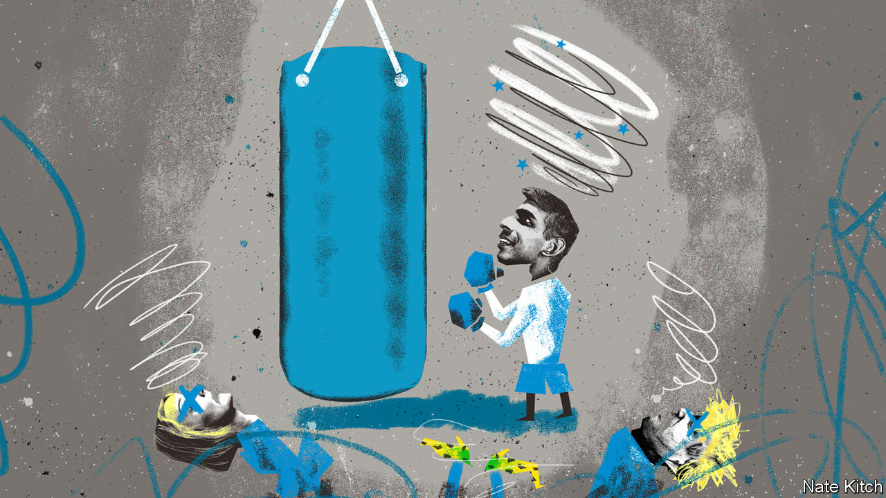

###### Bagehot

# The Tories v the institutions 

##### After 13 years, the Conservatives still have no idea how to reform Britain’s institutions 

 

> May 4th 2023 

From the perspective of the typical Conservative mp, Richard Sharp was a perfect choice as chairman of the British Broadcasting Corporation (bbc). A former Goldman Sachs banker and committed Brexiteer, Mr Sharp thought the bbc had a “liberal bias”. Mr Sharp was a Tory donor, close to both Boris Johnson, the former prime minister, and Rishi Sunak, the current one. Unfortunately, Mr Sharp was : he resigned on April 28th for failing to declare his role in introducing the former prime minister to someone willing to lend him money. 

Mr Sharp’s departure is the latest example of an often overlooked Conservative failure. The Conservatives have run the country for 13 years. But they have failed to shape its institutions. The Tories have lost almost every fight they have picked—whether against Whitehall or the bbc or the quangos that run British life. Each Conservative government since 2010 has promised to fundamentally alter how Britain works. Each has failed. 

It is not for want of trying. Every one of those governments has pledged to shake up the civil service, for instance. Dominic Cummings, Mr Johnson’s revolutionary adviser, promised a “hard rain” on the mandarins; he was gone 18 months later. When senior civil servants themselves are hoofed out, they are replaced by more of the same. Rather than rein in the civil service, the civil service has begun to rein in ministers. Dominic Raab resigned as justice secretary last month after being found to have . 

Taming the Treasury, Britain’s overmighty finance department, has been a goal of successive Conservative prime ministers. Liz Truss was simply the most zealous, firing the department’s permanent secretary on day three of her ill-fated 45-day premiership. Theresa May’s team also wanted to restrain the department. Mr Johnson resented the Treasury as an obstacle to his beloved big projects. Yet today the Treasury is stronger than ever. Mr Sunak, a Treasury alumnus, sits in 10 Downing Street; Jeremy Hunt, the chancellor, veers little from the department’s orthodoxy. 

If the Treasury is still supreme despite the efforts of the Conservative Party, so are the technocrats. Ms Truss had a staring contest with the Bank of England, which refused to blink. Ms Truss lost her job. Conservatives may seethe about Andrew Bailey’s performance as the bank’s governor.  is, after all, still skipping along in double digits, albeit owing to factors beyond his control. Yet changing the current set-up is beyond the pale. Even rejigging its mandate, once discussed relatively openly by both parties, is seen as excessive radicalism. What the bank says, goes. 

David Cameron proposed a “bonfire of the quangos”, the independent bodies that controlled everything from water regulation to Britain’s charities. They are more powerful than ever. The establishment in 2013 of nhs England, which oversees £160bn of spending ($200bn; about 7% of British gdp), effectively stripped the health secretary of a say over the day-to-day operations of the health service. The Office for Budget Responsibility, a quango that monitors government spending, now has a near-sacred position that belies the fact it is barely a teenager. 

Brexit was supposed to create a leaner, more efficient British state once the shackles of eu law had been removed. Parliament, rather than officials, would dictate policy. Instead, European red tape has been replaced by British red tape, with eu law effectively copied and pasted into domestic statute. Plans to repeal these laws en masse have been scrapped. This may be wise. But it was not what the Conservatives promised. Rather than strip down regulation or remove legislation, as is supposedly their bent, the Conservatives are much more likely simply to gripe about it. It is easier to complain than to achieve anything, even in government.

Yet an advantage of the British system of government is that quick, sweeping change is possible. Armed with a majority and competent leadership, a government can do what it likes. It took New Labour little time to fundamentally alter the country’s institutions. Within its first few years Labour had passed the Human Rights Act and given the Bank of England its independence. It pushed through devolution to Scotland and Wales. New quangos, such as Ofcom, which regulated broadcasters, were created. 

Labour managed to change both the shape of Britain’s institutions and the people running them. At the start of the Blair era, the establishment was still filled with patrician Tories. British society would have been recognisable to Peter Cook, a 1960s satirist who mocked the reactionary tendencies of its pale, public-school elite. By the end of the New Labour years, the people at the top of Britain’s institutions were, on the whole, far more liberal and diverse. 

Skip forward 13 years and the Conservatives oversee institutions that are largely unchanged from the Blair era. Conservative mps seethe about the influence of European judges on the country’s laws. But they do little about it. Attempts to put their own people into positions of power have largely failed. At least Mr Sharp actually made it into his post. The Conservatives have repeatedly botched plans to install Paul Dacre, the editor-in-chief of DMG Media, which publishes the Tory-supporting and other titles, as head of Ofcom. The Conservatives still live in New Labour’s world, however much they may hate it. 

Cheers, Gramsci’s crying 

The Tory party has no excuses. New Labour knew how they wanted Britain to work. The Conservatives have produced no such vision. Conservatism is in general allergic to big ideas and systemic thinking. Most Tory MPs are happier moaning about institutions than altering them. Instead of learning from its mistakes, the government has given up. Mr Sunak has neither the time nor the inclination to radically alter British institutions between now and the next general election. After more than a decade in power, the Conservatives have not figured out how to reform the state. They may not get another chance for a while. ■


