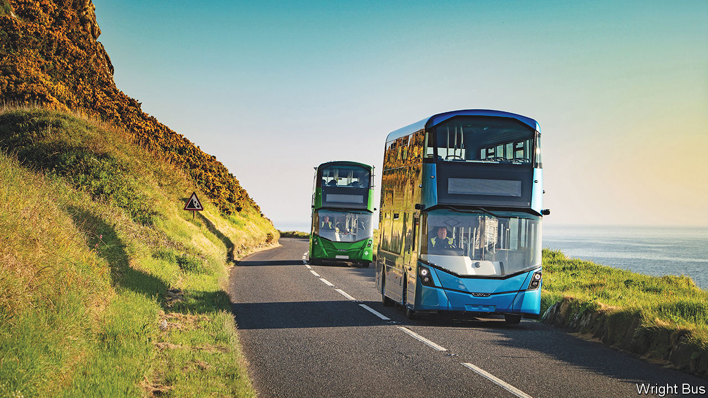

###### Bus swap

# Wrightbus bets on hydrogen buses 

##### A Northern Irish firm stakes its future on clean transport 

 

> May 4th 2023 

Smoking once put money into the pockets of the people of Ballymena. More than 2,000 people were employed making Benson &amp; Hedges and Silk Cut cigarettes at the Gallaher’s factory in the Northern Irish town. Shifting consumer preferences and globalisation ate away at the business; the final workers were laid off in 2017 when production moved to Poland. Now the former tobacco factory is at the forefront of an altogether cleaner industry. 

The site is owned by Wrightbus, whose buses all had diesel engines just four years ago. In 2022 60% of the buses it made were clean, at least in terms of exhaust-pipe emissions; this year 90% will be in that category. Most of those buses are battery-powered, but Wrightbus’s most striking bet is on hydrogen. 

The firm has gambled on the fuel, building the world’s first double-decker hydrogen bus. A hydrogen fuel cell, which converts the pressurised gas into electricity, drives the motor; water is the only by-product. Wrightbus already has 144 single- and double-decker hydrogen buses on British and Irish roads—almost the entirety of the UK’s hydrogen-bus fleet—and orders for another 53 buses which will go as far afield as Germany and Australia. 

Wrightbus is an unlikely pioneer. Mismanagement had caused the 73-year-old firm to collapse into administration in 2019. By the time Jo Bamford, whose family runs JCB, a big construction-equipment firm, bought it a few weeks later, its 1,150-strong staff had shrunk to 56. Now the firm has 1,000 employees, and the main constraint on growth is recruitment (it apparently takes two years to train to paint a bus) in an area with near-full employment. 

Buta Atwal, who oversaw the firm’s green transformation before stepping down as chief executive at the end of last year, reckoned that hydrogen will win out over batteries as the most effective investment for most buses. The technology requires about eight minutes’ refuelling time, much snappier than the hours spent charging batteries. Hydrogen buses have a much longer range than battery-powered ones, which matters for rural or intercity transport. The technology can also be applied to similar large vehicles, such as bin lorries. Mr Bamford is an evangelist: another of his companies produces the fuel and JCB has already come out with its own hydrogen digger.

Others are much less convinced, simply because of how much has to be done to make the  work. Clean versions of the gas are in short supply. More than 95% of current hydrogen production globally is made from natural gas but does nothing about the carbon dioxide thereby emitted. “Blue hydrogen” requires this carbon to be captured and stored; “green hydrogen” is produced from water, using an electrolyser that has to be powered by renewable energy. The fuel must be stored and transported using purpose-built infrastructure—unlike electricity, which is already delivered to every home and business. Just building a hydrogen fuel station can take an estimated 18 months. 

Government subsidies will be crucial to all this. President Joe Biden’s green spending splurge in America includes plans to reduce the cost of clean hydrogen to $1 a kg within a decade (from roughly $5 today). The EU says that hydrogen could contribute 13-20% of the bloc’s fuel mix by 2050 (Wrightbus stands to gain from the Windsor Framework, the newly renegotiated part of the Brexit divorce deal which keeps Northern Ireland in both the United Kingdom and the EU’s single market for goods). This is an environment made for lobbying; JCB’s political connections to the Tories are unlikely to hurt.

In the race between battery-powered buses and hydrogen-powered ones, there is no certainty about the winner. Users may not care. Clean-energy buses of both stripes bring an unglamorous form of transport closer to the comfort of trains. Silent, vibration-free travel is more likely to tempt commuters out of cars than a noisy vehicle belching diesel fumes. And whichever technology prevails, a firm that had broken down three years ago hopes to be among those to take advantage. ■


