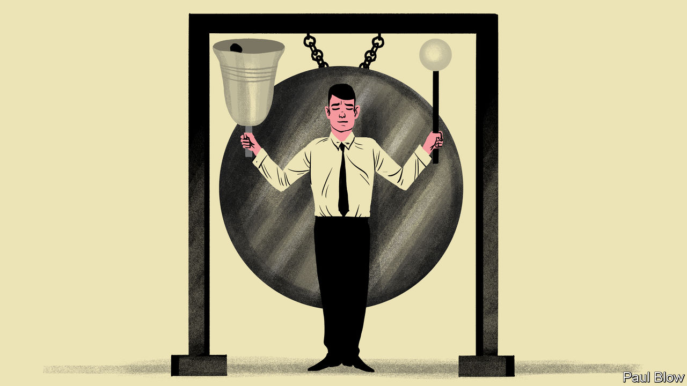

###### Bartleby

# A short guide to corporate rituals 

##### From the public to the private, ceremonies pervade business life 

 

> May 4th 2023 

For a public demonstration of the importance of ritual, the coronation of King Charles III on May 6th will be hard to beat. The ceremony will take place at Westminster Abbey, where monarchs have been crowned since William the Conqueror in 1066. There will be anointing, homage-paying, oath-taking and all manner of processing. In any other circumstances this kind of behaviour would warrant a medical diagnosis. But the alchemy of tradition means that it will instead call forth a sense of continuity and the idea of shared history. 

Rituals are also a big part of corporate life. There is nothing to match coronation levels of weirdness, much as some chief executives might like the idea of robes and a throne. But firms have their own ceremonies and rites. Some are internal: the repetitive rhythms of performance reviews and weekly meetings, budget processes and farewell cards are all ritualistic. Others are more public, from investor days to conference calls with analysts. The pandemic spawned a host of new customs, from regular events designed to lure people into the office to dedicated times of the week devoted to concentrated work.

Business rituals can arise spontaneously—those informal games of office bingo for when the boss uses their favourite bit of jargon. They can also be entirely private. No rule exists to say that, on entering a hotel room, the business traveller must check the minibar; that if the hotel manager has written a letter welcoming him, he must feel absurdly pleased; that if there is a plate of fruit, he must immediately eat all of it. Yet all of these things are as if ordained.

The prime example of the set-piece ceremony is the annual shareholders’ meeting. As a way of getting things done, this format is dreadful. Any information that shareholders actually need is available to them elsewhere. Many people delegate their voting rights to others. Plenty come just for the sandwiches. 

But as a ritual it matters. The board of directors enter and sit on a podium; some of them may say absolutely nothing. The bosses give presentations to show that shareholders could not wish for a better set of managers. A succession of small shareholders then take the microphone and harangue the company’s management for being totally useless. It is performative, to be sure, but a bit of a performance doesn’t go amiss for something as bloodless as corporate governance. The annual meeting offers a useful physical reminder of who is accountable to whom. 

Standard rites of this sort can evolve into company-specific ones. Amazon has attached a copy of its very first letter to shareholders, from 1997, to every one it has published since as a way of demonstrating that an underlying ethos endures even as the world around it changes. 

Rituals are also used as a way of building culture and team spirit. The financial industry has a long-established custom of giving “tombstones” out to clients and bankers when a transaction closes. The original tombstones were ads in newspapers, so called because they were laid out in a way that resembled gravestone inscriptions. The modern versions are sometimes known as “deal toys”. Lucite may not have much intrinsic value but the ritual survives as part-reward, part-commemoration, part-brag. Plenty of firms have less involved celebratory rites, like ringing bells or banging gongs when they hit certain sales milestones. 

Even simple rituals can encourage a sense of community and purpose among employees. A paper published in 2021 by Tami Kim of the University of Virginia and her co-authors asked volunteers to participate in a set of physical movements before starting out on a brainstorming exercise. Some looked at each other during this warm-up and others did not. The people who maintained eye contact rated the subsequent brainstorming as more meaningful.

But turning everything into a ritual also risks being tiresome. The only thing worse than an unnecessary meeting is an unnecessary meeting with stretching beforehand. Hosting colleagues at a regular meal and calling it “Fabulous Friday” is going to be most appealing to those who would otherwise be having a “Friendless Friday”. And one person’s ritual is another person’s ordeal. Ms Kim’s paper mentions a digital agency that holds regular sessions in which employees share personal stories about moments that changed their lives. This is indeed a ritual, but so is hanging, drawing and quartering. If there is a golden rule of corporate ritual, it is that it should make people feel as if they belong. ■


