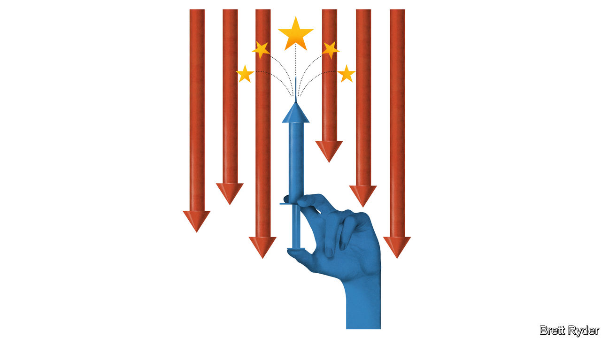

###### Schumpeter

# America needs a jab in its corporate backside 

##### Pfizer offers lessons in how to cope with paralysis over M&A and China 

 

> May 3rd 2023 

When Schumpeter recently visited New York, it was at its springtime best. There were cherry blossoms in Central Park, birdsong in the bushes, and—to drown out any false sense of serenity—the usual cacophony of car horns and jackhammers in the streets. Whoosh up in elevators to the salons of Wall Street’s , and it only gets better. The views are breathtaking, the preferences revealing—CDs lining the shelves of one legal beagle, a handkerchief in the top pocket of another. Yet if you thought such veterans had seen it all, think again. “It’s a shitload more complicated than it’s ever been,” says the boss of one bank.

The hierarchy of concerns changes depending on whom you talk to. But the components are the same. An interest-rate shock not seen for more than a generation. The difficulty of doing deals when money is no longer cheap. A maverick approach to antitrust from the sheriffs in Washington, DC. The rhetorical—if not yet real—decoupling between America and China, which business is afraid to speak out against, however much it stands to lose. 

So it was serendipitous that one of the New York companies your columnist visited was Pfizer, at its new headquarters in Hudson Yards. The pharma giant, worth $220bn, is rare among American firms in shrugging off many of the sources of uncertainty. Its covid-related partnership with BioNTech, a German vaccine developer, has given it a strong enough balance-sheet to take higher interest rates in its stride. It is a dealmaking machine, uncowed by the trustbusters. And it remains proud of its business in China. It may be sticking its neck out. But if that helps stick a needle into the skittish rump of corporate America, all the better. 

You can tell Pfizer is flush with cash by visiting its new digs. The main meeting room is a futuristic “purpose circle”. The shimmering executive suites look like they belong on the starship . A spiffy newish double-helix logo emphasises its devotion to science. The first topic of conversation is mergers and acquisitions. In little over a year it has splashed out $70bn. That includes the $43bn takeover of Seagen, a maker of cancer medicines, announced in March. It is the biggest pharma deal since 2019.

Pfizer can do M&amp;A because unlike most firms, it is not paralysed by the short-term economic outlook. Instead it is galvanised by the certainty that its covid-related bonanza is tapering off. Though sales of pandemic-related vaccines and antivirals beat Wall Street’s expectations in its first-quarter results on May 2nd, they still contributed to a 26% drop in overall revenues compared with the same period in 2022—and will fall further this year. It also faces a looming patent cliff from 2025 onwards, affecting non-covid blockbusters such as Eliquis, an anticoagulant, and Ibrance and Xtandi, two cancer drugs. To offset both of these forces, Pfizer is buying and developing a pipeline of new drugs that it hopes will boost revenues by $30bn in 2030. Like the rest of big pharma, it benefits from the fact that smaller, cash-strapped biotech firms are struggling in the high-interest-rate environment. That makes them relatively receptive to takeovers.

In doing such deals, Pfizer is unintimidated by the trustbusters, who are having a chilling effect on dealmaking in other industries. Jeff Haxer of Bain &amp; Company, a consultancy, notes that America’s Federal Trade Commission and Department of Justice are likelier to sue to stop deals taking place than tackle M&amp;A-related competition concerns through remedies such as divestments. So far they have failed to block many transactions, but the timeline for doing deals has lengthened. That affects the cost of financing for the buyer, and raises risks that the seller could be left stranded. Pfizer has taken steps to head off the trustbusters, such as playing down cost-cutting (ie, job-threatening) “synergies”, and playing up its commitment to cancer innovation. It insists the Seagen acquisition will close by early 2024.

Unlike many other American firms, Pfizer also remains unusually bullish about its business in China. It employs 7,000 people in the country, which helped bolster covid-related revenues in the first quarter. Its CEO, Albert Bourla, was one of a few bosses of well-known American firms to attend the China Development Forum in Beijing in March (Apple’s Tim Cook was another). Reuters reported that last month Pfizer signed an agreement with Sinopharm, a Chinese drugmaker, to market a dozen innovative drugs in China. It may make sense for a company with a promising business there to double down on its operations. But in a tense geopolitical climate in which many American businessmen fear a backlash if they raise their voices in defence of the trade relationship, it is bold nonetheless. 

So far Wall Street has given Pfizer little credit for its purposefulness. Its share price has fallen by almost a quarter this year. Critics argue that it may be overpaying for Seagen, and that the acquired drugs may not generate enough revenues to move the needle at Pfizer. They worry that pressures on drug pricing in America may end up destroying some of the economic rationale for its acquisitions. Pfizer still has its work cut out convincing investors its post-covid future is a bright one. As Mr Bourla put it: “It’s not enough to save the world. We need to increase the stock price.”

Seeing the vial as half-full 

Other industries might argue that big pharma, with some of the juiciest margins outside the tech industry, is unrepresentative of corporate America, and offers few lessons in how to cope with the current wave of uncertainty. Yet it is worth remembering that it is often in the depths of M&amp;A squeamishness that companies with strong balance-sheets strike the best deals. An investment banker notes that in 2009, during the global financial crisis, Pfizer paid $68bn for Wyeth, a vaccine-maker, despite misgivings on Wall Street. As luck would have it, more than a decade later that underappreciated business helped Pfizer rescue the world during the covid crisis. It can pay to be bold—even in mysterious ways. ■


 


