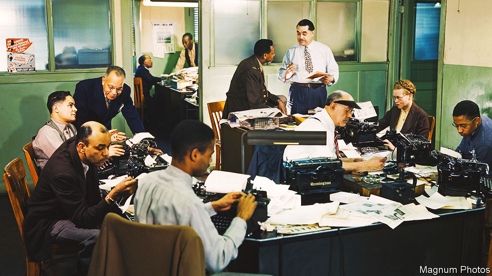

###### Ghost writers

# Artificial intelligence is remixing journalism into a “soup” of language 

##### The rise of the robot reporter implies profound changes to the nature of the news 

 

> May 4th 2023 

A sensational scoop was tweeted last month by America’s National Public Radio: Elon Musk’s “massive space sex rocket” had exploded on launch. Alas, it turned out to be an automated mistranscription of SpaceX, the billionaire’s rocketry firm. The error may be a taste of what is to come as artificial intelligence (AI) plays a bigger role in newsrooms.

Machines have been helping deliver the news for years: the Associated Press (AP) began publishing automated company earnings reports in 2014. The uses machine learning to decide how many free articles to show readers before they hit a paywall. Bayerischer Rundfunk, a German public broadcaster, moderates online comments with AI help. AP now also deploys it to create video “shot lists”, describing who and what is in each clip.

As AI improves, it is taking on more creative roles. One is newsgathering. At Reuters, machines look for patterns in large data sets. AP uses AI for “event detection”, scanning social media for ripples of news. At a journalism conference last month in Perugia, Italy, Nick Diakopoulos of Northwestern University showed how ChatGPT, a hit ai chatbot, could be used to assess the newsworthiness of research papers. The judgments of his model and those of human editors had a correlation coefficient of 0.58—maybe a close enough match to help a busy newsroom with an initial sift.

ChatGPT-like “generative” AIs are getting better at doing the writing and editing, too. Semafor, a news startup, is using AI to proofread stories. Radar AI, a British firm, creates data-driven pieces for local papers (“REVEALED: Map shows number of accessible toilets in south Essex”). Its five human journalists have filed more than 400,000 partly automated stories since 2018. In November Schibsted, a Norwegian media firm, launched an AI tool to turn long articles into short packages for Snapchat, a social network. News executives see potential in automatically reshaping stories for different formats or audiences.

Some sense a profound change in what this means for the news industry. AI “is going to change journalism more in the next three years than journalism has changed in the last 30 years”, predicts David Caswell of BBC News. By remixing information from across the internet, generative models are “messing with the fundamental unit of journalism”: the article. Instead of a single first draft of history, Mr Caswell says, the news may become “a sort of ‘soup’ of language that is experienced differently by different people”.

Many hacks have more prosaic concerns, chiefly about their jobs. As in other industries, employers portray AI as an assistant, not a replacement. But that could change. “We are not here to save journalists, we are here to save journalism,” Gina Chua, executive editor of Semafor, told the Perugia conference. The industry needs all the help it can get. On April 20th BuzzFeed shut down its Pulitzer-prizewinning news operation. A week later Vice, a one-time digital-media darling, made cuts; it is reportedly preparing for bankruptcy. As Lisa Gibbs of AP puts it: “In terms of challenges to journalists’ employment, [AI] is not highest on the list.” ■


