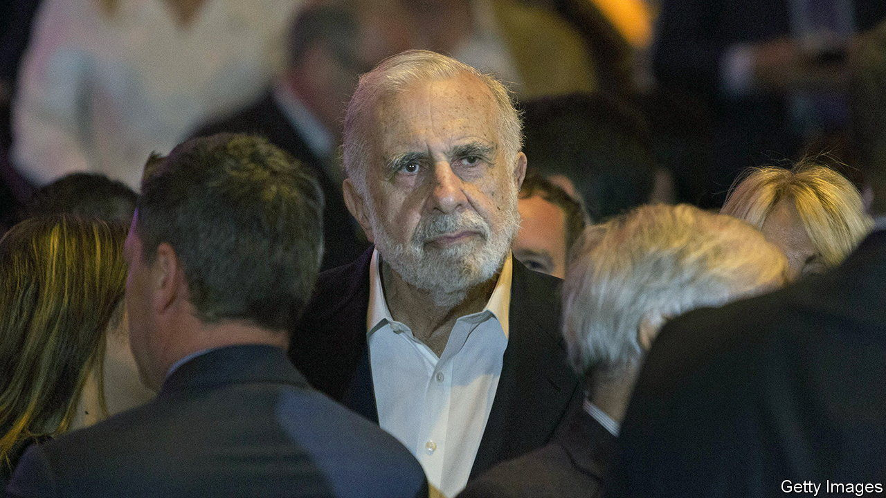
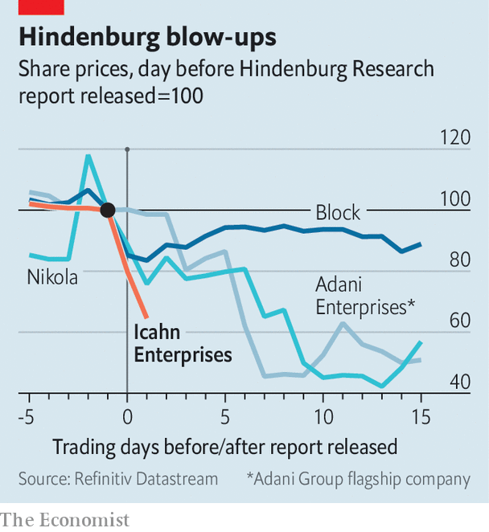

###### Can I sink Icahn?

# Hindenburg Research takes on Carl Icahn 

##### An upstart activist investor challenges a veteran of the trade 

 

> May 4th 2023 

BEFORE CARL ICAHN was an activist investor, he was an arbitrageur. Although it was swashbuckling corporate raids during the 1980s that made him infamous, some of Mr Icahn’s earliest campaigns involved investing in closed-end funds, a type of investment company which often trades at a discount to the value of its assets. Closing this gap, perhaps by agitating for the fund to liquidate its holdings, yields a profit.

 


Mr Icahn’s own investment holding company, Icahn Enterprises, suffered no such discount. Until this week the firm had a market capitalisation of around $18bn, more than triple the reported net value of its assets. These include majority ownership of energy and car companies, in addition to an activist-investment portfolio. On May 2nd Hindenburg Research, a short-selling outfit founded in 2017 by Nathan Anderson, accused Icahn Enterprises of operating a “Ponzi-like” structure. Icahn Enterprises has shed more than a third of its market value since Hindenburg released its report. It has become the latest of Hindenburg’s targets to hit the skids—and the headlines. Mr Anderson’s firm has previously taken aim at Nikola, a maker of electric lorries, the Adani Group, one of India’s mightiest conglomerates, and Block, an American fintech giant (see chart).

Hindenburg’s latest report alleges that Icahn Enterprises has inflated the value of its assets and funded its dividend with proceeds from selling shares to unwitting investors. It also calls on Mr Icahn to disclose the terms of personal loans secured against his majority holding in Icahn Enterprises. And it scolds Jefferies, Mr Icahn’s long-time investment bankers and the only big bank whose research analysts cover Icahn Enterprises, for allegedly turning a blind eye to the firm’s risks. Mr Icahn, Hindenburg argues, “has made a classic mistake of taking on too much leverage in the face of sustained losses”. Bill Ackman, another famed activist investor who once locked horns with Mr Icahn over an investment in Herbalife, an American supplement firm, gloated on Twitter that there was a “karmic quality” to the report. 

Short-sellers’ targets can be hamstrung in their immediate defences—share prices can tank quickly but detailed rebuttals take time. Even so, Mr Icahn’s first response looks muted compared with that of Hindenburg’s recent victims. In March Block described Hindenburg’s report as “factually inaccurate” and threatened litigation. In January the Adani Group accused the short-seller of “selective misinformation”. After stating that Hindenburg’s report is “self-serving”, Mr Icahn said on May 2nd merely that his firm’s performance would “speak for itself”. Jefferies has not commented on Hindenburg’s claims. 

Quite how messy this activist showdown becomes remains to be seen. Hindenburg’s report pitches a doyen of classic shareholder activism, which involves trying to drive a target’s share price up, against a newly prominent practitioner of short-selling, which aims to send it through the floor. The stakes are higher for Mr Icahn. His brand of activism requires investors to take him more seriously than they do the bad managers that, in his “anti-Darwinian” view, American commerce seems to promote. Icahn Enterprises must now prove that the same thing is not true of its own boardroom. ■


