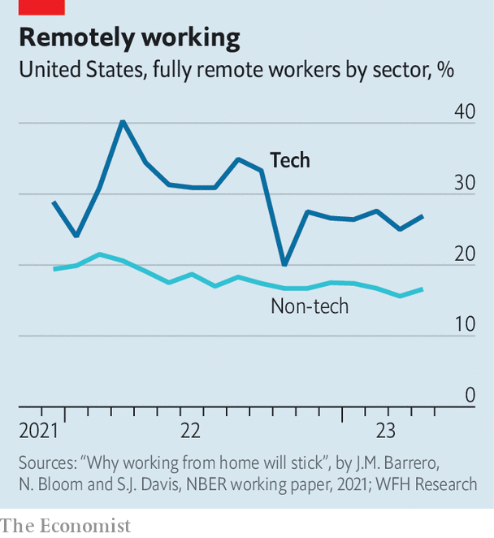

###### Coding in the moonlight

# How to two-time your employer: a tech worker’s guide 

##### Juggling jobs is a growing trend in the technology industry 

 

> May 4th 2023 

Two work laptops, two work calendars, two bosses and two pay-cheques. So far, neither of Matt’s employers is any the wiser. The tech worker (who, for obvious reasons, asked  not to use his real name) meets deadlines and does what is requested, though not more. He is not the only one.

People working several jobs is nothing new. Low earners have long had to juggle shifts to make ends meet. At the other end of the pay scale, directors often sit on a few corporate boards. According to America’s Bureau of Labour Statistics, at any given point in the past 30 years, between 4% and 6.5% of the American workforce was working more than one job. Estimates from the Census Bureau put that share even higher, going from 6.8% in 1996 to 7.8% in 2018. 

 


What is novel, as Matt’s example illustrates, is the rise of the job-juggling white-collar type, especially in the technology industry. Thank—or blame—remote work. Despite efforts by bosses to lure or coerce people back to their desks, the share of techies working fully remotely remains 60% higher than in other sectors (see chart). Without managers physically looking over their shoulders, some of them are two-timing their employers. Mid-career software engineers report applying for more junior positions so that they can “underpromise and overdeliver”, with minimal effort. 

Matt took a second job, or “J2” as he calls it, for two main reasons: boredom and concerns over job security. The tasks required by his first job, working remotely as a data scientist for a medium-sized tech firm, were not particularly challenging, taking him only eight hours a week. He had no inclination to “play office politics and move up the corporate ladder”. He did, though, covet cash. He reckoned he could take on a second job, double his pay and gain a safety-net were he to be laid off.

After interviewing for a few weeks, Matt found a promising J2: data engineering at a startup. He suspected that demands on his time would be as low as they were at his first job. He was mostly right, though striking a balance required some footwork. In his first week a rare J1 meeting was scheduled at the same time as one of his J2 “onboarding” sessions. Some fellow members of an online forum for the overemployed on Reddit, a social-media site, claim to have taken two meetings at once, with video off. If called on to speak at the same time, they feign connectivity problems or play a pre-recorded audio clip of a dog barking. Matt decided to tune in to the J1 call and reschedule his onboarding, blaming a doctor’s appointment.

The rise of generative artificial intelligence like ChatGPT may in time make double-jobbing harder by replacing some menial tech tasks. Until then, coasters can themselves use clever chatbots to help structure computer code, write documents and even conduct preliminary research. ChatGPT cannot replace the work of a software engineer, says one overemployee, but it gets you 90% of the way there. 

The employee-employer relationship has historically favoured the employers, who wield more clout because they can typically choose from more workers than workers can among companies. Matt thinks of his ruse as taking back some control. Two decently paying jobs afford him flexibility. And, he says, flexibility is power. If he were to get laid off, or if one job were to become unreasonably demanding, he could go and find another. For now, he thinks he is safe. So safe, in fact, that he is starting his search for a third job. ■


