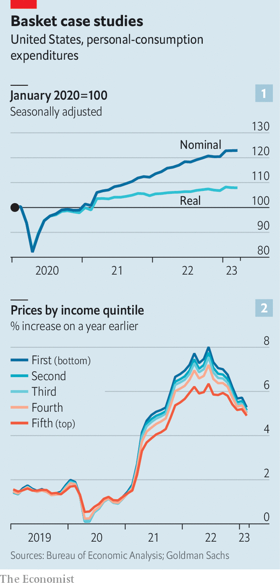
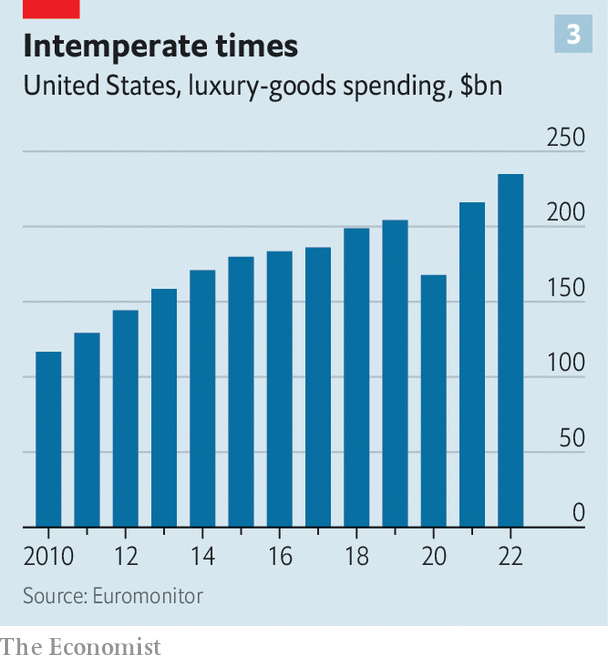

###### The missing middle

# The business trend that unites Walmart and Tiffany & Co 

##### Meet the winners from America’s consumer slowdown 

 

> May 2nd 2023 

After a four-year spruce-up , an upmarket American jeweller, reopened the doors of its flagship store on New York’s Fifth Avenue to the public on April 28th. At first glance the grand unveiling seems conspicuously ill timed. Hours earlier the Bureau of Economic Analysis had reported that nominal consumer spending in America barely grew in March, amid stubbornly  and a slowing job market.

Yet the throng of well-heeled New Yorkers who queued up on opening day to enter what Tiffany has modestly rechristened “The Landmark” hints at a more nuanced story. Hard economic times have, as in the past, pushed consumers of middling means to trade down to budget-friendly stores and products, boosting the performance of those businesses. Wealthy households, however, remain flush with cash, leaving businesses that cater to the affluent surprisingly buoyant. That has raised awkward questions for firms that offer their customers neither frugality nor luxury, but something in between.

 


It has been a rollercoaster three years for America’s consumers—and the businesses that cater to them. The onset of the covid-19 pandemic brought a sharp contraction in spending that was followed by an orgy of indulgence (see chart 1). Lower-income households took part in the revelry, spurred on by juicy stimulus cheques and an uptick in wages for less skilled workers as businesses raced to rehire waiters, shop assistants and the like.

Then, around 12 months ago, surging inflation led consumers to start tightening their belts, albeit with significant variation across the income distribution. A sharp rise in food and fuel prices triggered by Russia’s invasion of Ukraine, coupled with a jump in rent costs, hit households further down the income ladder particularly hard, given the higher share of spending they allot to such essentials. Over the course of 2022 the inflation rate for households in the bottom income quintile was one-fifth higher than that for the top quintile, according to Goldman Sachs, a bank, offsetting faster wage growth among low earners (see chart 2).

Inflation in America has begun to ease, falling from a peak of 7% last June to 4.2% in March, on the Federal Reserve’s preferred measure of consumer prices. Still, elevated price levels are weighing heavily on the less affluent, notes Gregory Daco of EY, a consultancy. Extra household savings amassed in the pandemic have dwindled from a peak of nearly $2.5trn in the middle of 2021 to $1.5trn or so, with the bulk held mostly by high-income households, according to Joseph Briggs of Goldman Sachs. Wallets at the top of the income distribution have also been fattened by a surge in asset prices in recent years, notes Paul Lejuez of Citigroup, another bank. Although markets have fallen from their frothy peaks, the S&amp;P 500 index of large companies is still up by 26% compared with January 2020. House prices have risen by 38%.

This unevenness in the financial health of consumers has had two effects. The first is that businesses at the wallet-sparing end of the price spectrum have gained new customers. While the poorest households have cut back on all but essential spending, those of middling means—with larger shopping carts—have been shifting to cheaper stores and brands, says Sarah Wolfe of Morgan Stanley, one more bank.

Analysts reckon that sales at Burlington, a discount department store, grew by 13.2% year on year in the first quarter of this year, compared with a decline of 4.2% for Macy’s, a middle-class stalwart. , a big-box retailer favoured by the thrifty, is expected to have clocked in at a respectable 4.9% for America last quarter, while Albertsons and Kroger, two mid-range supermarkets, are forecast to eke out a meagre 2.5% and 1.3%, respectively. A similar pattern is on display within retailers: in-house brands at Walmart are snatching sales away from branded goods from suppliers like Procter &amp; Gamble and Unilever, which have jacked up prices to protect margins. 

Consumers are bargain-hunting beyond department stores and supermarkets. On April 25th McDonald’s, a purveyor of cheap calories, announced an expectations-beating 12.6% growth in American same-store sales for the first quarter, compared with a year earlier. On April 20th IKEA, a Swedish maker of cheap furniture, said it was investing $2.2bn to expand its presence in America—days before Bed Bath &amp; Beyond, an assuredly middle-class rival, declared bankruptcy.

 


The second upshot of the uneven health of consumers is that, as wealthy shoppers keep splurging on the finer things in life, businesses at the wallet-emptying end of the price spectrum continue to thrive. Last year the market for luxury goods in America grew by a handsome 8.7%, well above inflation, according to Euromonitor, a market-research firm (see chart 3). On April 12th LVMH, the world’s largest luxury conglomerate and owner of Tiffany &amp; Co, reported first-quarter sales growth of 8%, year on year, in America—down from 15% in 2022 but still bubbly. Hermès, a maker of eye-wateringly expensive handbags, saw no slowdown in sales in America in the first quarter. The pattern extends well beyond designer wear. Luxury-car sales have been on a two-year tear, hitting a record 19.6% of the total market in January, according to data from Kelley Blue Book, another market researcher.

The resilience of the luxury business has been helped by a shift in focus since the financial crisis from the merely rich to the positively loaded, notes Claudia D’Arpizio of Bain &amp; Company, a consultancy. The penthouse floor of “The Landmark” is dedicated entirely to such ultra-high-net-worth shoppers. Whereas aspirational buyers may in good times splash out on a pair of Gucci sneakers, those at the tippy-top of the income distribution are reliable patrons even when the economy looks shaky. That has made luxury a less cyclical business than it once was.

The centre doesn’t hold

With consumer spending shifting to the two extremes of the price spectrum, some firms have already begun to reposition themselves. One strategy is to beef up pricier ranges. On April 3rd L’Oréal, a beauty giant whose brands extend from the affordable Garnier to the luxuriously expensive Lancôme, said it would spend $2.5bn buying Aesop, a maker of $40 hand soaps. 

Other businesses are reducing exposure to the shaky middle. On April 14th Walmart announced it was selling Bonobos, a mid-range menswear brand, for a mere $75m, well below the $310m it paid to acquire it in 2017. 

A third strategy is to invest in offerings for the budget-conscious. Video-streamers from Netflix to Disney have launched ad-supported tiers to mop up customers who balk at rising subscription prices.

Investors would do well to take note. Conventional market wisdom dictates steering clear of businesses in “discretionary” spending categories (cars, clothes and other non-essentials) in favour of “staples” (necessities such as groceries) in tough economic times. The new logic of consumption suggests that the pedlars of the most essential fare can expect to do well as the economy sours. But so can sellers of the exceedingly discretionary. ■


