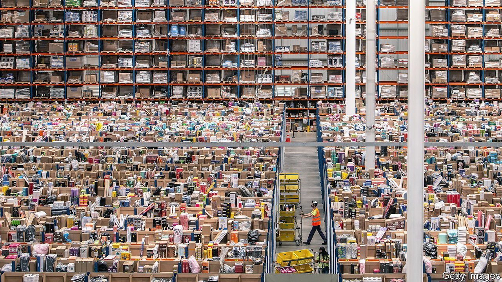
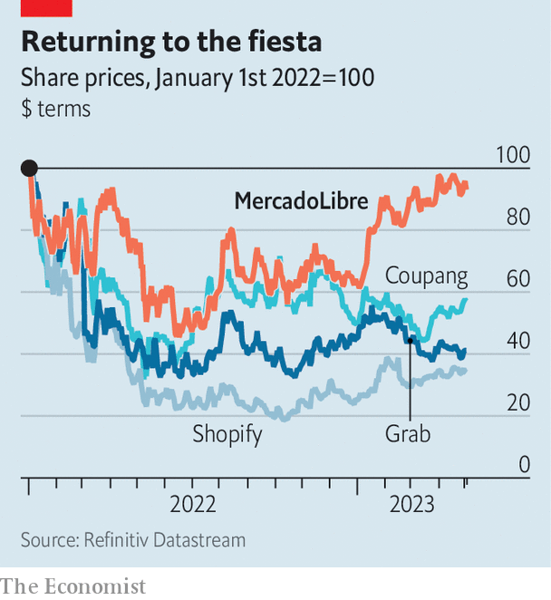

###### Latin America’s other Amazon

# Why MercadoLibre keeps soaring as other e-emporiums sink 

##### A combination of local knowledge and focus explain the firm’s success 

 

> May 4th 2023 

IN MARCH AMAZON announced it would fire 9,000 workers—bringing to 27,000 the total number it has laid off this year. The e-commerce giant’s share price is down by a third since 2021. Other online-shopping darlings, from Shopify in Canada to Coupang in South Korea and Grab in South-East Asia, have suffered a similar fate (see chart). With one exception. At $64bn, the market value of MercadoLibre, an Argentine firm listed in New York with operations across Latin America, has been rising lately and is back roughly to where it was at the start of 2022—and twice that before covid-19. In April, as the world’s tech firms were sacking workers en masse, it said it would hire 13,000, mainly in Brazil and Mexico, raising its workforce by a third. 

 


MercadoLibre needs more workers. On May 3rd it reported that revenues grew by 35% in the first quarter of 2023, to $3bn. Last year goods worth $35bn changed hands on its platform, helping generate $1bn in pre-tax profits. How is it flourishing as similar firms elsewhere struggle?

Its success is a mix of good management and good fortune. Early on it expanded from connecting buyers and sellers into payments, initially to allay users’ fear of fraud. Its payments system, MercadoPago, is now widely trusted and used beyond its platform; more than $100bn flowed through it in 2022. The company has also built its own logistics network to deliver packages quickly in a region where infrastructure can be patchy. In ten years it has gone from not touching parcels, all of which were handled by third-party shippers, to having a hand in ferrying 93% of its e-commerce packages. More recently it added a fast-growing advertising business. Unlike Amazon, which regularly receives complaints about working conditions, employees rank MercadoLibre among the best Latin American firms to work for. 

MercadoLibre also benefits from a deep understanding of local shopping habits, notes Ricardo Tapia of the University of Anáhuac in Mexico City. For instance, by accumulating points for purchases, its shoppers can gain benefits such as free delivery. What may seem gimmicky to Western shoppers, for whom a big benefit of buying online is that it saves time, is a big draw for game-loving Latin Americans. 

The resulting strength has allowed the firm to take advantage of fortuitous circumstances. As everywhere in the world, the pandemic accelerated the growth of e-commerce in its region. In Mexico, MercadoLibre’s third-biggest market after Brazil and Argentina, 63m people bought something online in 2022, up from 37m in 2018. In contrast to more mature markets such as Britain, the number of Latin Americans buying online did not drop back down after an initial boom in 2020. 

The region’s brick-and-mortar retailers, which are rapidly improving their own digital offerings, and online giants such as Amazon have cottoned on to this trend. To keep growing, MercadoLibre may need to boost penetration in less online countries such as Colombia, where Amazon is weaker, and perhaps move into new segments, such as groceries. But it does at least enjoy another advantage over foreign rivals, for which Latin America is a peripheral market—focus. Failure in its home region is simply not an option, says Agustin Gutierrez of McKinsey, a consultancy. Nothing concentrates the mind like survival. ■


