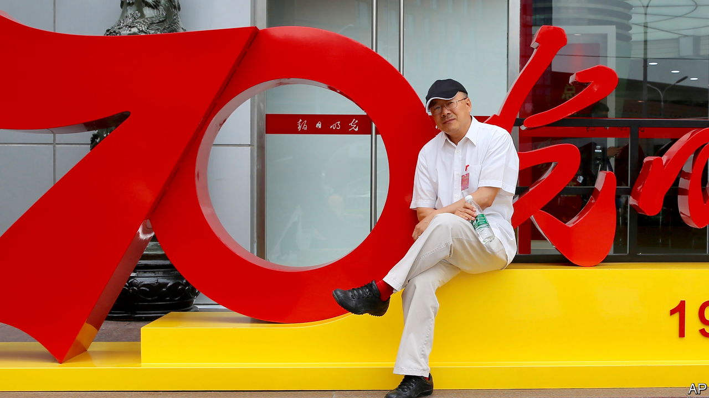

###### The smokeless war

# A battle against spies in China is spooking locals and foreigners 

##### A revised law gives the police plenty of excuses to target people they dislike 

 

> May 4th 2023 

China’s struggle against spying is “extremely grim”, said a spokesman for the country’s rubber-stamp parliament late last month. The techniques used by foreign spooks, he added, were becoming ever harder to detect. To tackle this, the legislature approved a new, more sweeping, version of the country’s counter-espionage law on April 26th. Among foreigners in China, it is causing jitters. In what Chinese officials call their “smokeless war” against spies, risks to the innocent are growing. 

Even before the law was passed, anxieties had been rising. The arrest in March of a Japanese businessman in Beijing caused shivers among fellow executives in China. The man, a senior employee of a Japanese drug firm, Astellas Pharma, and a longtime resident of China, has been accused of spying (no other details have been released). Such charges are far from rare. The foreign ministry in Tokyo says he was the 17th Japanese to be seized by China’s counter-espionage police since 2015. But the latest detainee was unusual: a prominent member of the business community from a big company. 

In April family members of a Chinese journalist, Dong Yuyu (pictured), revealed that he had been arrested last year while meeting a Japanese diplomat in Beijing, and accused of spying. Mr Dong is well known among foreign diplomats and journalists. He had been working as a senior editor at , one of the country’s official newspapers. He also contributed to , a magazine, when it was strongly pro-reform (it was neutered after a hostile takeover in 2016), as well as the Chinese website of the . On the same day as the revised law on spying was passed, the authorities announced the arrest of Li Yanhe, a China-born Taiwanese publisher who had been visiting the mainland. He has been accused of “endangering national security”. Books produced by Mr Li’s firm include works critical of China’s Communist Party. 

Recent police raids on firms’ offices have also rattled foreign businesspeople. In one such swoop, in March, five Chinese employees of Mintz Group, an American due-diligence firm, were detained in Beijing for reasons that have not been made public. In April police in Shanghai questioned staff at the premises of Bain, an American consultancy, and took away computers and phones, according to the . Again, the reason is unclear. But amid  between China and America, Western businesspeople worry that police may be looking for excuses, whether security-related or otherwise, to flex muscle. 

For the police, the new wording of the counter-espionage law provides plenty of excuses to target people they dislike—both Chinese and foreign. The old version listed colluding to “steal, pry into, purchase or illegally provide state secrets or intelligence” as one kind of espionage. Now it also applies to “other documents, data, materials or items related to national security or interests”. In theory this could mean that obtaining non-classified information on topics ranging from the economy to politics could be construed as spying.

In practice it has always been so. But making this clearer in law aims to send a message to Chinese: they must be super-cautious about sharing with foreigners any information that is not available in the country’s highly censored public-facing media. China also has many publications that provide news of a more genuine kind, but they are classified. The party’s main mouthpiece, the , produces a thrice-weekly digest of commentary from social media, but even this is restricted to “internal” circulation among officials. 

Since the country first adopted its spying law in 2014, it has mounted a publicity campaign mainly aimed at ordinary citizens. Propaganda teams even tour villages, urging vigilance against foreign spooks. In 2015 the Ministry of State Security set up a hotline, 12339, for people to report suspected threats, with substantial rewards offered. That year the government also declared that April 15th would be marked annually as National Security Education Day. It says it wants the “whole of society” to mobilise to “make it difficult for criminals who engage in spying and sabotage even to take a step”. It is certainly making foreigners feel less welcome. ■


