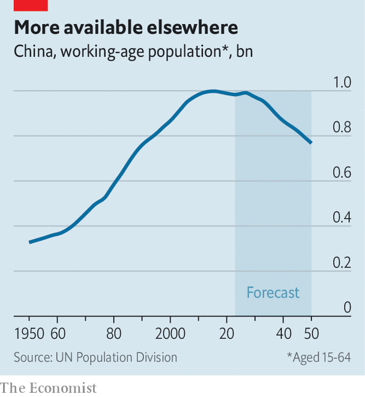

###### Closed society

# China needs foreign workers. So why won’t it embrace immigration? 

##### Opposition to multiculturalism is fuelled, in part, by claims of racial purity 

 

> May 4th 2023 

For hundreds of years China could boast of having more people than any other country. The title became official in the 1950s, when the UN began compiling such data. Such a large population conferred on China certain bragging rights. A huge labour supply also helped to boost its annual GDP growth, which has averaged close to 9% over the past three decades.

 


Last month China’s reign came to an end. India has overtaken it as the world’s most populous country. The demographic trends behind the shift have troubling implications for the new number two. China’s working-age population has been shrinking for a decade (see chart). Its population as a whole declined last year—and it is ageing rapidly. This is likely to hinder economic growth and create an enormous burden of care.

Yet when officials in Beijing mull solutions, one seems largely absent from the discussion: immigration. China has astonishingly few foreign-born residents. Of its 1.4bn people, around 1m, or just 0.1%, are immigrants. That compares with shares of 15% in America, 19% in Germany and 30% in Australia. Place it next to that of other Asian countries which also shun immigration and China’s total still looks measly. Foreigners constitute 2% of Japan’s population and 3% of South Korea’s. Even North Korea has a higher proportion of immigrants than China, according to the UN.

China’s future economic and social needs resemble those that have made other societies recruit guest workers. In January the government released a list of 100 occupations, such as salesperson and cleaner, where there is a lack of staff. Over 80% of manufacturers faced labour shortages in 2022, according to one survey. Nearly half of China’s 400m blue-collar workers are aged over 40, reported a study in December. That is in line with an official estimate that China will have trouble filling nearly 30m manufacturing jobs by 2025.

An abundance of young and cheap workers once filled these openings. But as China ages and shrinks that supply of willing labour is drying up. Firms complain of a mismatch between the jobs sought by young people, an increasing number of whom have university degrees, and those available. Many young Chinese do not want to work in factories, laments , a party mouthpiece. That helps explain why nearly 20% of 16- to 24-year-olds in cities are unemployed.

China could make better use of its existing population. The country is under-urbanised and its rural residents under-educated by advanced-economy standards. Higher pay and fewer curbs on internal migration would certainly help. But even young migrants from rural areas seem less inclined than in the past to travel to cities for blue-collar work. 

In many other countries immigrants do the jobs that pay too little to attract locals. Immigrants have also helped to ease the burden where populations are ageing. Japan, for example, has allowed foreign nurses to tend to its seniors. China faces an even greater challenge in this regard. Unlike Japan, it has not grown rich before growing old, and will have soaring bills for health and social care.

China admits that it needs more young people. ​​The government has tried to coax citizens to have more babies—to little avail. Chinese women, on average, have less than 1.2 children, well below the 2.1 needed to keep the population stable. 

In contrast, the state has made little effort to attract people from abroad. In 2016 it set up a three-tiered, points-based system for employment-visa applicants. The lowest tier, class C, includes those with relatively little education and work experience. These permits are difficult to obtain. “Encourage the top, control the middle and limit the bottom,” went a state slogan at the time the system was introduced.

Even those at the top face big obstacles, though. The country’s green-card system, introduced in 2004, is limited and complex. It was meant to save affluent or highly skilled foreign workers from having to reapply for a visa each year. In practice, only 11,000 or so ten-year residence permits were issued from 2004 to 2016, the last year such data were released. During that same period, America, with a quarter of China’s population, issued nearly 12m green cards.

Since then China has established a national immigration agency and tried to ease the application process for residency. But the threshold remains high: applicants must have invested at least $500,000 in a Chinese business for three consecutive years, be married to a Chinese citizen, have made or be making a significant contribution to the country, or possess skills that are especially needed. None of this will help Chinese manufacturers fill jobs.

Long live the kin

The simple truth is that China has no interest in becoming an immigrant melting pot. Part of this may be explained by foreign bullying of the country in the past. But opposition to multiculturalism is also fuelled by claims of Chinese racial purity long peddled by nationalists. Officials boast of a single Chinese bloodline dating back thousands of years. In 2017 Xi Jinping, China’s supreme leader, told Donald Trump, then America’s president: “We people are the original people, black hair, yellow skin, inherited onwards. We call ourselves the descendants of the dragon.”

That informs immigration and nationalisation policy. An overwhelming share of China’s green cards go to foreigners of Chinese ancestry. Similarly, foreign-born children of Chinese nationals get special treatment when applying to Chinese universities. The Thousand Talents programme to attract academics from abroad enrolled nearly 8,000 scientists and engineers from 2008 to 2018. All but 390 were Chinese-born returnees, according to the Brookings Institution, a think-tank in America.

Citizenship is all but closed to foreigners, unless they are the children of Chinese nationals. Chinese green cards, unlike American ones, do not offer a path. China had only 16,595 naturalised citizens in total in 2020. Japan, meanwhile, naturalises around 7,000 new citizens each year. In America the number is over 800,000.

Public attitudes make it hard to be more open. In 2020 a proposal to ease the path to residency for rich or skilled foreigners faced a populist backlash, with men promising to protect Chinese women from immigrants. In general the state encourages a closed mindset. A national-security campaign warned Chinese women that their foreign boyfriends could be spies, while officials blame perceived social ills on “foreign influences”. 

Then there is the one-child policy, which was ditched only in 2016. Couples may now have up to three children. Few want that many. But it may be difficult to convince a generation raised on—and scarred by—population control that high inflows of immigrants are desirable.

That is a shame. Looser immigration policies would not only help employers with labour shortages. They would also encourage innovation. Google, LinkedIn and Tesla were all co-founded by immigrants to America. But the bright young minds from abroad who study in China find it hard to get a visa upon graduation. Meanwhile, many Chinese students are studying in the West—and staying there.

Curiously, the main route to Chinese citizenship now seems to be sporting excellence. Around a dozen footballers, most with no ancestral ties to China, were naturalised in 2019 and 2020 in a failed attempt to help the country reach the World Cup. Another handful of athletes, most with a parent born in China, got citizenship before the Winter Olympics in 2022. Labour shortages in less glamorous trades may soon force officials to consider admitting newcomers who will never win a medal. ■


