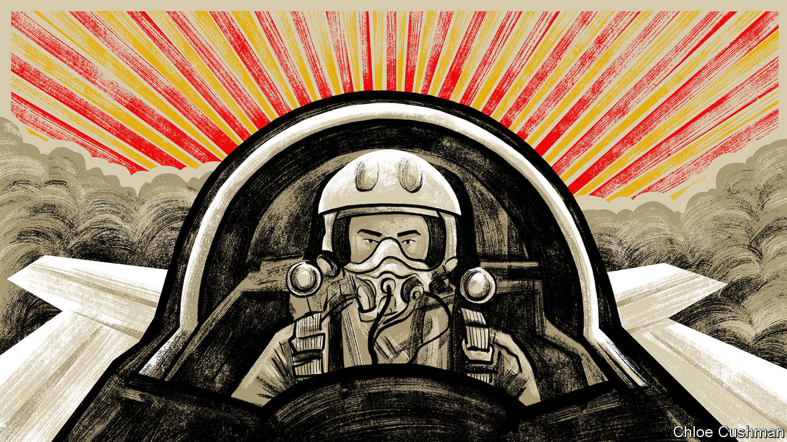

###### Chaguan

# China’s new “Top Gun” normalises war with America 

##### A PLA-backed box-office hit takes China to the danger zone 

 

> May 4th 2023 

In these tense times, a lack of loud war drums in Beijing and Washington has been a rare source of comfort. True, the drums are not quite silent. Some American generals and politicians have talked up the chances of conflict with China within a few years, which is less helpful than they may suppose. People’s Liberation Army (PLA) fighter jets keep staging recklessly close,  to intimidate Western military aircraft in international airspace near China. The PLA refuses to discuss rules for safely managing close encounters, precisely because it wants to frighten foreign warplanes and ships far away. That shows a dangerous appetite for risk. America and China remain at loggerheads over a rather trivial crisis: the downing of an unmanned Chinese surveillance balloon. What hopes have they of  on a par with one in 2001 that killed a PLA pilot and obliged an American spy plane to crash-land at a Chinese air base?

Still, when President Joe Biden and President Xi Jinping  last November, they agreed on the need to avoid armed conflict. Chinese censors routinely silence online nationalists demanding attacks on Taiwan, for the masses have no right to dictate to Mr Xi when or how that island should be conquered. Chinese public opinion has not, to date, been readied to sacrifice decades of growing prosperity on the altars of war.

A new film about China’s air force tests that record of restraint. “Born to Fly”, made in close collaboration with the PLA, has topped the domestic box office during the May Day holidays. It depicts test pilots risking (and losing) their lives to perfect a new stealth fighter. The plane is needed for combat against a foreign power that, though unnamed, speaks American-accented English. 

Readers planning to watch the film should return to this spoiler-filled column later. Others should know that the movie breaks new ground in the “main melody” genre, as works promoting major party policies are known. Such films are shown to students, party members and government workers nationwide, alongside commercial screenings. “Born to Fly” is the highest-profile flick of this type to normalise the notion that the present-day PLA’s mission is to fight and kill Americans.

The movie makes much of its realism. The film-makers have wheeled out PLA veterans to praise its authenticity and even the acting of its young male lead, Wang Yibo, an elfin former singer in a boy band. But its geopolitical premise is bogus. In the real world, China is locked in territorial disputes with many neighbours. Notably, China claims to control almost all of the , building PLA bases atop disputed reefs and rocks. To challenge China’s unilateral claims and uphold the principle of freedom of navigation, America and other powers fly and sail through areas of the South China Sea deemed open to all by international law.

“Born to Fly” twists such missions into acts of war. The film opens with foreign jets shattering windows and hurling Chinese fishermen and oilfield workers into the sea with low, supersonic passes. The aggressors chortle “well done” to one another. Told by radio that they are in an area under China’s jurisdiction, the foreigners retort: “We can come and go whenever we want.” They then proceed to outfly the PLA’s ageing planes. At the film’s end, the intruders return, firing without warning on Chinese fighters. This time, the PLA has advanced jets and drives them away.

Dismayingly, the film blends anti-American fantasies with some of Mr Xi’s highest priorities. The test pilots are told they are in a battle against a technological blockade and containment strategy imposed by foreign powers, a line echoing Mr Xi’s calls for self-reliance. What is more, the male lead’s story could be inspired by Mr Xi’s many speeches to the young, which emphasise discipline and deplore softness. The hero is brattish when he arrives at his desert air base. But after visiting a martyrs’ cemetery for test pilots and watching his commander choose death to avoid ejecting over a city, he devotes his life to his motherland. When the young man is injured, his parents ask him to quit the PLA. They grumble about his earlier refusal of an offer to study overseas and express doubts that China can ever match Western planes. The hero scolds his over-protective parents, informing them that his generation will give China back its confidence. Even a ludicrous plot device, in which the hero designs a plane-saving technology on his laptop in his spare time, aligns with a PLA campaign to recruit college graduates with engineering and computing skills.

Buzzing the superpower

Successful patriotic works reveal how countries wish to see themselves. “”, a wildly popular film released in 2017, is misremembered as warmongering. In fact, the plot depicts a Chinese commando evacuating civilians from an African civil conflict with the help of a half-American doctor (though the commando also punches a racist foreign mercenary to death, it is true). The China of the film is a proud peacekeeper. At one point, a Chinese warship waits for the UN Security Council to approve a missile strike. In contrast, “Born To Fly” depicts China overcoming backwardness to fight America one-on-one: a much grimmer story.

Foreign critics call “Born To Fly” a copy of “Top Gun: Maverick”, a film about American fighter pilots released last year, though not in China. While many of the scenes look similar, the critique is unfair to both films. “Top Gun: Maverick” is wistful and nostalgic, and as interested in human frailties as in noisy machines. It depicts a weary superpower and an ageing pilot enforcing a multilateral treaty on nuclear non-proliferation, ie, defending the rules-based order. Alas, “Born to Fly” is closer in spirit to the first “Top Gun”. That film from 1986 shows obnoxious young pilots helping a hegemonic America enforce its will, without concern for the niceties of international law. “Born to Fly” is “Top Gun” with added nationalist grievance and no sex. If it is a hit in China’s cinemas, it should alarm the world like a beaten drum. ■


